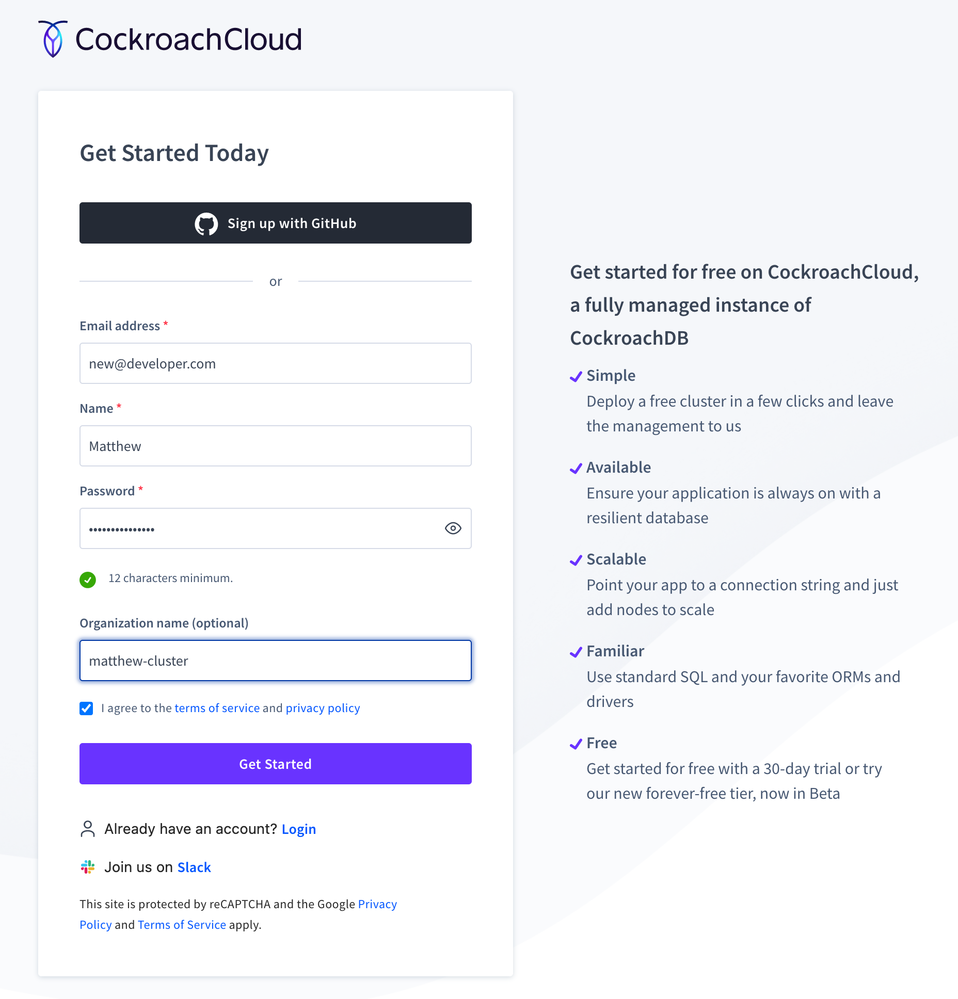
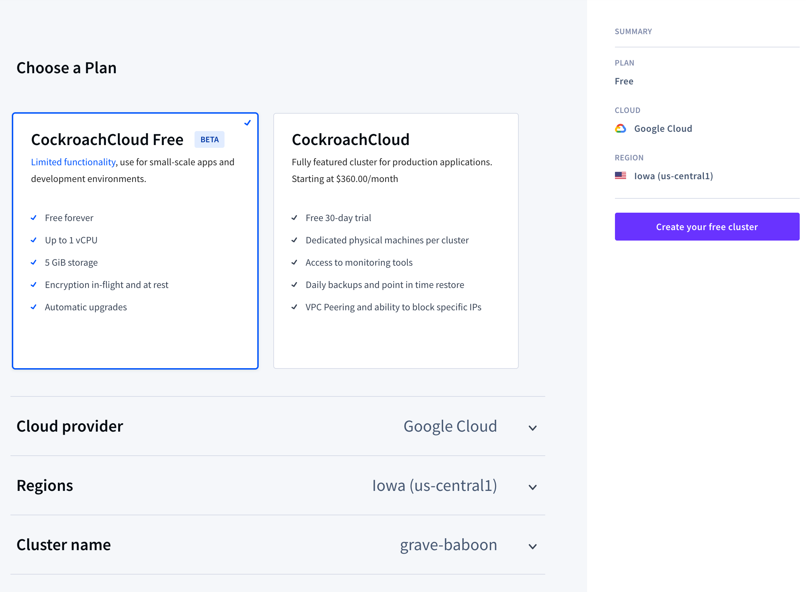
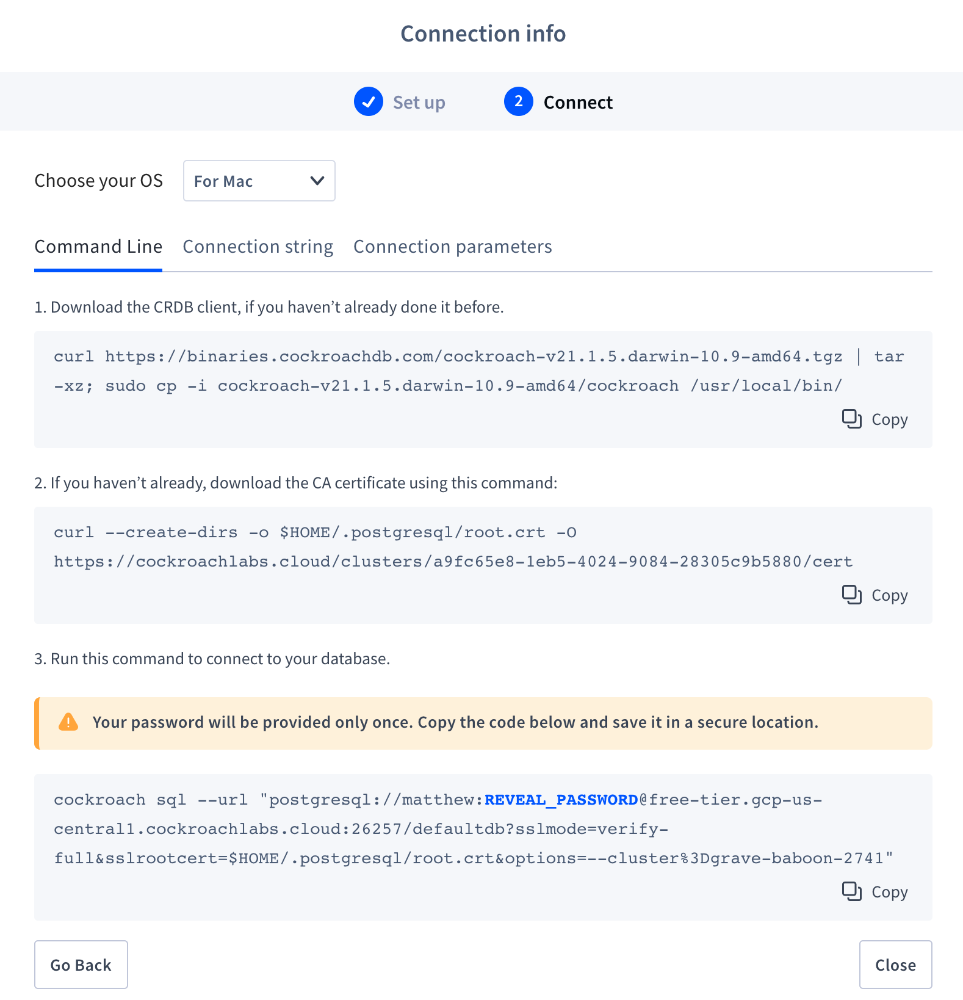
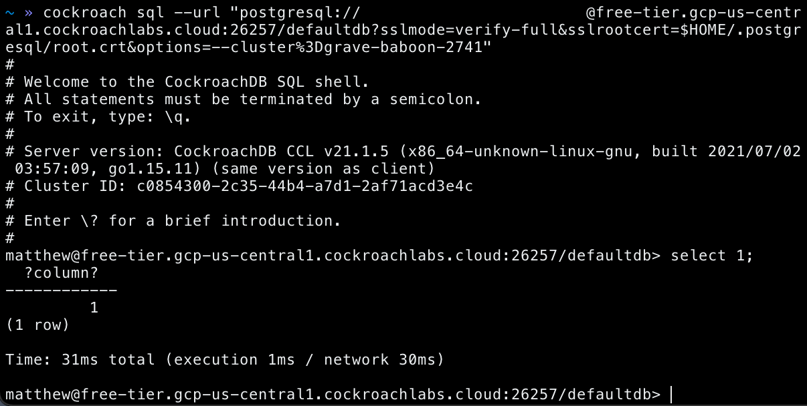

# Getting Started on Cockroach Cloud Free Tier (beta)

## Overview

This lab will cover the basics of getting started with connecting to your first free tier cluster.

First, let's review some terminology to get you familiar with the space.

**CockroachDB**: CockroachDB is a distributed SQL database built on a transactional and strongly-consistent key-value store. It **scales** horizontally; **survives** disk, machine, rack, and even datacenter failures with minimal latency disruption and no manual intervention; supports **strongly-consistent** ACID transactions; and provides a familiar **SQL** API for structuring, manipulating, and querying data.

Learn more [here](https://www.cockroachlabs.com/product/).

**Cockroach Cloud**: A fully managed instance of CockroachDB. You can deploy a new cluster in a few clicks and leave the management to us. 

Learn more [here](https://www.cockroachlabs.com/product/cockroachcloud/).


**Cockroach Cloud Free Tier (beta)**: CockroachCloud Free (beta) delivers free CockroachDB clusters for you and your organization. It is a managed instance of CockroachDB that that is free forever. 

## Lab Prerequisites
* A modern web browser (Chrome,Firefox)
* Terminal or Powershell (This Lab uses a MacOS Terminal)

## The Lab 

Navigate to https://cockroachlabs.cloud/signup and create an account. You can sign up with GitHub or create an account directly on this page. 



You will receive an email to verify your account. Once you verify your email address you will be granted access to the Cockroach Cloud console. 

Once logged in, click the Create Cluster option and you will be brought to the following page:



Let's review the different options:
1. **Choosing a plan**: We want to choose Cockroach Cloud Free. We'll cover dedicated Cockroach Cloud in anothoer Tutorial.
2. **Cloud provider**: Here you can choose which public cloud provider will host your COckroach Cloud Free Tier cluster. We'll choose Google Cloud for the purposes of this Lab.
3. **Region**: Different cloud providers offer multiple regions that you can host your machines in. The consideration you want to make here is where you plan to host your application that will use the cluster. Let's say our application is geographically in the Central US, therefore we'll choose the default option of Iowa. As a rule of thumb, we'll want our application to be as close to the cluster as possible so there's minimal latency for our requests to the database.
4. **Cluster name**: This one is up to you. You could use your first name or the name of the application if you'd like to. 

After you've chosen your cluster configuration, click `Create your free cluster` shown on the right side. 

Your cluster will take about 20-30 seconds to be created and once it is ready you will be presented with information about how to connect.

> Let's pause here and recap what we've done so far. 
1. We learned about CockroachDB and Cockroach Cloud.
2. We created an account on Cockroach Cloud. 
3. We learned how easy it is to create a free tier cluster.

> Before proceeding, we'll need access to our machines terminal. The Terminal is a Command Line utility that allows you to make changes on your machine and interact with computer programs. We will use this to connect to our free tier cluster and start issuing SQL queries.

Not sure where to begin? if you're using a Mac, [here's](https://support.apple.com/guide/terminal/welcome/mac) where to get started.


Once you open your Terminal, we're ready to continue. At this point you've created your cluster and are ready to connect.

You will be presented with the following prompt:





I'll break down each step here so you know exactly what the command is doing. Note that each step is asking us to paste something into our terminal and to hit enter.

1. This step is telling us how to Download the CockroachDB Client. It will download the client for us, unzip it, and make sure the client is available for you to run from anywhere on your machine. This simplifies things as you won't have to rememmber where you put the Client program.

    Paste the following into your terminal:

    ```bash
    curl https://binaries.cockroachdb.com/cockroach-v21.1.5.darwin-10.9-amd64.tgz | tar -xz; sudo cp -i cockroach-v21.1.5.darwin-10.9-amd64/cockroach /usr/local/bin/
    ```

2. This command is doing two things. It will download a root certificate and put it in a pre-determined diretory so you know where it is. When we connect to our cluster, we'll have to tell the connect command to look in that pre-determined directory. This certificate allows us to verify your identity when connecting to the cluster.

    Paste the following into your terminal:

    ```bash
    curl --create-dirs -o $HOME/.postgresql/root.crt -O https://cockroachlabs.cloud/clusters/a9fc65e8-1eb5-4024-9084-28305c9b5880/cert
    ```
    
3. This step combines the previous two steps and connects you to your cluster. It uses the CockroachDB client we obtained in step 1, in combination with the certificate we got in step 2, and issues the connect command that begins with `cockroach sql`.

    > Before issuing the command, hover over the **blue** text that says `REVEAL_PASSWORD` to reveal your password. Save this in a secure place as your password will be provided only once.

    Paste the following into your terminal:

    ```bash
    cockroach sql --url "postgresql://<your_username>:<your_password>@free-tier.gcp-us-central1.cockroachlabs.cloud:26257/defaultdb?sslmode=verify-full&sslrootcert=$HOME/.postgresql/root.crt&options=--cluster%3Dgrave-baboon-2741"
    ```

    > Note that in the example above, I've substituted the placeholders with the username and password. When you go through these steps, the credentials will already be provided to you. Copy them directly from the website.


Congratulations! You've successfully connecting to Cockroach Cloud Free Tier.

Here's what it looks like on my end:




## References

Official Docs:

- [Cockroach Cloud](https://www.cockroachlabs.com/docs/cockroachcloud/index.html)
- [CockroachDB](https://www.cockroachlabs.com/docs/stable/index.html)
