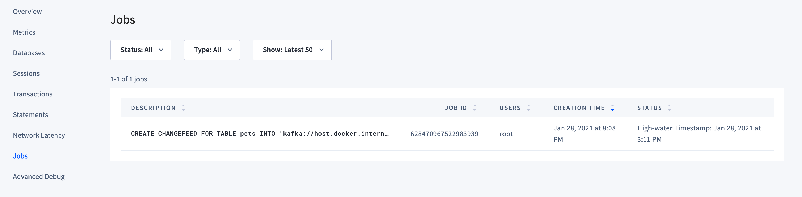

# Change Data Capture - Student Labs

## Overview

## Labs Prerequisites

1. Download CockroachDB binary following [these instructions](https://www.cockroachlabs.com/docs/stable/install-cockroachdb.html).
    Below example for linux:

    ```bash
    wget -qO- https://binaries.cockroachdb.com/cockroach-latest.linux-amd64.tgz | tar xvz
    sudo cp -i cockroach-*.linux-amd64/cockroach /usr/local/bin/
    ```

    Then start a single node cluster

    ```bash
    cockroach start-single-node --insecure --background
    ```

2. You also need:

    - a modern web browser,
    - a SQL client:
      - [Cockroach SQL client](https://www.cockroachlabs.com/docs/stable/install-cockroachdb-linux)
      - `psql`
      - [DBeaver Community edition](https://dbeaver.io/download/) (SQL tool with built-in CockroachDB plugin)

3. Download Apache Kafka from the [official website](https://kafka.apache.org/). Go to the **Download** page, search for the latest binary for Scala 2.13 and copy the mirror URL, example below

    ```bash
    # this is the closest mirror for Apache Kafka 2.7.0 built with Scala 2.13
    wget https://mirrors.sonic.net/apache/kafka/2.7.0/kafka_2.13-2.7.0.tgz

    tar xvf kafka_2.13-2.7.0.tgz
    cd kafka_2.13-2.7.0

    # install Java
    # below on Ubuntu 20.04
    sudo apt update
    sudo apt install -y default-jre
    ```

## Lab 0 - Start Apache Kafka

Open one more terminal, the Kafka Terminal, and `cd` into the `kafka` directory.

In the Kafka Terminal, start `zookeper` and the Kafka server in the background:

```bash
# zookeeper
bin/zookeeper-server-start.sh config/zookeeper.properties & > /dev/null 2>&1
# kafka server
bin/kafka-server-start.sh config/server.properties & > /dev/null 2>&1
```

Then, create a topic and start the producer

```bash
# create topic 'cockroach'
bin/kafka-topics.sh --create --topic cockroach --bootstrap-server localhost:9092  

# start producer to topic 'cockroach'
bin/kafka-console-producer.sh --topic cockroach --bootstrap-server localhost:9092  
```

At the prompt, send any string to the Kafka brokers

```bash
>Hello!
>
```

Ctrl+C to exit the Producer, then start the Consumer, from where you will read the incoming records

```bash
# start consumer
bin/kafka-console-consumer.sh --topic cockroach --from-beginning --bootstrap-server localhost:9092
[...]
Hello!
```

Good, if the Consumer received the string you sent, Kafka is ready!

### Kafka Reference Commands

```bash
# List Topics
bin/kafka-topics.sh --list --bootstrap-server localhost:9092

# Delete Topics
bin/kafka-topics.sh --bootstrap-server localhost:9092 --delete --topic topic-name
```

## Lab 1 - Connect to database and create data

Open the SQL Terminal and connect to the database

```bash
# use cockroach sql, defaults to localhost:26257
cockroach sql --insecure

# or use the --url param for any another host:
cockroach sql --url "postgresql://localhost:26257/defaultdb?sslmode=disable"

# or use psql
psql -h localhost -p 26257 -U root defaultdb
```

Enable `rangefeed` on cluster, then create a simple table

```sql
-- set the enterprise license
SET CLUSTER SETTING cluster.organization = "companyname";
SET CLUSTER SETTING enterprise.license = "xxxyyyzzz";

-- enable rangefeed
SET CLUSTER SETTING kv.rangefeed.enabled = 'true';

CREATE TABLE pets (
    id UUID NOT NULL DEFAULT gen_random_uuid(),
    person_name string,
    email string,
    pet_name string 
);
```

Create the changefeed with some special options.

The [`CREATE CHANGEFEED` statement](https://www.cockroachlabs.com/docs/stable/create-changefeed) creates a new changefeed, which targets an allowlist of tables, called "watched rows".
Every change to a watched row is emitted as a record in a configurable format (JSON by default) to a configurable sink, Kafka in this case.

The `updated` option adds an "updated" timestamp to each emitted row.

The `resolved` timestamp is a guarantee that no (previously unseen) rows with a lower update timestamp will be emitted on that partition.

We use `diff` to publish a `before` field with each message, which includes the value of the row before the update was applied.
At present, every row is sent across even if just one column updated. Thus, we need to be careful to use this option if we have very large tables.

With `schema_change_policy` set to `backfill`, when schema changes with column backfill are finished, we output all watched rows using the new schema. This is the default be we'll explicitly set anyway.

```sql
CREATE CHANGEFEED FOR TABLE pets
  INTO 'kafka://localhost:9092'
  WITH updated, 
    resolved='20s',
    diff,
    schema_change_policy=backfill;
```

```text
        job_id
----------------------
  628470967522983939
(1 row)
```

Verify the Changefeed is running

```sql
SHOW JOBS;
```

```text
        job_id       |  job_type  |                                                                    description                                                                    | statement | user_name | status  | running_status |             created              |             started              | finished |             modified             | fraction_completed | error | coordinator_id
---------------------+------------+---------------------------------------------------------------------------------------------------------------------------------------------------+-----------+-----------+---------+----------------+----------------------------------+----------------------------------+----------+----------------------------------+--------------------+-------+-----------------
  628470967522983939 | CHANGEFEED | CREATE CHANGEFEED FOR TABLE pets INTO 'kafka://host.docker.internal:9092' WITH diff, resolved = '20s', schema_change_policy = 'backfill', updated |           | root      | running | NULL           | 2021-01-28 20:08:38.506751+00:00 | 2021-01-28 20:08:38.624373+00:00 | NULL     | 2021-01-28 20:09:20.255186+00:00 | NULL               |       |           NULL
(1 row)
```

You can confirm the same from the **DB Console** Jobs page



## Lab 2 - Insert data and check incoming kafka records

In the Kafka terminal, stop the current process and start the consumer again this time listening to topic `pets`, the name of the table.

```bash
bin/kafka-console-consumer.sh --topic pets --from-beginning --bootstrap-server localhost:9092
```

On the SQL Terminal, insert some data

```sql
INSERT INTO pets (person_name, email, pet_name) VALUES ('Christopher', 'crobin@100acrewoods.com', 'Pooh');
INSERT INTO pets (person_name, email, pet_name) VALUES ('Christopher', 'crobin@100acrewoods.com', 'Tigger');
INSERT INTO pets (person_name, email, pet_name) VALUES ('Christopher', 'crobin@100acrewoods.com', 'Piglet');
INSERT INTO pets (person_name, email, pet_name) VALUES ('Walt', 'walt@disney.com', 'Mickey');
INSERT INTO pets (person_name, email, pet_name) VALUES ('Walt', 'walt@disney.com', 'Minnie');
```

```json
{
    "after": {
        "email": "crobin@100acrewoods.com",
        "id": "a8edfeda-8b33-4903-93c4-b79268845114",
        "person_name": "Christopher",
        "pet_name": "Pooh",
        "rowid": 628673502636244993
    },
    "before": null,
    "updated": "1611926327317651000.0000000000"
}
{
    "after": {
        "email": "crobin@100acrewoods.com",
        "id": "1693d422-221a-4bff-b12a-0bbfeb05e6dc",
        "person_name": "Christopher",
        "pet_name": "Tigger",
        "rowid": 628673748635222017
    },
    "before": null,
    "updated": "1611926402390626000.0000000000"
}
{
    "after": {
        "email": "crobin@100acrewoods.com",
        "id": "ab6598c3-39b7-4ac8-9d03-7cd4a1341ed5",
        "person_name": "Christopher",
        "pet_name": "Piglet",
        "rowid": 628674331445231617
    },
    "before": null,
    "updated": "1611926580250148000.0000000000"
}
{
    "after": {
        "email": "walt@disney.com",
        "id": "cd767fd4-fd70-47de-b67b-e84036d7efef",
        "person_name": "Walt",
        "pet_name": "Mickey",
        "rowid": 628674439270563841
    },
    "before": null,
    "updated": "1611926613155842000.0000000000"
}
{
    "after": {
        "email": "walt@disney.com",
        "id": "821cf90d-9fd6-4a43-9899-f8ea1090b796",
        "person_name": "Walt",
        "pet_name": "Minnie",
        "rowid": 628674439395409921
    },
    "before": null,
    "updated": "1611926613194191000.0000000000"
}
{
    "resolved": "1611926612703324000.0000000000"
}
```

As expected, `before` is empty as these are **new** rows.

Every 20s, we will receive a `resolved` record which we can use to provide strong ordering and global consistency guarantees by buffering records in between timestamp closures.
In other words, `resolved` is a **checkpoint**.

## Lab 3 - Update rows

Now we try to update a row

```sql
UPDATE pets SET email = 'w.disney@disney.com' WHERE person_name = 'Walt';
```

```json
{
    "after": {
        "email": "w.disney@disney.com",
        "id": "bd8c6d81-e0eb-4540-95d3-b48d00a9961f",
        "person_name": "Walt",
        "pet_name": "Mickey",
        "rowid": 628729172185841665
    },
    "before": {
        "email": "walt@disney.com",
        "id": "bd8c6d81-e0eb-4540-95d3-b48d00a9961f",
        "person_name": "Walt",
        "pet_name": "Mickey",
        "rowid": 628729172185841665
    },
    "updated": "1611943365911060185.0000000000"
}
{
    "after": {
        "email": "w.disney@disney.com",
        "id": "e9a08e6e-8a71-4b92-ab37-a1f1a0c51109",
        "person_name": "Walt",
        "pet_name": "Minnie",
        "rowid": 628729172196392961
    },
    "before": {
        "email": "walt@disney.com",
        "id": "e9a08e6e-8a71-4b92-ab37-a1f1a0c51109",
        "person_name": "Walt",
        "pet_name": "Minnie",
        "rowid": 628729172196392961
    },
    "updated": "1611943365911060185.0000000000"
}
```

As expected, the `before` dictionary is populated with the previous values.

## Lab 4 - Add Column for City

Let's add a column. Note that we don't specify a DEFAULT value, so no new data has been added yet, thus no data is sent to the changefeed.

```sql
ALTER TABLE pets ADD COLUMN city STRING;
```

Let's update the city column with some values

```sql
UPDATE pets SET city='Hundred Acre Woods' WHERE person_name = 'Christopher';
UPDATE pets SET city='Anaheim' WHERE person_name = 'Walt';
```

```json
{
    "after": {
        "city": "Hundred Acre Woods",
        "email": "crobin@100acrewoods.com",
        "id": "a8edfeda-8b33-4903-93c4-b79268845114",
        "person_name": "Christopher",
        "pet_name": "Pooh",
        "rowid": 628673502636244993
    },
    "before": {
        "city": null,
        "email": "crobin@100acrewoods.com",
        "id": "a8edfeda-8b33-4903-93c4-b79268845114",
        "person_name": "Christopher",
        "pet_name": "Pooh",
        "rowid": 628673502636244993
    },
    "updated": "1611927085406966000.0000000000"
}
{
    "after": {
        "city": "Hundred Acre Woods",
        "email": "crobin@100acrewoods.com",
        "id": "1693d422-221a-4bff-b12a-0bbfeb05e6dc",
        "person_name": "Christopher",
        "pet_name": "Tigger",
        "rowid": 628673748635222017
    },
    "before": {
        "city": null,
        "email": "crobin@100acrewoods.com",
        "id": "1693d422-221a-4bff-b12a-0bbfeb05e6dc",
        "person_name": "Christopher",
        "pet_name": "Tigger",
        "rowid": 628673748635222017
    },
    "updated": "1611927085406966000.0000000000"
}
{
    "after": {
        "city": "Hundred Acre Woods",
        "email": "crobin@100acrewoods.com",
        "id": "ab6598c3-39b7-4ac8-9d03-7cd4a1341ed5",
        "person_name": "Christopher",
        "pet_name": "Piglet",
        "rowid": 628674331445231617
    },
    "before": {
        "city": null,
        "email": "crobin@100acrewoods.com",
        "id": "ab6598c3-39b7-4ac8-9d03-7cd4a1341ed5",
        "person_name": "Christopher",
        "pet_name": "Piglet",
        "rowid": 628674331445231617
    },
    "updated": "1611927085406966000.0000000000"
}
{
    "after": {
        "city": "Anaheim",
        "email": "w.disney@disney.com",
        "id": "cd767fd4-fd70-47de-b67b-e84036d7efef",
        "person_name": "Walt",
        "pet_name": "Mickey",
        "rowid": 628674439270563841
    },
    "before": {
        "city": null,
        "email": "w.disney@disney.com",
        "id": "cd767fd4-fd70-47de-b67b-e84036d7efef",
        "person_name": "Walt",
        "pet_name": "Mickey",
        "rowid": 628674439270563841
    },
    "updated": "1611927085470704000.0000000000"
}
{
    "after": {
        "city": "Anaheim",
        "email": "w.disney@disney.com",
        "id": "821cf90d-9fd6-4a43-9899-f8ea1090b796",
        "person_name": "Walt",
        "pet_name": "Minnie",
        "rowid": 628674439395409921
    },
    "before": {
        "city": null,
        "email": "w.disney@disney.com",
        "id": "821cf90d-9fd6-4a43-9899-f8ea1090b796",
        "person_name": "Walt",
        "pet_name": "Minnie",
        "rowid": 628674439395409921
    },
    "updated": "1611927085470704000.0000000000"
}
```

Now we can see `before` populated. Again, the changefeed emits every column.

Let's create a new column with a DEFAULT value

```sql
 ALTER TABLE pets ADD COLUMN state STRING DEFAULT 'CA'; 
```

```json
{
    "after": {
        "city": "Hundred Acre Woods",
        "email": "crobin@100acrewoods.com",
        "id": "2df03e2a-59d0-4569-b12e-0a4343d82a13",
        "person_name": "Christopher",
        "pet_name": "Tigger",
        "rowid": 628729172161527809,
        "state": "CA"
    },
    "before": {
        "city": "Hundred Acre Woods",
        "email": "crobin@100acrewoods.com",
        "id": "2df03e2a-59d0-4569-b12e-0a4343d82a13",
        "person_name": "Christopher",
        "pet_name": "Tigger",
        "rowid": 628729172161527809
    },
    "updated": "1611943679503780624.0000000000"
}
{
    "after": {
        "city": "Hundred Acre Woods",
        "email": "crobin@100acrewoods.com",
        "id": "e0308555-503c-4fd8-aea5-56ba5deb6db9",
        "person_name": "Christopher",
        "pet_name": "Piglet",
        "rowid": 628729172173160449,
        "state": "CA"
    },
    "before": {
        "city": "Hundred Acre Woods",
        "email": "crobin@100acrewoods.com",
        "id": "e0308555-503c-4fd8-aea5-56ba5deb6db9",
        "person_name": "Christopher",
        "pet_name": "Piglet",
        "rowid": 628729172173160449
    },
    "updated": "1611943679503780624.0000000000"
}
{
    "after": {
        "city": "Anaheim",
        "email": "w.disney@disney.com",
        "id": "bd8c6d81-e0eb-4540-95d3-b48d00a9961f",
        "person_name": "Walt",
        "pet_name": "Mickey",
        "rowid": 628729172185841665,
        "state": "CA"
    },
    "before": {
        "city": "Anaheim",
        "email": "w.disney@disney.com",
        "id": "bd8c6d81-e0eb-4540-95d3-b48d00a9961f",
        "person_name": "Walt",
        "pet_name": "Mickey",
        "rowid": 628729172185841665
    },
    "updated": "1611943679503780624.0000000000"
}
{
    "after": {
        "city": "Anaheim",
        "email": "w.disney@disney.com",
        "id": "e9a08e6e-8a71-4b92-ab37-a1f1a0c51109",
        "person_name": "Walt",
        "pet_name": "Minnie",
        "rowid": 628729172196392961,
        "state": "CA"
    },
    "before": {
        "city": "Anaheim",
        "email": "w.disney@disney.com",
        "id": "e9a08e6e-8a71-4b92-ab37-a1f1a0c51109",
        "person_name": "Walt",
        "pet_name": "Minnie",
        "rowid": 628729172196392961
    },
    "updated": "1611943679503780624.0000000000"
}
```

As the new column does add data to the table, a new record is emitted for every row.

## Lab 5 - Cancel and Restart Changefeed

Changefeeds can not be altered, and cannot be backed up. To alter a changefeed, you have to cancel the Job and restart it.

We will modify the changefeed by removing the `before` dictionary.
Also, we want to start emitting CDC from a known timestamp, so we don't receive duplicate data.

Find the Job ID for the Changefeed.

```sql
SELECT job_id, description 
FROM [SHOW JOBS] 
WHERE job_type = 'CHANGEFEED' AND status = 'running';
```

```text
        job_id       |                                                              description
---------------------+-----------------------------------------------------------------------------------------------------------------------------------------
  628673297637244929 | CREATE CHANGEFEED FOR TABLE pets INTO 'kafka://localhost:9092' WITH diff, resolved = '20s', schema_change_policy = 'backfill', updated
(1 row)
```

Cancel the Job

```sql
CANCEL JOB 628673297637244929;
```

```text
CANCEL JOBS 1

Time: 159ms total (execution 159ms / network 0ms)
```

Use the Job ID to find the **high-water timestamp** for the ended changefeed

```sql
SELECT high_water_timestamp FROM crdb_internal.jobs WHERE job_id = 628673297637244929;
```

```text
       high_water_timestamp
----------------------------------
  1611930701424539000.0000000000
(1 row)
```

Use the `high_water_timestamp` value to start the new changefeed with the new options

```sql
CREATE CHANGEFEED FOR TABLE pets
  INTO 'kafka://localhost:9092'
  WITH updated, 
    resolved='20s',
    schema_change_policy=backfill,
    cursor = '1611930701424539000.000000000';
```

Confirm the Job started successfully

```sql
SELECT job_id, description 
FROM [SHOW JOBS] 
WHERE job_type = 'CHANGEFEED' AND status = 'running';
```

```text
        job_id       |                                                                                description
---------------------+-----------------------------------------------------------------------------------------------------------------------------------------------------------------------------
  628688992420495361 | CREATE CHANGEFEED FOR TABLE pets INTO 'kafka://localhost:9092' WITH cursor = '1611930701424539000.000000000', resolved = '20s', schema_change_policy = 'backfill', updated
(1 row)
```

Update and insert some values

```sql
INSERT INTO pets (person_name, email, pet_name) VALUES ('Donald Duck', 'donald@disney.com', 'Donald');

UPDATE pets SET city='100 Acre Woods' where person_name='Christopher';
```

```json
{
    "after": {
        "city": null,
        "email": "donald@disney.com",
        "id": "4ff832be-125d-4c65-bc3e-0419c9c6b3d0",
        "person_name": "Donald Duck",
        "pet_name": "Donald",
        "rowid": 628690087267368961
    },
    "updated": "1611931388545568000.0000000000"
}
{
    "after": {
        "city": "100 Acre Woods",
        "email": "crobin@100acrewoods.com",
        "id": "a8edfeda-8b33-4903-93c4-b79268845114",
        "person_name": "Christopher",
        "pet_name": "Pooh",
        "rowid": 628673502636244993
    },
    "updated": "1611931388588181000.0000000000"
}
{
    "after": {
        "city": "100 Acre Woods",
        "email": "crobin@100acrewoods.com",
        "id": "1693d422-221a-4bff-b12a-0bbfeb05e6dc",
        "person_name": "Christopher",
        "pet_name": "Tigger",
        "rowid": 628673748635222017
    },
    "updated": "1611931388588181000.0000000000"
}
{
    "after": {
        "city": "100 Acre Woods",
        "email": "crobin@100acrewoods.com",
        "id": "ab6598c3-39b7-4ac8-9d03-7cd4a1341ed5",
        "person_name": "Christopher",
        "pet_name": "Piglet",
        "rowid": 628674331445231617
    },
    "updated": "1611931388588181000.0000000000"
}
```

Congratulations, you reach the end of the labs!

## References

- [Stream data out using CDC](https://www.cockroachlabs.com/docs/stable/stream-data-out-of-cockroachdb-using-changefeeds.html)
- [CHANGEFEED](https://www.cockroachlabs.com/docs/stable/create-changefeed#options)
