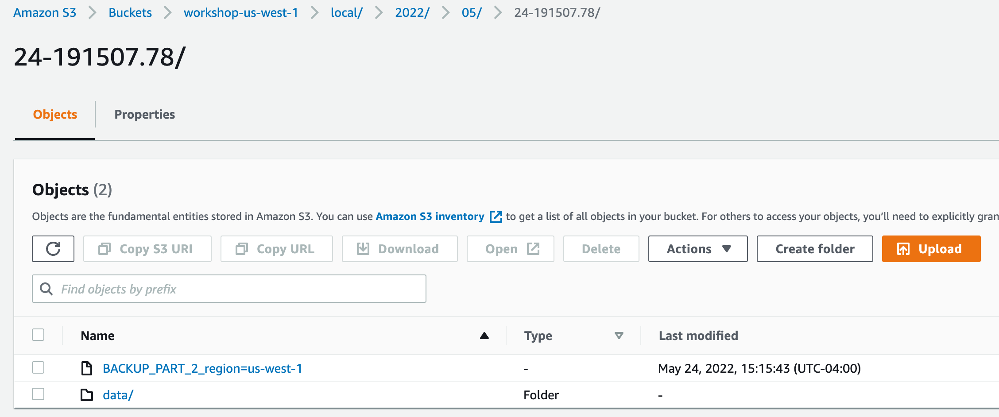

# Backup and Restore - Student Labs

In this demo we will familiarize with the Backup & Restore functionality in CockroachDB. We also include a write-up to understand the practice of Repaving.

## Overview

CockroachDB is by design fault tolerant and resilient, so Backup is only required for DR. Still, it is good practice to backup your entire database on at least a weekly basis with hourly/daily incremental backups.

You can read this excellent [blog post](https://www.cockroachlabs.com/blog/distributed-database-performance/) about how to architecture CockroachDB and the importance of Backups, but also how CockroachDB naturally brings RPO to zero.

## Labs Prerequisites

1. Access to AWS S3 and EC2

2. You also need:
    - a modern web browser,
    - a Terminal (Linux/Mac) or PowerShell (Windows)

## Lab 0 - Setup

Open the AWS Console and create 3 buckets, one for each region used in the CockroachDB cluster.
In this demo, we use the following buckets:

- workshop-us-east-1
- workshop-us-east-2
- workshop-us-west-1


Now, create the CockroachDB cluster across 3 regions; 1 node per region is sufficient, and make sure the `locality` is setup correctly.

Here for example the locality of the demo cluster:


Also, make sure the EC2 instances are created with an instance role that has the following policy attached.

```text
{
    "Version": "2012-10-17",
    "Statement": [
        {
            "Sid": "VisualEditor0",
            "Effect": "Allow",
            "Action": "s3:*",
            "Resource": [
                "arn:aws:s3:::workshop-us-east-1/*",
                "arn:aws:s3:::workshop-us-east-1",
                "arn:aws:s3:::workshop-us-east-2/*",
                "arn:aws:s3:::workshop-us-east-2",
                "arn:aws:s3:::workshop-us-west-1/*",
                "arn:aws:s3:::workshop-us-west-1"
            ]
        }
    ]
}
```

This policy allows the ec2 instances to communicate with S3 without exposing the access keys.

Once the cluster is deployed, SSH into any of the CockroachDB nodes and create the dataset

```bash
cockroach workload init tpcc
```

This will take a few minutes to load. While it works, you can read about the `workload` function and the `tpcc` database in [here](https://www.cockroachlabs.com/docs/stable/cockroach-workload.html).

Once done, connect to the database

```bash
cockroach sql --insecure
```

Check the data was created correctly

```sql
SHOW DATABASES;
```

```text
  database_name | owner | primary_region | regions | survival_goal
----------------+-------+----------------+---------+----------------
  defaultdb     | root  | NULL           | {}      | NULL
  postgres      | root  | NULL           | {}      | NULL
  system        | node  | NULL           | {}      | NULL
  tpcc          | root  | NULL           | {}      | NULL
(4 rows)


Time: 14ms total (execution 14ms / network 0ms)
```

You can also check the **Databases** page in the DB Console at <http://<any-node-ip>:8080> for an overview of your databases and their size.


Good job, we are now ready to perform our first backup job.

## Lab 1 - Full Cluster Backup

In the `workshop-us-east-1` bucket, we create a bucket called `demo`.

Connect to the SQL client, then backup the entire cluster to S3.

```sql
BACKUP INTO 's3://workshop-us-east-1/demo?AUTH=implicit'
  AS OF SYSTEM TIME '-10s';
```

```text
        job_id       |  status   | fraction_completed |   rows   | index_entries |   bytes
---------------------+-----------+--------------------+----------+---------------+-------------
  764594124031229953 | succeeded |                  1 | 50007602 |       6000107 | 7238990915
(1 row)


Time: 29.051s total (execution 29.050s / network 0.000s)
```

Check the Job progress in the DB Console


Alternatively, you can also list the JOBS using SQL

```sql
-- create handy view
CREATE VIEW jobsview AS
SELECT
    job_id,
    job_type,
    substring(description, 0, 60) AS short_description,
    status,
    created,
    finished - started AS duration,
    fraction_completed AS pct_done,
    error
FROM [SHOW JOBS]
WHERE job_type != 'SCHEMA CHANGE GC';

-- query last 5 jobs
SELECT * FROM jobsview ORDER BY created DESC LIMIT 1;
```

```text
        job_id       | job_type |                      short_description                      |  status   |          created           |    duration     | pct_done | error
---------------------+----------+-------------------------------------------------------------+-----------+----------------------------+-----------------+----------+--------
  764594124031229953 | BACKUP   | BACKUP INTO '/2022/05/24-152639.13' IN 's3://workshop-us-ea | succeeded | 2022-05-24 15:26:49.136449 | 00:00:28.977442 |        1 |
(1 row)
```

Verify what was backed up remotely

```sql
SHOW BACKUPS IN 's3://workshop-us-east-1/demo?AUTH=implicit';
```

```text
          path
-------------------------
  /2022/05/24-152639.13
(1 row)
```

```sql
SHOW BACKUP '/2022/05/24-152639.13' IN 's3://workshop-us-east-1/demo?AUTH=implicit';
```

```text
  database_name | parent_schema_name |      object_name       | object_type | backup_type | start_time |          end_time          | size_bytes |   rows   | is_full_cluster
----------------+--------------------+------------------------+-------------+-------------+------------+----------------------------+------------+----------+------------------
  NULL          | NULL               | system                 | database    | full        | NULL       | 2022-05-24 15:26:39.136487 |       NULL |     NULL |      true
  system        | public             | users                  | table       | full        | NULL       | 2022-05-24 15:26:39.136487 |         99 |        2 |      true
  system        | public             | zones                  | table       | full        | NULL       | 2022-05-24 15:26:39.136487 |        236 |        8 |      true
  system        | public             | settings               | table       | full        | NULL       | 2022-05-24 15:26:39.136487 |        311 |        5 |      true
  system        | public             | ui                     | table       | full        | NULL       | 2022-05-24 15:26:39.136487 |        155 |        1 |      true
  system        | public             | jobs                   | table       | full        | NULL       | 2022-05-24 15:26:39.136487 |      45667 |       45 |      true
  system        | public             | locations              | table       | full        | NULL       | 2022-05-24 15:26:39.136487 |       3452 |       64 |      true
  system        | public             | role_members           | table       | full        | NULL       | 2022-05-24 15:26:39.136487 |         94 |        1 |      true
  system        | public             | comments               | table       | full        | NULL       | 2022-05-24 15:26:39.136487 |          0 |        0 |      true
  system        | public             | role_options           | table       | full        | NULL       | 2022-05-24 15:26:39.136487 |          0 |        0 |      true
  system        | public             | scheduled_jobs         | table       | full        | NULL       | 2022-05-24 15:26:39.136487 |        251 |        1 |      true
  system        | public             | database_role_settings | table       | full        | NULL       | 2022-05-24 15:26:39.136487 |          0 |        0 |      true
  system        | public             | tenant_settings        | table       | full        | NULL       | 2022-05-24 15:26:39.136487 |          0 |        0 |      true
  NULL          | NULL               | defaultdb              | database    | full        | NULL       | 2022-05-24 15:26:39.136487 |       NULL |     NULL |      true
  defaultdb     | NULL               | public                 | schema      | full        | NULL       | 2022-05-24 15:26:39.136487 |       NULL |     NULL |      true
  NULL          | NULL               | postgres               | database    | full        | NULL       | 2022-05-24 15:26:39.136487 |       NULL |     NULL |      true
  postgres      | NULL               | public                 | schema      | full        | NULL       | 2022-05-24 15:26:39.136487 |       NULL |     NULL |      true
  NULL          | NULL               | tpcc                   | database    | full        | NULL       | 2022-05-24 15:26:39.136487 |       NULL |     NULL |      true
  tpcc          | NULL               | public                 | schema      | full        | NULL       | 2022-05-24 15:26:39.136487 |       NULL |     NULL |      true
  tpcc          | public             | warehouse              | table       | full        | NULL       | 2022-05-24 15:26:39.136487 |       5260 |      100 |      true
  tpcc          | public             | district               | table       | full        | NULL       | 2022-05-24 15:26:39.136487 |     101389 |     1000 |      true
  tpcc          | public             | customer               | table       | full        | NULL       | 2022-05-24 15:26:39.136487 | 1841491350 |  3000093 |      true
  tpcc          | public             | history                | table       | full        | NULL       | 2022-05-24 15:26:39.136487 |  226045989 |  3000013 |      true
  tpcc          | public             | order                  | table       | full        | NULL       | 2022-05-24 15:26:39.136487 |  163465000 |  3000005 |      true
  tpcc          | public             | new_order              | table       | full        | NULL       | 2022-05-24 15:26:39.136487 |   12600000 |   900000 |      true
  tpcc          | public             | item                   | table       | full        | NULL       | 2022-05-24 15:26:39.136487 |    8253886 |   100000 |      true
  tpcc          | public             | stock                  | table       | full        | NULL       | 2022-05-24 15:26:39.136487 | 3217442720 | 10000183 |      true
  tpcc          | public             | order_line             | table       | full        | NULL       | 2022-05-24 15:26:39.136487 | 1769535056 | 30006081 |      true
(28 rows)
```

Very good! The output shows both the `system` and `tpcc` databases backups are safely stored in S3!

Check how the backup files are actually stored in AWS S3 server.


These are the files for our **Full Cluster** backup. In the next lab we will run an **incremental** backup and see how the files will be nicely organized.

You can learn a lot more about Cockroach Backup strategies [in the docs](https://www.cockroachlabs.com/docs/v20.2/take-full-and-incremental-backups.html), too!

## Lab 2 - Incremental Backup

We are so content with CockroachDB features and performance that we decided to deploy another app using CockroachDB as our backend!

Let us load another database

```bash
cockroach workload init bank
```

Confirm the database was created and data was loaded

```sql
SELECT * FROM bank.bank LIMIT 5;
```

```text
  id | balance |                                               payload
-----+---------+-------------------------------------------------------------------------------------------------------
   0 |       0 | initial-dTqnRurXztAPkykhZWvsCmeJkMwRNcJAvTlNbgUEYfagEQJaHmfPsquKZUBOGwpAjPtATpGXFJkrtQCEJODSlmQctvyh
   1 |       0 | initial-PCLGABqTvrtRNyhAyOhQdyLfVtCmRykQJSsdwqUFABkPOMQayVEhiAwzZKHpJUiNmVaWYZnReMKfONZvRKbTETaIDccE
   2 |       0 | initial-VNfyUJHfCmMeAUoTgoSVvnByDyvpHNPHDfVoNWdXBFQpwMOBgNVtNijyTjmecvFqyeLHlDbIBRrbCzSeiHWSLmWbhIvh
   3 |       0 | initial-llflzsVuQYUlfwlyoaqjdwKUNgNFVgvlnINeOUUVyfxyvmOiAelxqkTBfpBBziYVHgQLLEuCazSXmURnXBlCCfsOqeji
   4 |       0 | initial-rmGzVVucMqbYnBaccWilErbWvcatqBsWSXvrbxYUUEhmOnccXzvqcsGuMVJNBjmzKErJzEzzfCzNTmLQqhkrDUxdgqDD
```

With the new data added, let's take another backup.
As in the specified location there is already a Full Backup, Cockroach will create a separate directory and put the incremental backup files in there.

```sql
BACKUP INTO LATEST IN 's3://workshop-us-east-1/demo?AUTH=implicit'
  AS OF SYSTEM TIME '-10s';
```

Check the JOBS table to confirm the backup is complete

```sql
SELECT * FROM jobsview ORDER BY created DESC LIMIT 2;
```

```text
        job_id       | job_type |                      short_description                      |  status   |          created           |    duration     | pct_done | error
---------------------+----------+-------------------------------------------------------------+-----------+----------------------------+-----------------+----------+--------
  764596186123829249 | BACKUP   | BACKUP INTO '/2022/05/24-152639.13' IN 's3://workshop-us-ea | succeeded | 2022-05-24 15:37:18.437207 | 00:00:01.834882 |        1 |
  764594124031229953 | BACKUP   | BACKUP INTO '/2022/05/24-152639.13' IN 's3://workshop-us-ea | succeeded | 2022-05-24 15:26:49.136449 | 00:00:28.977442 |        1 |
(2 rows)


Time: 4ms total (execution 4ms / network 0ms)````

Check in S3 how the files are organized. You can see that there is a new directory `incremental`.


Now let's see the available backups at the new location

```sql
SHOW BACKUPS IN 's3://workshop-us-east-1/demo?AUTH=implicit';
```

Still only 1 path

```text
          path
-------------------------
  /2022/05/24-152639.13
(1 row)
```

Let's however pull again the details of that specific backup path

```sql
SHOW BACKUP '/2022/05/24-152639.13' IN 's3://workshop-us-east-1/demo?AUTH=implicit'; 
```

```text
  database_name | parent_schema_name |      object_name       | object_type | backup_type |         start_time         |          end_time          | size_bytes |   rows   | is_full_cluster
----------------+--------------------+------------------------+-------------+-------------+----------------------------+----------------------------+------------+----------+------------------
  NULL          | NULL               | system                 | database    | full        | NULL                       | 2022-05-24 15:26:39.136487 |       NULL |     NULL |      true
  system        | public             | users                  | table       | full        | NULL                       | 2022-05-24 15:26:39.136487 |         99 |        2 |      true
  system        | public             | zones                  | table       | full        | NULL                       | 2022-05-24 15:26:39.136487 |        236 |        8 |      true
  system        | public             | settings               | table       | full        | NULL                       | 2022-05-24 15:26:39.136487 |        311 |        5 |      true
  system        | public             | ui                     | table       | full        | NULL                       | 2022-05-24 15:26:39.136487 |        155 |        1 |      true
  system        | public             | jobs                   | table       | full        | NULL                       | 2022-05-24 15:26:39.136487 |      45667 |       45 |      true
  system        | public             | locations              | table       | full        | NULL                       | 2022-05-24 15:26:39.136487 |       3452 |       64 |      true
  system        | public             | role_members           | table       | full        | NULL                       | 2022-05-24 15:26:39.136487 |         94 |        1 |      true
  system        | public             | comments               | table       | full        | NULL                       | 2022-05-24 15:26:39.136487 |          0 |        0 |      true
  system        | public             | role_options           | table       | full        | NULL                       | 2022-05-24 15:26:39.136487 |          0 |        0 |      true
  system        | public             | scheduled_jobs         | table       | full        | NULL                       | 2022-05-24 15:26:39.136487 |        251 |        1 |      true
  system        | public             | database_role_settings | table       | full        | NULL                       | 2022-05-24 15:26:39.136487 |          0 |        0 |      true
  system        | public             | tenant_settings        | table       | full        | NULL                       | 2022-05-24 15:26:39.136487 |          0 |        0 |      true
  NULL          | NULL               | defaultdb              | database    | full        | NULL                       | 2022-05-24 15:26:39.136487 |       NULL |     NULL |      true
  defaultdb     | NULL               | public                 | schema      | full        | NULL                       | 2022-05-24 15:26:39.136487 |       NULL |     NULL |      true
  NULL          | NULL               | postgres               | database    | full        | NULL                       | 2022-05-24 15:26:39.136487 |       NULL |     NULL |      true
  postgres      | NULL               | public                 | schema      | full        | NULL                       | 2022-05-24 15:26:39.136487 |       NULL |     NULL |      true
  NULL          | NULL               | tpcc                   | database    | full        | NULL                       | 2022-05-24 15:26:39.136487 |       NULL |     NULL |      true
  tpcc          | NULL               | public                 | schema      | full        | NULL                       | 2022-05-24 15:26:39.136487 |       NULL |     NULL |      true
  tpcc          | public             | warehouse              | table       | full        | NULL                       | 2022-05-24 15:26:39.136487 |       5260 |      100 |      true
  tpcc          | public             | district               | table       | full        | NULL                       | 2022-05-24 15:26:39.136487 |     101389 |     1000 |      true
  tpcc          | public             | customer               | table       | full        | NULL                       | 2022-05-24 15:26:39.136487 | 1841491350 |  3000093 |      true
  tpcc          | public             | history                | table       | full        | NULL                       | 2022-05-24 15:26:39.136487 |  226045989 |  3000013 |      true
  tpcc          | public             | order                  | table       | full        | NULL                       | 2022-05-24 15:26:39.136487 |  163465000 |  3000005 |      true
  tpcc          | public             | new_order              | table       | full        | NULL                       | 2022-05-24 15:26:39.136487 |   12600000 |   900000 |      true
  tpcc          | public             | item                   | table       | full        | NULL                       | 2022-05-24 15:26:39.136487 |    8253886 |   100000 |      true
  tpcc          | public             | stock                  | table       | full        | NULL                       | 2022-05-24 15:26:39.136487 | 3217442720 | 10000183 |      true
  tpcc          | public             | order_line             | table       | full        | NULL                       | 2022-05-24 15:26:39.136487 | 1769535056 | 30006081 |      true
  NULL          | NULL               | system                 | database    | incremental | 2022-05-24 15:26:39.136487 | 2022-05-24 15:37:08.437249 |       NULL |     NULL |      true
  system        | public             | users                  | table       | incremental | 2022-05-24 15:26:39.136487 | 2022-05-24 15:37:08.437249 |          0 |        0 |      true
  system        | public             | zones                  | table       | incremental | 2022-05-24 15:26:39.136487 | 2022-05-24 15:37:08.437249 |          0 |        0 |      true
  system        | public             | settings               | table       | incremental | 2022-05-24 15:26:39.136487 | 2022-05-24 15:37:08.437249 |          0 |        0 |      true
  system        | public             | ui                     | table       | incremental | 2022-05-24 15:26:39.136487 | 2022-05-24 15:37:08.437249 |          0 |        0 |      true
  system        | public             | jobs                   | table       | incremental | 2022-05-24 15:26:39.136487 | 2022-05-24 15:37:08.437249 |       1923 |        3 |      true
  system        | public             | locations              | table       | incremental | 2022-05-24 15:26:39.136487 | 2022-05-24 15:37:08.437249 |          0 |        0 |      true
  system        | public             | role_members           | table       | incremental | 2022-05-24 15:26:39.136487 | 2022-05-24 15:37:08.437249 |          0 |        0 |      true
  system        | public             | comments               | table       | incremental | 2022-05-24 15:26:39.136487 | 2022-05-24 15:37:08.437249 |          0 |        0 |      true
  system        | public             | role_options           | table       | incremental | 2022-05-24 15:26:39.136487 | 2022-05-24 15:37:08.437249 |          0 |        0 |      true
  system        | public             | scheduled_jobs         | table       | incremental | 2022-05-24 15:26:39.136487 | 2022-05-24 15:37:08.437249 |          0 |        0 |      true
  system        | public             | database_role_settings | table       | incremental | 2022-05-24 15:26:39.136487 | 2022-05-24 15:37:08.437249 |          0 |        0 |      true
  system        | public             | tenant_settings        | table       | incremental | 2022-05-24 15:26:39.136487 | 2022-05-24 15:37:08.437249 |          0 |        0 |      true
  NULL          | NULL               | defaultdb              | database    | incremental | 2022-05-24 15:26:39.136487 | 2022-05-24 15:37:08.437249 |       NULL |     NULL |      true
  defaultdb     | NULL               | public                 | schema      | incremental | 2022-05-24 15:26:39.136487 | 2022-05-24 15:37:08.437249 |       NULL |     NULL |      true
  NULL          | NULL               | postgres               | database    | incremental | 2022-05-24 15:26:39.136487 | 2022-05-24 15:37:08.437249 |       NULL |     NULL |      true
  postgres      | NULL               | public                 | schema      | incremental | 2022-05-24 15:26:39.136487 | 2022-05-24 15:37:08.437249 |       NULL |     NULL |      true
  NULL          | NULL               | tpcc                   | database    | incremental | 2022-05-24 15:26:39.136487 | 2022-05-24 15:37:08.437249 |       NULL |     NULL |      true
  tpcc          | NULL               | public                 | schema      | incremental | 2022-05-24 15:26:39.136487 | 2022-05-24 15:37:08.437249 |       NULL |     NULL |      true
  tpcc          | public             | warehouse              | table       | incremental | 2022-05-24 15:26:39.136487 | 2022-05-24 15:37:08.437249 |          0 |        0 |      true
  tpcc          | public             | district               | table       | incremental | 2022-05-24 15:26:39.136487 | 2022-05-24 15:37:08.437249 |          0 |        0 |      true
  tpcc          | public             | customer               | table       | incremental | 2022-05-24 15:26:39.136487 | 2022-05-24 15:37:08.437249 |          0 |        0 |      true
  tpcc          | public             | history                | table       | incremental | 2022-05-24 15:26:39.136487 | 2022-05-24 15:37:08.437249 |          0 |        0 |      true
  tpcc          | public             | order                  | table       | incremental | 2022-05-24 15:26:39.136487 | 2022-05-24 15:37:08.437249 |          0 |        0 |      true
  tpcc          | public             | new_order              | table       | incremental | 2022-05-24 15:26:39.136487 | 2022-05-24 15:37:08.437249 |          0 |        0 |      true
  tpcc          | public             | item                   | table       | incremental | 2022-05-24 15:26:39.136487 | 2022-05-24 15:37:08.437249 |          0 |        0 |      true
  tpcc          | public             | stock                  | table       | incremental | 2022-05-24 15:26:39.136487 | 2022-05-24 15:37:08.437249 |          0 |        0 |      true
  tpcc          | public             | order_line             | table       | incremental | 2022-05-24 15:26:39.136487 | 2022-05-24 15:37:08.437249 |          0 |        0 |      true
  defaultdb     | public             | jobsview               | table       | incremental | 2022-05-24 15:26:39.136487 | 2022-05-24 15:37:08.437249 |          0 |        0 |      true
  NULL          | NULL               | bank                   | database    | incremental | 2022-05-24 15:26:39.136487 | 2022-05-24 15:37:08.437249 |       NULL |     NULL |      true
  bank          | NULL               | public                 | schema      | incremental | 2022-05-24 15:26:39.136487 | 2022-05-24 15:37:08.437249 |       NULL |     NULL |      true
  bank          | public             | bank                   | table       | incremental | 2022-05-24 15:26:39.136487 | 2022-05-24 15:37:08.437249 |     115634 |     1000 |      true
(60 rows)
```

Very good! We have not updated the `tpcc` database, so `size_bytes` shows zeros, but we can see that 2 rows for `bank` have been added.
Also, we can see that the start and end time define when the incremental backups have been taken.

Another "day" has passed. Let's take another incremental backup

```sql
-- ??? Who did this, what's going on?!?
UPDATE tpcc.customer 
  SET c_credit_lim = 1000000
  WHERE c_id = 1;


BACKUP INTO LATEST IN 's3://workshop-us-east-1/demo?AUTH=implicit'
  AS OF SYSTEM TIME '-10s';
```

Then view the backups

```text
  database_name | parent_schema_name |      object_name       | object_type | backup_type |         start_time         |          end_time          | size_bytes |   rows   | is_full_cluster
----------------+--------------------+------------------------+-------------+-------------+----------------------------+----------------------------+------------+----------+------------------
  NULL          | NULL               | system                 | database    | full        | NULL                       | 2022-05-24 15:26:39.136487 |       NULL |     NULL |      true
  system        | public             | users                  | table       | full        | NULL                       | 2022-05-24 15:26:39.136487 |         99 |        2 |      true
  system        | public             | zones                  | table       | full        | NULL                       | 2022-05-24 15:26:39.136487 |        236 |        8 |      true
  system        | public             | settings               | table       | full        | NULL                       | 2022-05-24 15:26:39.136487 |        311 |        5 |      true
  system        | public             | ui                     | table       | full        | NULL                       | 2022-05-24 15:26:39.136487 |        155 |        1 |      true
  system        | public             | jobs                   | table       | full        | NULL                       | 2022-05-24 15:26:39.136487 |      45667 |       45 |      true
  system        | public             | locations              | table       | full        | NULL                       | 2022-05-24 15:26:39.136487 |       3452 |       64 |      true
  system        | public             | role_members           | table       | full        | NULL                       | 2022-05-24 15:26:39.136487 |         94 |        1 |      true
  system        | public             | comments               | table       | full        | NULL                       | 2022-05-24 15:26:39.136487 |          0 |        0 |      true
  system        | public             | role_options           | table       | full        | NULL                       | 2022-05-24 15:26:39.136487 |          0 |        0 |      true
  system        | public             | scheduled_jobs         | table       | full        | NULL                       | 2022-05-24 15:26:39.136487 |        251 |        1 |      true
  system        | public             | database_role_settings | table       | full        | NULL                       | 2022-05-24 15:26:39.136487 |          0 |        0 |      true
  system        | public             | tenant_settings        | table       | full        | NULL                       | 2022-05-24 15:26:39.136487 |          0 |        0 |      true
  NULL          | NULL               | defaultdb              | database    | full        | NULL                       | 2022-05-24 15:26:39.136487 |       NULL |     NULL |      true
  defaultdb     | NULL               | public                 | schema      | full        | NULL                       | 2022-05-24 15:26:39.136487 |       NULL |     NULL |      true
  NULL          | NULL               | postgres               | database    | full        | NULL                       | 2022-05-24 15:26:39.136487 |       NULL |     NULL |      true
  postgres      | NULL               | public                 | schema      | full        | NULL                       | 2022-05-24 15:26:39.136487 |       NULL |     NULL |      true
  NULL          | NULL               | tpcc                   | database    | full        | NULL                       | 2022-05-24 15:26:39.136487 |       NULL |     NULL |      true
  tpcc          | NULL               | public                 | schema      | full        | NULL                       | 2022-05-24 15:26:39.136487 |       NULL |     NULL |      true
  tpcc          | public             | warehouse              | table       | full        | NULL                       | 2022-05-24 15:26:39.136487 |       5260 |      100 |      true
  tpcc          | public             | district               | table       | full        | NULL                       | 2022-05-24 15:26:39.136487 |     101389 |     1000 |      true
  tpcc          | public             | customer               | table       | full        | NULL                       | 2022-05-24 15:26:39.136487 | 1841491350 |  3000093 |      true
  tpcc          | public             | history                | table       | full        | NULL                       | 2022-05-24 15:26:39.136487 |  226045989 |  3000013 |      true
  tpcc          | public             | order                  | table       | full        | NULL                       | 2022-05-24 15:26:39.136487 |  163465000 |  3000005 |      true
  tpcc          | public             | new_order              | table       | full        | NULL                       | 2022-05-24 15:26:39.136487 |   12600000 |   900000 |      true
  tpcc          | public             | item                   | table       | full        | NULL                       | 2022-05-24 15:26:39.136487 |    8253886 |   100000 |      true
  tpcc          | public             | stock                  | table       | full        | NULL                       | 2022-05-24 15:26:39.136487 | 3217442720 | 10000183 |      true
  tpcc          | public             | order_line             | table       | full        | NULL                       | 2022-05-24 15:26:39.136487 | 1769535056 | 30006081 |      true
  NULL          | NULL               | system                 | database    | incremental | 2022-05-24 15:26:39.136487 | 2022-05-24 15:37:08.437249 |       NULL |     NULL |      true
  system        | public             | users                  | table       | incremental | 2022-05-24 15:26:39.136487 | 2022-05-24 15:37:08.437249 |          0 |        0 |      true
  system        | public             | zones                  | table       | incremental | 2022-05-24 15:26:39.136487 | 2022-05-24 15:37:08.437249 |          0 |        0 |      true
  system        | public             | settings               | table       | incremental | 2022-05-24 15:26:39.136487 | 2022-05-24 15:37:08.437249 |          0 |        0 |      true
  system        | public             | ui                     | table       | incremental | 2022-05-24 15:26:39.136487 | 2022-05-24 15:37:08.437249 |          0 |        0 |      true
  system        | public             | jobs                   | table       | incremental | 2022-05-24 15:26:39.136487 | 2022-05-24 15:37:08.437249 |       1923 |        3 |      true
  system        | public             | locations              | table       | incremental | 2022-05-24 15:26:39.136487 | 2022-05-24 15:37:08.437249 |          0 |        0 |      true
  system        | public             | role_members           | table       | incremental | 2022-05-24 15:26:39.136487 | 2022-05-24 15:37:08.437249 |          0 |        0 |      true
  system        | public             | comments               | table       | incremental | 2022-05-24 15:26:39.136487 | 2022-05-24 15:37:08.437249 |          0 |        0 |      true
  system        | public             | role_options           | table       | incremental | 2022-05-24 15:26:39.136487 | 2022-05-24 15:37:08.437249 |          0 |        0 |      true
  system        | public             | scheduled_jobs         | table       | incremental | 2022-05-24 15:26:39.136487 | 2022-05-24 15:37:08.437249 |          0 |        0 |      true
  system        | public             | database_role_settings | table       | incremental | 2022-05-24 15:26:39.136487 | 2022-05-24 15:37:08.437249 |          0 |        0 |      true
  system        | public             | tenant_settings        | table       | incremental | 2022-05-24 15:26:39.136487 | 2022-05-24 15:37:08.437249 |          0 |        0 |      true
  NULL          | NULL               | defaultdb              | database    | incremental | 2022-05-24 15:26:39.136487 | 2022-05-24 15:37:08.437249 |       NULL |     NULL |      true
  defaultdb     | NULL               | public                 | schema      | incremental | 2022-05-24 15:26:39.136487 | 2022-05-24 15:37:08.437249 |       NULL |     NULL |      true
  NULL          | NULL               | postgres               | database    | incremental | 2022-05-24 15:26:39.136487 | 2022-05-24 15:37:08.437249 |       NULL |     NULL |      true
  postgres      | NULL               | public                 | schema      | incremental | 2022-05-24 15:26:39.136487 | 2022-05-24 15:37:08.437249 |       NULL |     NULL |      true
  NULL          | NULL               | tpcc                   | database    | incremental | 2022-05-24 15:26:39.136487 | 2022-05-24 15:37:08.437249 |       NULL |     NULL |      true
  tpcc          | NULL               | public                 | schema      | incremental | 2022-05-24 15:26:39.136487 | 2022-05-24 15:37:08.437249 |       NULL |     NULL |      true
  tpcc          | public             | warehouse              | table       | incremental | 2022-05-24 15:26:39.136487 | 2022-05-24 15:37:08.437249 |          0 |        0 |      true
  tpcc          | public             | district               | table       | incremental | 2022-05-24 15:26:39.136487 | 2022-05-24 15:37:08.437249 |          0 |        0 |      true
  tpcc          | public             | customer               | table       | incremental | 2022-05-24 15:26:39.136487 | 2022-05-24 15:37:08.437249 |          0 |        0 |      true
  tpcc          | public             | history                | table       | incremental | 2022-05-24 15:26:39.136487 | 2022-05-24 15:37:08.437249 |          0 |        0 |      true
  tpcc          | public             | order                  | table       | incremental | 2022-05-24 15:26:39.136487 | 2022-05-24 15:37:08.437249 |          0 |        0 |      true
  tpcc          | public             | new_order              | table       | incremental | 2022-05-24 15:26:39.136487 | 2022-05-24 15:37:08.437249 |          0 |        0 |      true
  tpcc          | public             | item                   | table       | incremental | 2022-05-24 15:26:39.136487 | 2022-05-24 15:37:08.437249 |          0 |        0 |      true
  tpcc          | public             | stock                  | table       | incremental | 2022-05-24 15:26:39.136487 | 2022-05-24 15:37:08.437249 |          0 |        0 |      true
  tpcc          | public             | order_line             | table       | incremental | 2022-05-24 15:26:39.136487 | 2022-05-24 15:37:08.437249 |          0 |        0 |      true
  defaultdb     | public             | jobsview               | table       | incremental | 2022-05-24 15:26:39.136487 | 2022-05-24 15:37:08.437249 |          0 |        0 |      true
  NULL          | NULL               | bank                   | database    | incremental | 2022-05-24 15:26:39.136487 | 2022-05-24 15:37:08.437249 |       NULL |     NULL |      true
  bank          | NULL               | public                 | schema      | incremental | 2022-05-24 15:26:39.136487 | 2022-05-24 15:37:08.437249 |       NULL |     NULL |      true
  bank          | public             | bank                   | table       | incremental | 2022-05-24 15:26:39.136487 | 2022-05-24 15:37:08.437249 |     115634 |     1000 |      true
  NULL          | NULL               | system                 | database    | incremental | 2022-05-24 15:37:08.437249 | 2022-05-24 15:45:22.847397 |       NULL |     NULL |      true
  system        | public             | users                  | table       | incremental | 2022-05-24 15:37:08.437249 | 2022-05-24 15:45:22.847397 |          0 |        0 |      true
  system        | public             | zones                  | table       | incremental | 2022-05-24 15:37:08.437249 | 2022-05-24 15:45:22.847397 |          0 |        0 |      true
  system        | public             | settings               | table       | incremental | 2022-05-24 15:37:08.437249 | 2022-05-24 15:45:22.847397 |          0 |        0 |      true
  system        | public             | ui                     | table       | incremental | 2022-05-24 15:37:08.437249 | 2022-05-24 15:45:22.847397 |          0 |        0 |      true
  system        | public             | jobs                   | table       | incremental | 2022-05-24 15:37:08.437249 | 2022-05-24 15:45:22.847397 |        809 |        2 |      true
  system        | public             | locations              | table       | incremental | 2022-05-24 15:37:08.437249 | 2022-05-24 15:45:22.847397 |          0 |        0 |      true
  system        | public             | role_members           | table       | incremental | 2022-05-24 15:37:08.437249 | 2022-05-24 15:45:22.847397 |          0 |        0 |      true
  system        | public             | comments               | table       | incremental | 2022-05-24 15:37:08.437249 | 2022-05-24 15:45:22.847397 |          0 |        0 |      true
  system        | public             | role_options           | table       | incremental | 2022-05-24 15:37:08.437249 | 2022-05-24 15:45:22.847397 |          0 |        0 |      true
  system        | public             | scheduled_jobs         | table       | incremental | 2022-05-24 15:37:08.437249 | 2022-05-24 15:45:22.847397 |          0 |        0 |      true
  system        | public             | database_role_settings | table       | incremental | 2022-05-24 15:37:08.437249 | 2022-05-24 15:45:22.847397 |          0 |        0 |      true
  system        | public             | tenant_settings        | table       | incremental | 2022-05-24 15:37:08.437249 | 2022-05-24 15:45:22.847397 |          0 |        0 |      true
  NULL          | NULL               | defaultdb              | database    | incremental | 2022-05-24 15:37:08.437249 | 2022-05-24 15:45:22.847397 |       NULL |     NULL |      true
  defaultdb     | NULL               | public                 | schema      | incremental | 2022-05-24 15:37:08.437249 | 2022-05-24 15:45:22.847397 |       NULL |     NULL |      true
  NULL          | NULL               | postgres               | database    | incremental | 2022-05-24 15:37:08.437249 | 2022-05-24 15:45:22.847397 |       NULL |     NULL |      true
  postgres      | NULL               | public                 | schema      | incremental | 2022-05-24 15:37:08.437249 | 2022-05-24 15:45:22.847397 |       NULL |     NULL |      true
  NULL          | NULL               | tpcc                   | database    | incremental | 2022-05-24 15:37:08.437249 | 2022-05-24 15:45:22.847397 |       NULL |     NULL |      true
  tpcc          | NULL               | public                 | schema      | incremental | 2022-05-24 15:37:08.437249 | 2022-05-24 15:45:22.847397 |       NULL |     NULL |      true
  tpcc          | public             | warehouse              | table       | incremental | 2022-05-24 15:37:08.437249 | 2022-05-24 15:45:22.847397 |          0 |        0 |      true
  tpcc          | public             | district               | table       | incremental | 2022-05-24 15:37:08.437249 | 2022-05-24 15:45:22.847397 |          0 |        0 |      true
  tpcc          | public             | customer               | table       | incremental | 2022-05-24 15:37:08.437249 | 2022-05-24 15:45:22.847397 |     564812 |     1000 |      true
  tpcc          | public             | history                | table       | incremental | 2022-05-24 15:37:08.437249 | 2022-05-24 15:45:22.847397 |          0 |        0 |      true
  tpcc          | public             | order                  | table       | incremental | 2022-05-24 15:37:08.437249 | 2022-05-24 15:45:22.847397 |          0 |        0 |      true
  tpcc          | public             | new_order              | table       | incremental | 2022-05-24 15:37:08.437249 | 2022-05-24 15:45:22.847397 |          0 |        0 |      true
  tpcc          | public             | item                   | table       | incremental | 2022-05-24 15:37:08.437249 | 2022-05-24 15:45:22.847397 |          0 |        0 |      true
  tpcc          | public             | stock                  | table       | incremental | 2022-05-24 15:37:08.437249 | 2022-05-24 15:45:22.847397 |          0 |        0 |      true
  tpcc          | public             | order_line             | table       | incremental | 2022-05-24 15:37:08.437249 | 2022-05-24 15:45:22.847397 |          0 |        0 |      true
  defaultdb     | public             | jobsview               | table       | incremental | 2022-05-24 15:37:08.437249 | 2022-05-24 15:45:22.847397 |          0 |        0 |      true
  NULL          | NULL               | bank                   | database    | incremental | 2022-05-24 15:37:08.437249 | 2022-05-24 15:45:22.847397 |       NULL |     NULL |      true
  bank          | NULL               | public                 | schema      | incremental | 2022-05-24 15:37:08.437249 | 2022-05-24 15:45:22.847397 |       NULL |     NULL |      true
  bank          | public             | bank                   | table       | incremental | 2022-05-24 15:37:08.437249 | 2022-05-24 15:45:22.847397 |          0 |        0 |      true
(92 rows)
```

The backup process looks good, but you got hacked! A malicious user has corrupted some of your data!!

```sql
SELECT c_credit_lim FROM tpcc.customer WHERE c_id = 1 LIMIT 10;
```

```text
 c_credit_lim
----------------
    1000000.00
    1000000.00
    1000000.00
    1000000.00
    1000000.00
    1000000.00
    1000000.00
    1000000.00
    1000000.00
    1000000.00
(10 rows)
```

Now what?

## Lab 3 - Restore a database

After careful consideration, you decide that it's best to drop the database and restore from the last valid backup - the 2nd incremental backup - with `enddate` = `2022-05-24 15:37:08.437249`.

```sql
-- this can take 2-3 minutes
DROP DATABASE tpcc CASCADE;

-- check note below re timestamp precision - notice I added a trailing 5 to the microseconds...
RESTORE DATABASE tpcc
FROM LATEST IN 's3://workshop-us-east-1/demo?AUTH=implicit'
  AS OF SYSTEM TIME '2022-05-24 15:37:08.437249';
```

```text
        job_id       |  status   | fraction_completed |   rows   | index_entries |   bytes
---------------------+-----------+--------------------+----------+---------------+-------------
  764599796801142785 | succeeded |                  1 | 50007085 |       6000000 | 7247941750
(1 row)
```

**Please note:** you might get an error like below when you try to restore

```text
ERROR: invalid RESTORE timestamp: restoring to arbitrary time requires that BACKUP for requested time be created with 'revision_history' option. nearest BACKUP times are 2022-05-24 15:26:39.136487236 +0000 UTC or 2022-05-24 15:37:08.437249624 +0000 UTC
```

That's because the timestamp you entered is not exactly the `enddate` timestamp. Check the timestamp suggested in the error message. In this example, I have updated the enddate by adding a '624' to my microseconds.

```sql
--- verify the malicious user is gone
SELECT c_credit_lim FROM tpcc.customer WHERE c_id = 1 LIMIT 10;
```

```text
  c_credit_lim
----------------
      50000.00
      50000.00
      50000.00
      50000.00
      50000.00
      50000.00
      50000.00
      50000.00
      50000.00
      50000.00
(10 rows)
```

Good, you're back in business!

There are many ways in which you can manage your backups. Read the docs to find out more about:

- [Backups with revision history and restore from point in time](https://www.cockroachlabs.com/docs/v20.2/take-backups-with-revision-history-and-restore-from-a-point-in-time.html)
- [Encrypted Backup and Restore](https://www.cockroachlabs.com/docs/v20.2/take-and-restore-encrypted-backups.html)
- [Locality-aware Backups](https://www.cockroachlabs.com/docs/v20.2/take-and-restore-locality-aware-backups.html)
- [Scheduling Backups](https://www.cockroachlabs.com/docs/v20.2/manage-a-backup-schedule.html)

## Lab 4 - Automate backup jobs

You are happy with the way your backups are taken and you want to automate this process with the following schedule:

- daily at midnight: Full Cluster backup
- hourly: incremental backup

You can run this schedule from CockroachDB directly, without using tools like `cron` or `anacron`. Run below statement

```sql
CREATE SCHEDULE weekly
  FOR BACKUP INTO 's3://workshop-us-east-1/weekly?AUTH=implicit'
    WITH revision_history
    RECURRING '@hourly'
    FULL BACKUP '@daily'
    WITH SCHEDULE OPTIONS first_run = 'now';
```

```text
     schedule_id     | label  |                     status                     |           first_run           | schedule |                                        backup_stmt
---------------------+--------+------------------------------------------------+-------------------------------+----------+---------------------------------------------------------------------------------------------
  764635942894501889 | weekly | PAUSED: Waiting for initial backup to complete | NULL                          | @hourly  | BACKUP INTO 's3://workshop-us-east-1/weekly?AUTH=implicit' WITH revision_history, detached
  764635943065354241 | weekly | ACTIVE                                         | 2022-05-24 18:59:31.113695+00 | @daily   | BACKUP INTO 's3://workshop-us-east-1/weekly?AUTH=implicit' WITH revision_history, detached
(2 rows)
```

Confirm the schedule looks good, check the `next_run` column

```sql
SHOW SCHEDULES;
```

```text
          id         |        label         | schedule_status |        next_run        |   state   | recurrence | jobsrunning | owner |            created            |                                                                                            command
---------------------+----------------------+-----------------+------------------------+-----------+------------+-------------+-------+-------------------------------+------------------------------------------------------------------------------------------------------------------------------------------------------------------------------------------------
  764581162389667841 | sql-stats-compaction | ACTIVE          | 2022-05-24 20:00:00+00 | succeeded | @hourly    |           0 | node  | 2022-05-24 14:20:53.541426+00 | {}
  764635942894501889 | weekly               | ACTIVE          | 2022-05-24 20:00:00+00 | NULL      | @hourly    |           0 | root  | 2022-05-24 18:59:31.113709+00 | {"backup_statement": "BACKUP INTO LATEST IN \'s3://workshop-us-east-1/weekly?AUTH=implicit\' WITH revision_history, detached", "backup_type": 1, "dependent_schedule_id": 764635943065354241}
  764635943065354241 | weekly               | ACTIVE          | 2022-05-25 00:00:00+00 | NULL      | @daily     |           0 | root  | 2022-05-24 18:59:31.113709+00 | {"backup_statement": "BACKUP INTO \'s3://workshop-us-east-1/weekly?AUTH=implicit\' WITH revision_history, detached", "dependent_schedule_id": 764635942894501889}
(3 rows)
```

As we set the `first_run` to `now`, the first backup job was started, and most likely it just finished, confirm in the DB Console > Jobs page.
Being the first backup, this is necessarely a Full Backup regardless of the schedule.

Let's verify we can see the first backup

```sql
SHOW BACKUPS IN 's3://workshop-us-east-1/weekly?AUTH=implicit';
```

```text
          path
-------------------------
  /2022/05/24-185931.11
(1 row)
```

```sql
SHOW BACKUP '/2022/05/24-185931.11' IN 's3://workshop-us-east-1/weekly?AUTH=implicit';
```

```text
  database_name | parent_schema_name |      object_name       | object_type | backup_type | start_time |          end_time          | size_bytes |   rows   | is_full_cluster
----------------+--------------------+------------------------+-------------+-------------+------------+----------------------------+------------+----------+------------------
  NULL          | NULL               | system                 | database    | full        | NULL       | 2022-05-24 18:59:31.113695 |       NULL |     NULL |      true
  system        | public             | users                  | table       | full        | NULL       | 2022-05-24 18:59:31.113695 |         99 |        2 |      true
  system        | public             | zones                  | table       | full        | NULL       | 2022-05-24 18:59:31.113695 |        236 |        8 |      true
  system        | public             | settings               | table       | full        | NULL       | 2022-05-24 18:59:31.113695 |        311 |        5 |      true
  system        | public             | ui                     | table       | full        | NULL       | 2022-05-24 18:59:31.113695 |        155 |        1 |      true
  system        | public             | jobs                   | table       | full        | NULL       | 2022-05-24 18:59:31.113695 |     310989 |       64 |      true
  system        | public             | locations              | table       | full        | NULL       | 2022-05-24 18:59:31.113695 |       3713 |       64 |      true
  system        | public             | role_members           | table       | full        | NULL       | 2022-05-24 18:59:31.113695 |         94 |        1 |      true
  system        | public             | comments               | table       | full        | NULL       | 2022-05-24 18:59:31.113695 |          0 |        0 |      true
  system        | public             | role_options           | table       | full        | NULL       | 2022-05-24 18:59:31.113695 |          0 |        0 |      true
  system        | public             | scheduled_jobs         | table       | full        | NULL       | 2022-05-24 18:59:31.113695 |        813 |        1 |      true
  system        | public             | database_role_settings | table       | full        | NULL       | 2022-05-24 18:59:31.113695 |          0 |        0 |      true
  system        | public             | tenant_settings        | table       | full        | NULL       | 2022-05-24 18:59:31.113695 |          0 |        0 |      true
  NULL          | NULL               | defaultdb              | database    | full        | NULL       | 2022-05-24 18:59:31.113695 |       NULL |     NULL |      true
  defaultdb     | NULL               | public                 | schema      | full        | NULL       | 2022-05-24 18:59:31.113695 |       NULL |     NULL |      true
  NULL          | NULL               | postgres               | database    | full        | NULL       | 2022-05-24 18:59:31.113695 |       NULL |     NULL |      true
  postgres      | NULL               | public                 | schema      | full        | NULL       | 2022-05-24 18:59:31.113695 |       NULL |     NULL |      true
  defaultdb     | public             | jobsview               | table       | full        | NULL       | 2022-05-24 18:59:31.113695 |          0 |        0 |      true
  NULL          | NULL               | bank                   | database    | full        | NULL       | 2022-05-24 18:59:31.113695 |       NULL |     NULL |      true
  bank          | NULL               | public                 | schema      | full        | NULL       | 2022-05-24 18:59:31.113695 |       NULL |     NULL |      true
  bank          | public             | bank                   | table       | full        | NULL       | 2022-05-24 18:59:31.113695 |     115634 |     1000 |      true
  NULL          | NULL               | tpcc                   | database    | full        | NULL       | 2022-05-24 18:59:31.113695 |       NULL |     NULL |      true
  tpcc          | NULL               | public                 | schema      | full        | NULL       | 2022-05-24 18:59:31.113695 |       NULL |     NULL |      true
  tpcc          | public             | warehouse              | table       | full        | NULL       | 2022-05-24 18:59:31.113695 |       5360 |      100 |      true
  tpcc          | public             | district               | table       | full        | NULL       | 2022-05-24 18:59:31.113695 |     102389 |     1000 |      true
  tpcc          | public             | customer               | table       | full        | NULL       | 2022-05-24 18:59:31.113695 | 1847491350 |  3000097 |      true
  tpcc          | public             | history                | table       | full        | NULL       | 2022-05-24 18:59:31.113695 |  229045989 |  3000013 |      true
  tpcc          | public             | order                  | table       | full        | NULL       | 2022-05-24 18:59:31.113695 |  163465000 |  3000005 |      true
  tpcc          | public             | new_order              | table       | full        | NULL       | 2022-05-24 18:59:31.113695 |   12600000 |   900000 |      true
  tpcc          | public             | item                   | table       | full        | NULL       | 2022-05-24 18:59:31.113695 |    8253886 |   100000 |      true
  tpcc          | public             | stock                  | table       | full        | NULL       | 2022-05-24 18:59:31.113695 | 3217442720 | 10000172 |      true
  tpcc          | public             | order_line             | table       | full        | NULL       | 2022-05-24 18:59:31.113695 | 1769535056 | 30006081 |      true
(32 rows)
```

Perfect! Let it run for a few days, ideally until tomorrow so you can see the scheduler run Sunday's full backup cluster job.

You can learn more about [Backup Schedule](https://www.cockroachlabs.com/docs/v20.2/manage-a-backup-schedule.html) and the SQL command [CREATE SCHEDULE FOR BACKUP](https://www.cockroachlabs.com/docs/v20.2/create-schedule-for-backup) in our docs.

## Lab 5 - Locality-aware Backups

You can create [locality-aware backups](https://www.cockroachlabs.com/docs/stable/take-and-restore-locality-aware-backups.html) such that each node writes files only to the backup destination that matches the node locality configured at node startup.

This is useful for:

- Reducing cloud storage data transfer costs by keeping data within cloud regions.
- Helping you comply with data domiciling requirements, like GDPR.

```sql
BACKUP INTO
  ('s3://workshop-us-east-1/local?COCKROACH_LOCALITY=default&AUTH=implicit',
   's3://workshop-us-east-2/local?COCKROACH_LOCALITY=region%3Dus-east-2&AUTH=implicit',
   's3://workshop-us-west-1/local?COCKROACH_LOCALITY=region%3Dus-west-1&AUTH=implicit'
   )
  AS OF SYSTEM TIME '-10s';
```

Open the AWS Console and check that you do see data stored in each of the 3 buckets.
The bucket that you set to be the default will also contain all metadata.




Using SQL, point the command to the default location to view the entire backup

```sql
SHOW BACKUPS IN
  's3://backup?COCKROACH_LOCALITY=default&AWS_ENDPOINT=http://minio:9000&AWS_ACCESS_KEY_ID=minioadmin&AWS_SECRET_ACCESS_KEY=minioadmin';
```

```text
          path
-------------------------
  /2022/05/24-191507.78
(1 row)
```

```sql
SHOW BACKUP '/2022/05/24-191507.78' IN 's3://workshop-us-east-1/local?AUTH=implicit';
```

```text
  database_name | parent_schema_name |      object_name       | object_type | backup_type | start_time |          end_time          | size_bytes |   rows   | is_full_cluster
----------------+--------------------+------------------------+-------------+-------------+------------+----------------------------+------------+----------+------------------
  NULL          | NULL               | system                 | database    | full        | NULL       | 2022-05-24 19:15:07.787368 |       NULL |     NULL |      true
  system        | public             | users                  | table       | full        | NULL       | 2022-05-24 19:15:07.787368 |         99 |        2 |      true
  system        | public             | zones                  | table       | full        | NULL       | 2022-05-24 19:15:07.787368 |        236 |        8 |      true
  system        | public             | settings               | table       | full        | NULL       | 2022-05-24 19:15:07.787368 |        311 |        5 |      true
  system        | public             | ui                     | table       | full        | NULL       | 2022-05-24 19:15:07.787368 |        155 |        1 |      true
  system        | public             | jobs                   | table       | full        | NULL       | 2022-05-24 19:15:07.787368 |      79268 |       66 |      true
  system        | public             | locations              | table       | full        | NULL       | 2022-05-24 19:15:07.787368 |       3452 |       64 |      true
  system        | public             | role_members           | table       | full        | NULL       | 2022-05-24 19:15:07.787368 |         94 |        1 |      true
  system        | public             | comments               | table       | full        | NULL       | 2022-05-24 19:15:07.787368 |          0 |        0 |      true
  system        | public             | role_options           | table       | full        | NULL       | 2022-05-24 19:15:07.787368 |          0 |        0 |      true
  system        | public             | scheduled_jobs         | table       | full        | NULL       | 2022-05-24 19:15:07.787368 |        890 |        3 |      true
  system        | public             | database_role_settings | table       | full        | NULL       | 2022-05-24 19:15:07.787368 |          0 |        0 |      true
  system        | public             | tenant_settings        | table       | full        | NULL       | 2022-05-24 19:15:07.787368 |          0 |        0 |      true
  NULL          | NULL               | defaultdb              | database    | full        | NULL       | 2022-05-24 19:15:07.787368 |       NULL |     NULL |      true
  defaultdb     | NULL               | public                 | schema      | full        | NULL       | 2022-05-24 19:15:07.787368 |       NULL |     NULL |      true
  NULL          | NULL               | postgres               | database    | full        | NULL       | 2022-05-24 19:15:07.787368 |       NULL |     NULL |      true
  postgres      | NULL               | public                 | schema      | full        | NULL       | 2022-05-24 19:15:07.787368 |       NULL |     NULL |      true
  defaultdb     | public             | jobsview               | table       | full        | NULL       | 2022-05-24 19:15:07.787368 |          0 |        0 |      true
  NULL          | NULL               | bank                   | database    | full        | NULL       | 2022-05-24 19:15:07.787368 |       NULL |     NULL |      true
  bank          | NULL               | public                 | schema      | full        | NULL       | 2022-05-24 19:15:07.787368 |       NULL |     NULL |      true
  bank          | public             | bank                   | table       | full        | NULL       | 2022-05-24 19:15:07.787368 |     115634 |     1000 |      true
  NULL          | NULL               | tpcc                   | database    | full        | NULL       | 2022-05-24 19:15:07.787368 |       NULL |     NULL |      true
  tpcc          | NULL               | public                 | schema      | full        | NULL       | 2022-05-24 19:15:07.787368 |       NULL |     NULL |      true
  tpcc          | public             | warehouse              | table       | full        | NULL       | 2022-05-24 19:15:07.787368 |       5360 |      100 |      true
  tpcc          | public             | district               | table       | full        | NULL       | 2022-05-24 19:15:07.787368 |     102389 |     1000 |      true
  tpcc          | public             | customer               | table       | full        | NULL       | 2022-05-24 19:15:07.787368 | 1847491350 |  3000097 |      true
  tpcc          | public             | history                | table       | full        | NULL       | 2022-05-24 19:15:07.787368 |  229045989 |  3000013 |      true
  tpcc          | public             | order                  | table       | full        | NULL       | 2022-05-24 19:15:07.787368 |  163465000 |  3000005 |      true
  tpcc          | public             | new_order              | table       | full        | NULL       | 2022-05-24 19:15:07.787368 |   12600000 |   900000 |      true
  tpcc          | public             | item                   | table       | full        | NULL       | 2022-05-24 19:15:07.787368 |    8253886 |   100000 |      true
  tpcc          | public             | stock                  | table       | full        | NULL       | 2022-05-24 19:15:07.787368 | 3217442720 | 10000168 |      true
  tpcc          | public             | order_line             | table       | full        | NULL       | 2022-05-24 19:15:07.787368 | 1769535056 | 30006080 |      true
(32 rows)
```

Good stuff! You have practiced a lot of Backup & Restore techniques, time to learn something new! In the next session, we'll review **Repaving** for our CockroachDB cluster nodes.

## Lab 6 - Repaving

In this lab, we practice the technique of **Repaving**, the process of rebuilding the environment from a known clean state, useful as a cybersecurity measure.

In the context of repaving the CockroachDB platform, you have 2 options:

1. Decommission
2. Data Swap (Detach/Attach)

### Decommission

The **Decommission** process consist of the following:

1. Add a new node, in the same region, dc, az, rack with the same locality settings as the node being repaved.
2. Wait for that new node to connected and starts receiving data
3. Decommission the node to cycle out.
4. Once the decommission is finished, the vm/container can be removed.

Pros:

- Can do this to more than one node at a time
- More resilient during the transition as an extra node has been added
- The added node adds CPU that can be used for queries as soon as the replicas make it to it

Cons:

- All replicas must be moved off of the node being decommissioned
- Significantly slower (might be hours)
- Higher network bandwidth usage

You can read more about the Decommission process in our [docs](https://www.cockroachlabs.com/docs/v20.2/remove-nodes.html).

Let's spin up a new node and add it to the cluster. In this example, we want to repave node `roach-seattle-3` for node `roach-seattle-4`

```bash
docker run -d --name=roach-seattle-4 --hostname=roach-seattle-4 --ip=172.27.0.14 --cap-add NET_ADMIN --net=us-west-2-net --add-host=roach-seattle-1:172.27.0.11 --add-host=roach-seattle-2:172.27.0.12 --add-host=roach-seattle-3:172.27.0.13 -v "roach-seattle-4-data:/cockroach/cockroach-data" cockroachdb/cockroach:latest start --insecure --join=roach-seattle-1,roach-newyork-1,roach-london-1 --locality=region=us-west-2,zone=c

# attach container to networks
docker network connect uswest-useast-net roach-seattle-4
docker network connect uswest-euwest-net roach-seattle-4
```

In the AdminUI, you should see you have now 10 nodes and 2 nodes are in the `us-west-2` region, zone `c`.


In the Overview > Node List, click on the node10 to see that this node is already up and operational


You can also see from the CLI

```bash
$ cockroach node status --insecure
  id |        address        |      sql_address      |  build  |            started_at            |            updated_at            |        locality        | is_available | is_live
-----+-----------------------+-----------------------+---------+----------------------------------+----------------------------------+------------------------+--------------+----------
   1 | roach-newyork-1:26257 | roach-newyork-1:26257 | v20.2.x | 2020-10-08 15:43:06.102417+00:00 | 2020-10-08 19:48:42.057632+00:00 | region=us-east-1,zone=a | true         | true
   2 | roach-newyork-2:26257 | roach-newyork-2:26257 | v20.2.x | 2020-10-08 15:43:06.43971+00:00  | 2020-10-08 19:48:42.38807+00:00  | region=us-east-1,zone=b | true         | true
   3 | roach-newyork-3:26257 | roach-newyork-3:26257 | v20.2.x | 2020-10-08 15:43:06.894065+00:00 | 2020-10-08 19:48:42.842474+00:00 | region=us-east-1,zone=c | true         | true
   4 | roach-seattle-1:26257 | roach-seattle-1:26257 | v20.2.x | 2020-10-08 15:43:17.319058+00:00 | 2020-10-08 19:48:44.300456+00:00 | region=us-west-2,zone=a | true         | true
   5 | roach-seattle-2:26257 | roach-seattle-2:26257 | v20.2.x | 2020-10-08 15:43:18.046842+00:00 | 2020-10-08 19:48:40.567553+00:00 | region=us-west-2,zone=b | true         | true
   6 | roach-seattle-3:26257 | roach-seattle-3:26257 | v20.2.x | 2020-10-08 15:43:18.704429+00:00 | 2020-10-08 19:48:41.219253+00:00 | region=us-west-2,zone=c | true         | true
   7 | roach-london-2:26257  | roach-london-2:26257  | v20.2.x | 2020-10-08 15:43:21.746067+00:00 | 2020-10-08 19:48:44.378163+00:00 | region=eu-west-1,zone=b | true         | true
   8 | roach-london-1:26257  | roach-london-1:26257  | v20.2.x | 2020-10-08 15:43:22.22653+00:00  | 2020-10-08 19:48:40.398695+00:00 | region=eu-west-1,zone=a | true         | true
   9 | roach-london-3:26257  | roach-london-3:26257  | v20.2.x | 2020-10-08 15:43:22.250806+00:00 | 2020-10-08 19:48:40.438241+00:00 | region=eu-west-1,zone=c | true         | true
  10 | roach-seattle-4:26257 | roach-seattle-4:26257 | v20.2.x | 2020-10-08 19:37:35.190801+00:00 | 2020-10-08 19:48:40.624029+00:00 | region=us-west-2,zone=c | true         | true
(10 rows)
```

At this point, you can decommission node `roach-seattle-3`, which from above table is node with id = 6.

```bash
$ cockroach node decommission 6 --insecure

  id | is_live | replicas | is_decommissioning | is_draining
-----+---------+----------+--------------------+--------------
   6 |  true   |       21 |        true        |    false
(1 row)
.....
  id | is_live | replicas | is_decommissioning | is_draining
-----+---------+----------+--------------------+--------------
   6 |  true   |       19 |        true        |    false
(1 row)

[...]

  id | is_live | replicas | is_decommissioning | is_draining
-----+---------+----------+--------------------+--------------
   6 |  true   |        0 |        true        |    false
(1 row)

No more data reported on target nodes. Please verify cluster health before removing the nodes.
```

Verify the node is empty using the AdminUI


And finally you can just stop and remove the container. Please note: it will take a few minutes for the AdminUI to update with the correct status of the cluster

```bash
docker stop roach-seattle-3
docker rm roach-seattle-3
```

Verify the status on the CLI

```bash
$ cockroach node status --insecure
  id |        address        |      sql_address      |  build  |            started_at            |            updated_at            |        locality        | is_available | is_live
-----+-----------------------+-----------------------+---------+----------------------------------+----------------------------------+------------------------+--------------+----------
   1 | roach-newyork-1:26257 | roach-newyork-1:26257 | v20.2.x | 2020-10-08 15:43:06.102417+00:00 | 2020-10-08 20:00:45.702579+00:00 | region=us-east-1,zone=a | true         | true
   2 | roach-newyork-2:26257 | roach-newyork-2:26257 | v20.2.x | 2020-10-08 15:43:06.43971+00:00  | 2020-10-08 20:00:46.032631+00:00 | region=us-east-1,zone=b | true         | true
   3 | roach-newyork-3:26257 | roach-newyork-3:26257 | v20.2.x | 2020-10-08 15:43:06.894065+00:00 | 2020-10-08 20:00:42.021404+00:00 | region=us-east-1,zone=c | true         | true
   4 | roach-seattle-1:26257 | roach-seattle-1:26257 | v20.2.x | 2020-10-08 15:43:17.319058+00:00 | 2020-10-08 20:00:43.479506+00:00 | region=us-west-2,zone=a | true         | true
   5 | roach-seattle-2:26257 | roach-seattle-2:26257 | v20.2.x | 2020-10-08 15:43:18.046842+00:00 | 2020-10-08 20:00:44.211455+00:00 | region=us-west-2,zone=b | true         | true
   7 | roach-london-2:26257  | roach-london-2:26257  | v20.2.x | 2020-10-08 15:43:21.746067+00:00 | 2020-10-08 20:00:43.557008+00:00 | region=eu-west-1,zone=b | true         | true
   8 | roach-london-1:26257  | roach-london-1:26257  | v20.2.x | 2020-10-08 15:43:22.22653+00:00  | 2020-10-08 20:00:44.041947+00:00 | region=eu-west-1,zone=a | true         | true
   9 | roach-london-3:26257  | roach-london-3:26257  | v20.2.x | 2020-10-08 15:43:22.250806+00:00 | 2020-10-08 20:00:44.081871+00:00 | region=eu-west-1,zone=c | true         | true
  10 | roach-seattle-4:26257 | roach-seattle-4:26257 | v20.2.x | 2020-10-08 19:37:35.190801+00:00 | 2020-10-08 20:00:44.268408+00:00 | region=us-west-2,zone=c | true         | true
(9 rows)
```

Good job, you've successfully and safely repaved one node using decommission!

### Data Swap

The process of **data Swap** consists of:

1. Spin up a new cockroach node (without starting cockroach)
2. Stop the cockroach node being cycled out (sigterm)
3. Detach the data storage from the old node
4. Attach the data storage to the new node
5. Start cockroach in the new node

Pros:

- Super fast
- Less than a minute if done well
- No network usage

Cons:

- Less resilient during this swap, one node is down, so it should only be done one node at a time
- If this takes longer than 5 mins, the system will declare the node dead and it will start the repair process.

The key to this is: automation. We will not use any DevOps tools however as in this lab we focus on the process. Also, as our cluster runs on docker containes and not on VMs, the process varies slightly.

The CockroachDB data storage is mounted as a Docker Volume. Check the docker volume in your cluster

```bash
$ docker volume ls
DRIVER              VOLUME NAME
local               roach-london-1-data
local               roach-london-2-data
local               roach-london-3-data
local               roach-newyork-1-data
local               roach-newyork-2-data
local               roach-newyork-3-data
local               roach-seattle-1-data
local               roach-seattle-2-data
local               roach-seattle-3-data
local               roach-seattle-4-data
```

You remember that in the previous exercise we have stopped and removed `roach-seattle-3` and yet its Volume persisted. We will take advantage of this feature for this repaving technique.

Let's repave node `roach-london-1` for `roach-london-4`

```bash
# drain roach-london-1
docker exec -it roach-london-1 cockroach node drain --insecure

# stop and remove the node immediately
docker stop roach-london-1
docker rm roach-london-1

# start the new container using the same volume roach-london-1-data
docker run -d --name=roach-london-4 --hostname=roach-london-4 --ip=172.29.0.14 --cap-add NET_ADMIN --net=eu-west-1-net --add-host=roach-london-1:172.29.0.11 --add-host=roach-london-2:172.29.0.12 --add-host=roach-london-3:172.29.0.13 -v "roach-london-1-data:/cockroach/cockroach-data" cockroachdb/cockroach:latest start --insecure --join=roach-seattle-1,roach-newyork-1,roach-london-1 --locality=region=eu-west-1,zone=a

# connect to networks
docker network connect useast-euwest-net roach-london-4
docker network connect uswest-euwest-net roach-london-4
```

Check the AdminUI. Immediately you will see the node added to the cluster, with no need to repair!


You can verify from the CLI, too

```bash
$ cockroach node status --insecure
  id |        address        |      sql_address      |  build  |            started_at            |            updated_at            |        locality        | is_available | is_live
-----+-----------------------+-----------------------+---------+----------------------------------+----------------------------------+------------------------+--------------+----------
   1 | roach-newyork-1:26257 | roach-newyork-1:26257 | v20.2.x | 2020-10-08 15:43:06.102417+00:00 | 2020-10-08 20:23:09.69264+00:00  | region=us-east-1,zone=a | true         | true
   2 | roach-newyork-2:26257 | roach-newyork-2:26257 | v20.2.x | 2020-10-08 15:43:06.43971+00:00  | 2020-10-08 20:23:10.023896+00:00 | region=us-east-1,zone=b | true         | true
   3 | roach-newyork-3:26257 | roach-newyork-3:26257 | v20.2.x | 2020-10-08 15:43:06.894065+00:00 | 2020-10-08 20:23:05.977296+00:00 | region=us-east-1,zone=c | true         | true
   4 | roach-seattle-1:26257 | roach-seattle-1:26257 | v20.2.x | 2020-10-08 15:43:17.319058+00:00 | 2020-10-08 20:23:07.468981+00:00 | region=us-west-2,zone=a | true         | true
   5 | roach-seattle-2:26257 | roach-seattle-2:26257 | v20.2.x | 2020-10-08 15:43:18.046842+00:00 | 2020-10-08 20:23:08.202968+00:00 | region=us-west-2,zone=b | true         | true
   7 | roach-london-2:26257  | roach-london-2:26257  | v20.2.x | 2020-10-08 15:43:21.746067+00:00 | 2020-10-08 20:23:07.547155+00:00 | region=eu-west-1,zone=b | true         | true
   8 | roach-london-4:26257  | roach-london-4:26257  | v20.2.x | 2020-10-08 20:21:36.196613+00:00 | 2020-10-08 20:23:09.491299+00:00 | region=eu-west-1,zone=a | true         | true
   9 | roach-london-3:26257  | roach-london-3:26257  | v20.2.x | 2020-10-08 15:43:22.250806+00:00 | 2020-10-08 20:23:08.072601+00:00 | region=eu-west-1,zone=c | true         | true
  10 | roach-seattle-4:26257 | roach-seattle-4:26257 | v20.2.x | 2020-10-08 19:37:35.190801+00:00 | 2020-10-08 20:23:08.258708+00:00 | region=us-west-2,zone=c | true         | true
(9 rows)
```

Our new node `roach-london-4` is up and running, we repaved in a matter of seconds!

## Summary

In this labs we have learned how to backup and restore your data, how to create a schedule and where to look into the Documentation for further features and options.

We also practice the technique of Repaving and, while we worked on Docker, the same principles can be applied to VMs or to Kubernetes Pods.
