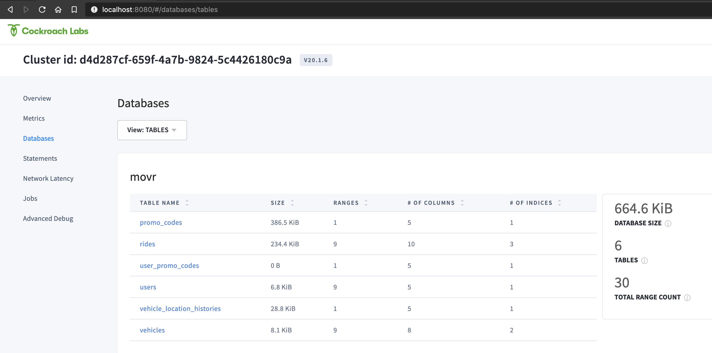
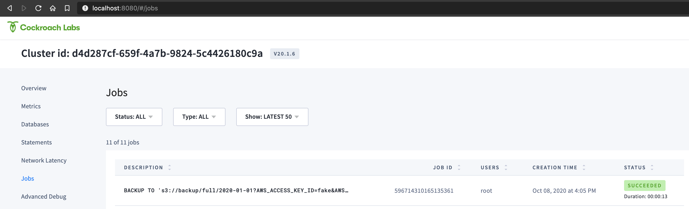

# Backup and Restorre - Student Labs

synopsys In this lab TODO

## Overview

5 lines overivew TODO

## Labs Prerequisites

1. Build the dev cluster following [these instructions](/infrastructure/build-local-docker-cluster.md).

2. You also need:

    - a modern web browser,
    - a SQL client:
      - [Cockroach SQL client](https://www.cockroachlabs.com/docs/stable/install-cockroachdb-linux)
      - `psql`
      - [DBeaver Community edition](https://dbeaver.io/download/) (SQL tool with built-in CockroachDB plugin)

## Lab 0 - Create S3 Compatible service and sample database

We will use a S3 compatible service to store our backup files. For this workshop, we will use [Adobe S3Mock](https://github.com/adobe/S3Mock).

Start a container and attach it to the 3 regional networks so that every cluster node can reach it.

```bash
# start s3mock. A bucket called 'backup' is automatically created
docker run --name s3mock -p 9090:9090 -p 9191:9191 -t --hostname s3mock -d -e initialBuckets=backup adobe/s3mock

# attach networks
docker network connect us-west2-net s3mock
docker network connect us-east4-net s3mock
docker network connect eu-west2-net s3mock
```

Now that the infrastructure is in place, let's create a database and load some data. Connect to cluster node `roach-newyork-1`

```bash
docker exec -it roach-newyork-1 bash
```

In the container, generate a sample database with data. Please note, this will take few minutes to complete. While it works, you can read about the `workload` function and the `movr` database in [here](https://www.cockroachlabs.com/docs/stable/cockroach-workload.html)

```bash
cockroach workload init movr
```

Once done, connect to the database

```bash
cockroach sql --insecure
```

Check the data was created correctly

```sql
USE movr;
SHOW TABLES;
SELECT * FROM rides LIMIT 10;
```

```text
SET

Time: 65.5088ms

          table_name
------------------------------
  promo_codes
  rides
  user_promo_codes
  users
  vehicle_location_histories
  vehicles
(6 rows)

Time: 131.2331ms

                   id                  |   city    | vehicle_city |               rider_id               |              vehicle_id              |         start_address          |           end_address           |        start_time         |         end_time          | revenue
---------------------------------------+-----------+--------------+--------------------------------------+--------------------------------------+--------------------------------+---------------------------------+---------------------------+---------------------------+----------
  ab020c49-ba5e-4800-8000-00000000014e | amsterdam | amsterdam    | c28f5c28-f5c2-4000-8000-000000000026 | aaaaaaaa-aaaa-4800-8000-00000000000a | 1905 Christopher Locks Apt. 77 | 66037 Belinda Plaza Apt. 93     | 2018-12-13 03:04:05+00:00 | 2018-12-14 08:04:05+00:00 |   77.00
  ab851eb8-51eb-4800-8000-00000000014f | amsterdam | amsterdam    | b851eb85-1eb8-4000-8000-000000000024 | aaaaaaaa-aaaa-4800-8000-00000000000a | 70458 Mary Crest               | 33862 Charles Junctions Apt. 49 | 2018-12-26 03:04:05+00:00 | 2018-12-28 10:04:05+00:00 |   81.00
  ac083126-e978-4800-8000-000000000150 | amsterdam | amsterdam    | c28f5c28-f5c2-4000-8000-000000000026 | aaaaaaaa-aaaa-4800-8000-00000000000a | 50217 Victoria Fields Apt. 44  | 56217 Wilson Spring             | 2018-12-07 03:04:05+00:00 | 2018-12-07 10:04:05+00:00 |    9.00
  ac8b4395-8106-4800-8000-000000000151 | amsterdam | amsterdam    | ae147ae1-47ae-4800-8000-000000000022 | bbbbbbbb-bbbb-4800-8000-00000000000b | 34704 Stewart Ports Suite 56   | 53889 Frank Lake Apt. 49        | 2018-12-22 03:04:05+00:00 | 2018-12-22 16:04:05+00:00 |   27.00
  ad0e5604-1893-4800-8000-000000000152 | amsterdam | amsterdam    | ae147ae1-47ae-4800-8000-000000000022 | aaaaaaaa-aaaa-4800-8000-00000000000a | 10806 Kevin Spur               | 15744 Valerie Squares           | 2018-12-08 03:04:05+00:00 | 2018-12-08 22:04:05+00:00 |   20.00
  ad916872-b020-4800-8000-000000000153 | amsterdam | amsterdam    | b3333333-3333-4000-8000-000000000023 | bbbbbbbb-bbbb-4800-8000-00000000000b | 51101 Cassandra Spring         | 96936 Parker Summit             | 2018-12-10 03:04:05+00:00 | 2018-12-12 02:04:05+00:00 |   22.00
  ae147ae1-47ae-4800-8000-000000000154 | amsterdam | amsterdam    | bd70a3d7-0a3d-4000-8000-000000000025 | aaaaaaaa-aaaa-4800-8000-00000000000a | 63503 Lisa Summit Suite 28     | 26800 Brown Station             | 2018-12-25 03:04:05+00:00 | 2018-12-26 22:04:05+00:00 |    0.00
  ae978d4f-df3b-4800-8000-000000000155 | amsterdam | amsterdam    | b851eb85-1eb8-4000-8000-000000000024 | bbbbbbbb-bbbb-4800-8000-00000000000b | 95059 Mendez Village Apt. 96   | 26739 Ellis Drive Apt. 91       | 2018-12-16 03:04:05+00:00 | 2018-12-16 21:04:05+00:00 |   51.00
  af1a9fbe-76c8-4800-8000-000000000156 | amsterdam | amsterdam    | ae147ae1-47ae-4800-8000-000000000022 | aaaaaaaa-aaaa-4800-8000-00000000000a | 64807 Melissa Branch           | 32661 Dalton Flats Suite 70     | 2018-12-18 03:04:05+00:00 | 2018-12-18 12:04:05+00:00 |   87.00
  af9db22d-0e56-4800-8000-000000000157 | amsterdam | amsterdam    | c28f5c28-f5c2-4000-8000-000000000026 | aaaaaaaa-aaaa-4800-8000-00000000000a | 20937 Gibson River             | 50480 Steven Row                | 2018-12-23 03:04:05+00:00 | 2018-12-25 11:04:05+00:00 |   88.00
(10 rows)
```

You can also check the **Databases** page in the AdminUI at <http://localhost:8080> for an overview of your databases and their size.



Good job, we are now ready to perform our first backup job.

## Lab 1 - Full Cluster Backup

Backup the entire cluster to S3. Please note: we must include the "KEYS" parameter even though none are required for S3Mock.

```sql
BACKUP TO 's3://backup/2020-01-01?AWS_ENDPOINT=http://s3mock:9090&AWS_ACCESS_KEY_ID=fake&AWS_SECRET_ACCESS_KEY=fake' AS OF SYSTEM TIME '-10s';
```

Check the Job progress in the Admin UI



Alternatively, you can also list the JOBS using SQL

```sql
-- create handy view
CREATE VIEW jobsview AS
SELECT
    job_id,
    job_type,
    substring(description, 0, 60) AS short_description,
    status,
    created,
    finished - started AS duration,
    fraction_completed AS pct_done,
    error
FROM [SHOW JOBS]
WHERE job_type != 'SCHEMA CHANGE GC';

-- query last 5 jobs
SELECT * FROM jobsview ORDER BY created DESC LIMIT 5;
```

```text
        job_id       |   job_type    |                      short_description                      |  status   |             created              |    duration     | pct_done | error
---------------------+---------------+-------------------------------------------------------------+-----------+----------------------------------+-----------------+----------+--------
  596714310165135361 | BACKUP        | BACKUP TO 's3://backup/2020-01-01?AWS_ACCESS_KEY_ID=fake&AW | succeeded | 2020-10-08 16:05:55.787686+00:00 | 00:00:13.619662 |        1 |
  596710673946640385 | SCHEMA CHANGE | ALTER TABLE movr.public.user_promo_codes ADD FOREIGN KEY (c | succeeded | 2020-10-08 15:47:24.493597+00:00 | 00:00:19.246661 |        1 |
  596710671515779073 | SCHEMA CHANGE | ALTER TABLE movr.public.user_promo_codes ADD FOREIGN KEY (c | succeeded | 2020-10-08 15:47:24.493597+00:00 | 00:00:02.966944 |        1 |
  596710568452194305 | SCHEMA CHANGE | ALTER TABLE movr.public.vehicle_location_histories ADD FORE | succeeded | 2020-10-08 15:46:53.042466+00:00 | 00:00:02.967055 |        1 |
  596710570891804673 | SCHEMA CHANGE | ALTER TABLE movr.public.vehicle_location_histories ADD FORE | succeeded | 2020-10-08 15:46:53.042466+00:00 | 00:00:20.31613  |        1 |
```

Verify what was backed up remotely

```sql
SHOW BACKUP 's3://backup/2020-01-01?AWS_ENDPOINT=http://s3mock:9090&AWS_ACCESS_KEY_ID=fake&AWS_SECRET_ACCESS_KEY=fake';
```

```text
  database_name |         table_name         | start_time |             end_time             | size_bytes | rows | is_full_cluster
----------------+----------------------------+------------+----------------------------------+------------+------+------------------
  system        | users                      | NULL       | 2020-10-08 16:05:45.715862+00:00 |         99 |    2 |      true
  system        | zones                      | NULL       | 2020-10-08 16:05:45.715862+00:00 |        201 |    7 |      true
  system        | settings                   | NULL       | 2020-10-08 16:05:45.715862+00:00 |        374 |    5 |      true
  system        | ui                         | NULL       | 2020-10-08 16:05:45.715862+00:00 |          0 |    0 |      true
  system        | jobs                       | NULL       | 2020-10-08 16:05:45.715862+00:00 |      14036 |   20 |      true
  system        | locations                  | NULL       | 2020-10-08 16:05:45.715862+00:00 |        360 |    7 |      true
  system        | role_members               | NULL       | 2020-10-08 16:05:45.715862+00:00 |         94 |    1 |      true
  system        | comments                   | NULL       | 2020-10-08 16:05:45.715862+00:00 |          0 |    0 |      true
  movr          | users                      | NULL       | 2020-10-08 16:05:45.715862+00:00 |       4911 |   50 |      true
  movr          | vehicles                   | NULL       | 2020-10-08 16:05:45.715862+00:00 |       3182 |   15 |      true
  movr          | rides                      | NULL       | 2020-10-08 16:05:45.715862+00:00 |     156387 |  500 |      true
  movr          | vehicle_location_histories | NULL       | 2020-10-08 16:05:45.715862+00:00 |      73918 | 1000 |      true
  movr          | promo_codes                | NULL       | 2020-10-08 16:05:45.715862+00:00 |     219973 | 1000 |      true
  movr          | user_promo_codes           | NULL       | 2020-10-08 16:05:45.715862+00:00 |          0 |    0 |      true
(14 rows)
```

Very good! The output shows both the `system` and `movr` databases backups are safely stored in S3!

If you are curious to see what the backup file looks like, connect to container `s3mock`

```bash
docker exec -it s3mock /bin/sh
```

Then drill into the `backup` bucket directory inside `/tmp`

```bash
/ # ls -ltr /tmp/s3mockFileStore1602171829630/backup/2020-01-01/
total 168
drwxr-xr-x    2 root     root          4096 Oct  8 16:06 596714343610908673%002Esst
drwxr-xr-x    2 root     root          4096 Oct  8 16:06 596714343184596999%002Esst
drwxr-xr-x    2 root     root          4096 Oct  8 16:06 596714343154941960%002Esst
[...]
drwxr-xr-x    2 root     root          4096 Oct  8 16:06 BACKUP
```

You can learn a lot more about Cockroach Backup strategies [in the docs](https://www.cockroachlabs.com/docs/v20.2/take-full-and-incremental-backups.html), too!

## Lab 2 - Incremental Backup

We are so content with CockroachDB features and performance that we decided to deploy another app using CockroachDB as our backend!

Let us load another database

```bash
cockroach workload init bank
```

Confirm the database was created and data was loaded

```sql
SELECT * FROM bank.bank LIMIT 10;
```

```text
  id | balance |                                               payload
-----+---------+-------------------------------------------------------------------------------------------------------
   0 |       0 | initial-dTqnRurXztAPkykhZWvsCmeJkMwRNcJAvTlNbgUEYfagEQJaHmfPsquKZUBOGwpAjPtATpGXFJkrtQCEJODSlmQctvyh
   1 |       0 | initial-PCLGABqTvrtRNyhAyOhQdyLfVtCmRykQJSsdwqUFABkPOMQayVEhiAwzZKHpJUiNmVaWYZnReMKfONZvRKbTETaIDccE
   2 |       0 | initial-VNfyUJHfCmMeAUoTgoSVvnByDyvpHNPHDfVoNWdXBFQpwMOBgNVtNijyTjmecvFqyeLHlDbIBRrbCzSeiHWSLmWbhIvh
   3 |       0 | initial-llflzsVuQYUlfwlyoaqjdwKUNgNFVgvlnINeOUUVyfxyvmOiAelxqkTBfpBBziYVHgQLLEuCazSXmURnXBlCCfsOqeji
   4 |       0 | initial-rmGzVVucMqbYnBaccWilErbWvcatqBsWSXvrbxYUUEhmOnccXzvqcsGuMVJNBjmzKErJzEzzfCzNTmLQqhkrDUxdgqDD
   5 |       0 | initial-jXejtgYqbhAMjWszDWhRMrreNesfWgMHlFNZwrACPjPAJqkxZtWAtMUZnYhpwIuVTUhtuAZmrcLOerfZkYenmcFgnsXK
   6 |       0 | initial-rEwGJlYhtthvaMmYrLvcctmXZyyUSYpmcnSmOsZqjxBiTARaJCEHVnSPAJFTzpfqjheUnjvcHxGafmjaqtcEibbRGRcr
   7 |       0 | initial-jgSEECNqBhAebEjfAeVYekdkazEPZagEQYcajFZXfArIucQcCvrFARXidZNthBWtDVFzGAfQbscjCkoxvZyTKbNIdRxN
   8 |       0 | initial-XNLtmUlDQeZkRPMaygqBLWwUqXmqHhEquyfervKFBFDwYrWsGkYVJtJroUncsmdcSHhUqsVNLOwiamuOxlYayMqrLheK
   9 |       0 | initial-yebOGytNpTjrZWGwZjBYJtxekffbsIuqDwKSlhbtpnimeKKeOKDMsPtPgQgYWYdwHmNTuINQvtqlintFvZIFmyMzbZLx
```

With the new data added, let's take an incremental backup.
We want the location of the incremental backup to be on a separate location (directory `2020-01-02`), so we must point BACKUP to the location of the Full Backup we want to increment from.

```sql
BACKUP TO 's3://backup/2020-01-02?AWS_ENDPOINT=http://s3mock:9090&AWS_ACCESS_KEY_ID=fake&AWS_SECRET_ACCESS_KEY=fake' AS OF SYSTEM TIME '-10s'
INCREMENTAL FROM 's3://backup/2020-01-01?AWS_ENDPOINT=http://s3mock:9090&AWS_ACCESS_KEY_ID=fake&AWS_SECRET_ACCESS_KEY=fake';
```

Check the JOBS table to confirm the backup is complete

```sql
SELECT * FROM jobsview ORDER BY created DESC LIMIT 1;
```

```text
        job_id       |   job_type    |                      short_description                      |  status   |             created              |    duration     | pct_done | error
---------------------+---------------+-------------------------------------------------------------+-----------+----------------------------------+-----------------+----------+--------
  596733912437358593 | BACKUP        | BACKUP TO 's3://backup/2020-01-02?AWS_ACCESS_KEY_ID=fake&AW | succeeded | 2020-10-08 17:45:37.926408+00:00 | 00:00:15.477749 |        1 |
````

Now let's see the available backups at the new location

```sql
SHOW BACKUP 's3://backup/2020-01-02?AWS_ENDPOINT=http://s3mock:9090&AWS_ACCESS_KEY_ID=fake&AWS_SECRET_ACCESS_KEY=fake';
```

```text
  database_name |         table_name         |            start_time            |             end_time             | size_bytes | rows | is_full_cluster
----------------+----------------------------+----------------------------------+----------------------------------+------------+------+------------------
  system        | users                      | 2020-10-08 16:05:45.715862+00:00 | 2020-10-08 17:45:27.579751+00:00 |          0 |    0 |      true
  system        | zones                      | 2020-10-08 16:05:45.715862+00:00 | 2020-10-08 17:45:27.579751+00:00 |          0 |    0 |      true
  system        | settings                   | 2020-10-08 16:05:45.715862+00:00 | 2020-10-08 17:45:27.579751+00:00 |          0 |    0 |      true
  system        | ui                         | 2020-10-08 16:05:45.715862+00:00 | 2020-10-08 17:45:27.579751+00:00 |          0 |    0 |      true
  system        | jobs                       | 2020-10-08 16:05:45.715862+00:00 | 2020-10-08 17:45:27.579751+00:00 |       9795 |    4 |      true
  system        | locations                  | 2020-10-08 16:05:45.715862+00:00 | 2020-10-08 17:45:27.579751+00:00 |          0 |    0 |      true
  system        | role_members               | 2020-10-08 16:05:45.715862+00:00 | 2020-10-08 17:45:27.579751+00:00 |          0 |    0 |      true
  system        | comments                   | 2020-10-08 16:05:45.715862+00:00 | 2020-10-08 17:45:27.579751+00:00 |          0 |    0 |      true
  movr          | users                      | 2020-10-08 16:05:45.715862+00:00 | 2020-10-08 17:45:27.579751+00:00 |          0 |    0 |      true
  movr          | vehicles                   | 2020-10-08 16:05:45.715862+00:00 | 2020-10-08 17:45:27.579751+00:00 |          0 |    0 |      true
  movr          | rides                      | 2020-10-08 16:05:45.715862+00:00 | 2020-10-08 17:45:27.579751+00:00 |          0 |    0 |      true
  movr          | vehicle_location_histories | 2020-10-08 16:05:45.715862+00:00 | 2020-10-08 17:45:27.579751+00:00 |          0 |    0 |      true
  movr          | promo_codes                | 2020-10-08 16:05:45.715862+00:00 | 2020-10-08 17:45:27.579751+00:00 |          0 |    0 |      true
  movr          | user_promo_codes           | 2020-10-08 16:05:45.715862+00:00 | 2020-10-08 17:45:27.579751+00:00 |          0 |    0 |      true
  movr          | jobsview                   | 2020-10-08 16:05:45.715862+00:00 | 2020-10-08 17:45:27.579751+00:00 |          0 |    0 |      true
  bank          | bank                       | 2020-10-08 16:05:45.715862+00:00 | 2020-10-08 17:45:27.579751+00:00 |     114634 | 1000 |      true
(16 rows)
```

Very good! We have not updated the `movr` database, so it is all zero, but we can see that `bank` has been added.

Another day has passed. Let's take another incremental backup

```sql
-- ??? Who did this, what's going on?!?
UPDATE movr.users SET NAME = 'malicious user' WHERE id IN ('ae147ae1-47ae-4800-8000-000000000022', 'b3333333-3333-4000-8000-000000000023', 'b851eb85-1eb8-4000-8000-000000000024');

-- wait 10 seconds else the changes won't be captured
BACKUP TO 's3://backup/2020-01-03?AWS_ENDPOINT=http://s3mock:9090&AWS_ACCESS_KEY_ID=fake&AWS_SECRET_ACCESS_KEY=fake' AS OF SYSTEM TIME '-10s'
INCREMENTAL FROM
    's3://backup/2020-01-01?AWS_ENDPOINT=http://s3mock:9090&AWS_ACCESS_KEY_ID=fake&AWS_SECRET_ACCESS_KEY=fake',
    's3://backup/2020-01-02?AWS_ENDPOINT=http://s3mock:9090&AWS_ACCESS_KEY_ID=fake&AWS_SECRET_ACCESS_KEY=fake';
```

Confirm the backup looks good

```sql
SHOW BACKUP 's3://backup/2020-01-03?AWS_ENDPOINT=http://s3mock:9090&AWS_ACCESS_KEY_ID=fake&AWS_SECRET_ACCESS_KEY=fake';
```

```text
  database_name |         table_name         |            start_time            |             end_time             | size_bytes | rows | is_full_cluster
----------------+----------------------------+----------------------------------+----------------------------------+------------+------+------------------
  system        | users                      | 2020-10-08 20:53:33.294473+00:00 | 2020-10-08 20:59:36.994805+00:00 |          0 |    0 |      true
  system        | zones                      | 2020-10-08 20:53:33.294473+00:00 | 2020-10-08 20:59:36.994805+00:00 |          0 |    0 |      true
  system        | settings                   | 2020-10-08 20:53:33.294473+00:00 | 2020-10-08 20:59:36.994805+00:00 |          0 |    0 |      true
  system        | ui                         | 2020-10-08 20:53:33.294473+00:00 | 2020-10-08 20:59:36.994805+00:00 |          0 |    0 |      true
  system        | jobs                       | 2020-10-08 20:53:33.294473+00:00 | 2020-10-08 20:59:36.994805+00:00 |      19648 |    2 |      true
  system        | locations                  | 2020-10-08 20:53:33.294473+00:00 | 2020-10-08 20:59:36.994805+00:00 |          0 |    0 |      true
  system        | role_members               | 2020-10-08 20:53:33.294473+00:00 | 2020-10-08 20:59:36.994805+00:00 |          0 |    0 |      true
  system        | comments                   | 2020-10-08 20:53:33.294473+00:00 | 2020-10-08 20:59:36.994805+00:00 |          0 |    0 |      true
  movr          | users                      | 2020-10-08 20:53:33.294473+00:00 | 2020-10-08 20:59:36.994805+00:00 |        309 |    3 |      true
  movr          | vehicles                   | 2020-10-08 20:53:33.294473+00:00 | 2020-10-08 20:59:36.994805+00:00 |          0 |    0 |      true
  movr          | rides                      | 2020-10-08 20:53:33.294473+00:00 | 2020-10-08 20:59:36.994805+00:00 |          0 |    0 |      true
  movr          | vehicle_location_histories | 2020-10-08 20:53:33.294473+00:00 | 2020-10-08 20:59:36.994805+00:00 |          0 |    0 |      true
  movr          | promo_codes                | 2020-10-08 20:53:33.294473+00:00 | 2020-10-08 20:59:36.994805+00:00 |          0 |    0 |      true
  movr          | user_promo_codes           | 2020-10-08 20:53:33.294473+00:00 | 2020-10-08 20:59:36.994805+00:00 |          0 |    0 |      true
  movr          | jobsview                   | 2020-10-08 20:53:33.294473+00:00 | 2020-10-08 20:59:36.994805+00:00 |          0 |    0 |      true
  bank          | bank                       | 2020-10-08 20:53:33.294473+00:00 | 2020-10-08 20:59:36.994805+00:00 |          0 |    0 |      true
(16 rows)
```

The backup process looks good, but you got hacked! A malicious user has corrupted some of your data!!

```sql
SELECT * FROM movr.users WHERE name = 'malicious user';
```

```text
                   id                  |   city    |      name      |            address            | credit_card
---------------------------------------+-----------+----------------+-------------------------------+--------------
  ae147ae1-47ae-4800-8000-000000000022 | amsterdam | malicious user | 88194 Angela Gardens Suite 94 | 4443538758
  b3333333-3333-4000-8000-000000000023 | amsterdam | malicious user | 29590 Butler Plain Apt. 25    | 3750897994
  b851eb85-1eb8-4000-8000-000000000024 | amsterdam | malicious user | 32768 Eric Divide Suite 88    | 8107478823
(3 rows)
```

## Lab 3 - Restore a database

After careful consideration, you decide that it's best to drop the database and restore from the last valid backup, dated 2020-01-02.

```sql
-- this can take 2-3 minutes
DROP DATABASE movr CASCADE;

RESTORE DATABASE movr
FROM
    's3://backup/2020-01-01?AWS_ENDPOINT=http://s3mock:9090&AWS_ACCESS_KEY_ID=fake&AWS_SECRET_ACCESS_KEY=fake',
    's3://backup/2020-01-02?AWS_ENDPOINT=http://s3mock:9090&AWS_ACCESS_KEY_ID=fake&AWS_SECRET_ACCESS_KEY=fake';

--- verify the malicious user is gone
SELECT * FROM movr.users WHERE name = 'malicious user';
```

```text
        job_id       |  status   | fraction_completed | rows | index_entries | bytes
---------------------+-----------+--------------------+------+---------------+---------
  596743986481856513 | succeeded |                  1 | 2565 |          1015 | 458371
(1 row)

Time: 195.3715ms

  id | city | name | address | credit_card
-----+------+------+---------+--------------
(0 rows)
```

Good, you're back in business!

There are many, better ways in which you can manage your backup. Read the docs to find out more about:

- [Backups with revision history and restore from point in time](https://www.cockroachlabs.com/docs/v20.2/take-backups-with-revision-history-and-restore-from-a-point-in-time.html)
- [Encrypted Backup and Restore](https://www.cockroachlabs.com/docs/v20.2/take-and-restore-encrypted-backups.html)
- [Locality-aware Backups](https://www.cockroachlabs.com/docs/v20.2/take-and-restore-locality-aware-backups.html)
- [Scheduling Backups](https://www.cockroachlabs.com/docs/v20.2/manage-a-backup-schedule.html)

## Lab 4 - Repaving

In this lab, we practice the technique of **Repaving**, the process of rebuilding the environment from a known clean state, useful as a cybersecurity measure.

In the context of repaving the CockroachDB platform, you have 2 options:

1. Decommission
2. Data Swap (Detach/Attach)

### Decommission

The **Decommission** process consist of the following:

1. Add a new node, in the same region, dc, az, rack with the same locality settings as the node being repaved.
2. Wait for that new node to connected and starts receiving data
3. Decommission the node to cycle out.
4. Once the decommission is finished, the vm/container can be removed.

Pros:

- Can do this to more than one node at a time
- More resilient during the transition as an extra node has been added
- The added node adds CPU that can be used for queries as soon as the replicas make it to it

Cons:

- All replicas must be moved off of the node being decommissioned
- Significantly slower (might be hours)
- Higher network bandwidth usage

You can read more about the Decommission process in our [docs](https://www.cockroachlabs.com/docs/v20.2/remove-nodes.html).

Let's spin up a new node and add it to the cluster. In this example, we want to repave node `roach-seattle-3` for node `roach-seattle-4`

```bash
docker run -d --name=roach-seattle-4 --hostname=roach-seattle-4 --ip=172.27.0.14 --cap-add NET_ADMIN --net=us-west2-net --add-host=roach-seattle-1:172.27.0.11 --add-host=roach-seattle-2:172.27.0.12 --add-host=roach-seattle-3:172.27.0.13 -v "roach-seattle-4-data:/cockroach/cockroach-data" cockroachdb/cockroach:v20.1.5 start --insecure --join=roach-seattle-1,roach-newyork-1,roach-london-1 --locality=region=us-west2,zone=c

# attach container to networks
docker network connect uswest-useast-net roach-seattle-4
docker network connect uswest-euwest-net roach-seattle-4
```

In the AdminUI, you should see you have now 10 nodes and 2 nodes are in the `us-west2` region, zone `c`.


In the Overview > Node List, click on the node10 to see that this node is already up and operational


You can also see from the CLI

```bash
root@roach-newyork-1:/cockroach# cockroach node status --insecure
  id |        address        |      sql_address      |  build  |            started_at            |            updated_at            |        locality        | is_available | is_live
-----+-----------------------+-----------------------+---------+----------------------------------+----------------------------------+------------------------+--------------+----------
   1 | roach-newyork-1:26257 | roach-newyork-1:26257 | v20.1.6 | 2020-10-08 15:43:06.102417+00:00 | 2020-10-08 19:48:42.057632+00:00 | region=us-east4,zone=a | true         | true
   2 | roach-newyork-2:26257 | roach-newyork-2:26257 | v20.1.6 | 2020-10-08 15:43:06.43971+00:00  | 2020-10-08 19:48:42.38807+00:00  | region=us-east4,zone=b | true         | true
   3 | roach-newyork-3:26257 | roach-newyork-3:26257 | v20.1.6 | 2020-10-08 15:43:06.894065+00:00 | 2020-10-08 19:48:42.842474+00:00 | region=us-east4,zone=c | true         | true
   4 | roach-seattle-1:26257 | roach-seattle-1:26257 | v20.1.6 | 2020-10-08 15:43:17.319058+00:00 | 2020-10-08 19:48:44.300456+00:00 | region=us-west2,zone=a | true         | true
   5 | roach-seattle-2:26257 | roach-seattle-2:26257 | v20.1.6 | 2020-10-08 15:43:18.046842+00:00 | 2020-10-08 19:48:40.567553+00:00 | region=us-west2,zone=b | true         | true
   6 | roach-seattle-3:26257 | roach-seattle-3:26257 | v20.1.6 | 2020-10-08 15:43:18.704429+00:00 | 2020-10-08 19:48:41.219253+00:00 | region=us-west2,zone=c | true         | true
   7 | roach-london-2:26257  | roach-london-2:26257  | v20.1.6 | 2020-10-08 15:43:21.746067+00:00 | 2020-10-08 19:48:44.378163+00:00 | region=eu-west2,zone=b | true         | true
   8 | roach-london-1:26257  | roach-london-1:26257  | v20.1.6 | 2020-10-08 15:43:22.22653+00:00  | 2020-10-08 19:48:40.398695+00:00 | region=eu-west2,zone=a | true         | true
   9 | roach-london-3:26257  | roach-london-3:26257  | v20.1.6 | 2020-10-08 15:43:22.250806+00:00 | 2020-10-08 19:48:40.438241+00:00 | region=eu-west2,zone=c | true         | true
  10 | roach-seattle-4:26257 | roach-seattle-4:26257 | v20.1.6 | 2020-10-08 19:37:35.190801+00:00 | 2020-10-08 19:48:40.624029+00:00 | region=us-west2,zone=c | true         | true
(10 rows)
```

At this point, you can decommission node `roach-seattle-3`, which from above table is node with id = 6.

```bash
root@roach-newyork-1:/cockroach# cockroach node decommission 6 --insecure

  id | is_live | replicas | is_decommissioning | is_draining
-----+---------+----------+--------------------+--------------
   6 |  true   |       21 |        true        |    false
(1 row)
.....
  id | is_live | replicas | is_decommissioning | is_draining
-----+---------+----------+--------------------+--------------
   6 |  true   |       19 |        true        |    false
(1 row)

[...]

  id | is_live | replicas | is_decommissioning | is_draining
-----+---------+----------+--------------------+--------------
   6 |  true   |        0 |        true        |    false
(1 row)

No more data reported on target nodes. Please verify cluster health before removing the nodes.
```

Verify the node is empty using the AdminUI


And finally you can just stop and remove the container. Please note: it will take a few minutes for the AdminUI to update with the correct status of the cluster

```bash
docker stop roach-seattle-3
docker rm roach-seattle-3
```

Verify the status on the CLI

```bash
root@roach-newyork-1:/cockroach# cockroach node status --insecure
  id |        address        |      sql_address      |  build  |            started_at            |            updated_at            |        locality        | is_available | is_live
-----+-----------------------+-----------------------+---------+----------------------------------+----------------------------------+------------------------+--------------+----------
   1 | roach-newyork-1:26257 | roach-newyork-1:26257 | v20.1.6 | 2020-10-08 15:43:06.102417+00:00 | 2020-10-08 20:00:45.702579+00:00 | region=us-east4,zone=a | true         | true
   2 | roach-newyork-2:26257 | roach-newyork-2:26257 | v20.1.6 | 2020-10-08 15:43:06.43971+00:00  | 2020-10-08 20:00:46.032631+00:00 | region=us-east4,zone=b | true         | true
   3 | roach-newyork-3:26257 | roach-newyork-3:26257 | v20.1.6 | 2020-10-08 15:43:06.894065+00:00 | 2020-10-08 20:00:42.021404+00:00 | region=us-east4,zone=c | true         | true
   4 | roach-seattle-1:26257 | roach-seattle-1:26257 | v20.1.6 | 2020-10-08 15:43:17.319058+00:00 | 2020-10-08 20:00:43.479506+00:00 | region=us-west2,zone=a | true         | true
   5 | roach-seattle-2:26257 | roach-seattle-2:26257 | v20.1.6 | 2020-10-08 15:43:18.046842+00:00 | 2020-10-08 20:00:44.211455+00:00 | region=us-west2,zone=b | true         | true
   7 | roach-london-2:26257  | roach-london-2:26257  | v20.1.6 | 2020-10-08 15:43:21.746067+00:00 | 2020-10-08 20:00:43.557008+00:00 | region=eu-west2,zone=b | true         | true
   8 | roach-london-1:26257  | roach-london-1:26257  | v20.1.6 | 2020-10-08 15:43:22.22653+00:00  | 2020-10-08 20:00:44.041947+00:00 | region=eu-west2,zone=a | true         | true
   9 | roach-london-3:26257  | roach-london-3:26257  | v20.1.6 | 2020-10-08 15:43:22.250806+00:00 | 2020-10-08 20:00:44.081871+00:00 | region=eu-west2,zone=c | true         | true
  10 | roach-seattle-4:26257 | roach-seattle-4:26257 | v20.1.6 | 2020-10-08 19:37:35.190801+00:00 | 2020-10-08 20:00:44.268408+00:00 | region=us-west2,zone=c | true         | true
(9 rows)
```

Good job, you've successfully and safely repaved one node using decommission!

### Data Swap

The process of **data Swap** consists of:

1. Spin up a new cockroach node (without starting cockroach)
2. Stop the cockroach node being cycled out (sigterm)
3. Detach the data storage from the old node
4. Attach the data storage to the new node
5. Start cockroach in the new node

Pros:

- Super fast
- Less than a minute if done well
- No network usage

Cons:

- Less resilient during this swap, one node is down, so it should only be done one node at a time
- If this takes longer than 5 mins, the system will declare the node dead and it will start the repair process.

The key to this is: automation. We will not use any DevOps tools however as in this lab we focus on the process. Also, as our cluster runs on docker containes and not on VMs, the process varies slightly.

The CockroachDB data storage is mounted as a Docker Volume. Check the docker volume in your cluster

```bash
$ docker volume ls
DRIVER              VOLUME NAME
local               roach-london-1-data
local               roach-london-2-data
local               roach-london-3-data
local               roach-newyork-1-data
local               roach-newyork-2-data
local               roach-newyork-3-data
local               roach-seattle-1-data
local               roach-seattle-2-data
local               roach-seattle-3-data
local               roach-seattle-4-data
```

You remember that in the previous exercise we have stopped and removed `roach-seattle-3` and yet its Volume persisted. We will take advantage of this feature for this repaving technique.

Let's repave node `roach-london-1` for `roach-london-4`

```bash
# drain roach-london-1
docker exec -it roach-london-1 cockroach node drain --insecure

# stop and remove the node immediately
docker stop roach-london-1
docker rm roach-london-1

# start the new container using the same volume roach-london-1-data
docker run -d --name=roach-london-4 --hostname=roach-london-4 --ip=172.29.0.14 --cap-add NET_ADMIN --net=eu-west2-net --add-host=roach-london-1:172.29.0.11 --add-host=roach-london-2:172.29.0.12 --add-host=roach-london-3:172.29.0.13 -v "roach-london-1-data:/cockroach/cockroach-data" cockroachdb/cockroach:v20.1.5 start --insecure --join=roach-seattle-1,roach-newyork-1,roach-london-1 --locality=region=eu-west2,zone=a

# connect to networks
docker network connect useast-euwest-net roach-london-4
docker network connect uswest-euwest-net roach-london-4
```

Check the AdminUI. Immediately you will see the node added to the cluster, with no need to repair!


You can verify from the CLI, too

```bash
root@roach-newyork-1:/cockroach# cockroach node status --insecure
  id |        address        |      sql_address      |  build  |            started_at            |            updated_at            |        locality        | is_available | is_live
-----+-----------------------+-----------------------+---------+----------------------------------+----------------------------------+------------------------+--------------+----------
   1 | roach-newyork-1:26257 | roach-newyork-1:26257 | v20.1.6 | 2020-10-08 15:43:06.102417+00:00 | 2020-10-08 20:23:09.69264+00:00  | region=us-east4,zone=a | true         | true
   2 | roach-newyork-2:26257 | roach-newyork-2:26257 | v20.1.6 | 2020-10-08 15:43:06.43971+00:00  | 2020-10-08 20:23:10.023896+00:00 | region=us-east4,zone=b | true         | true
   3 | roach-newyork-3:26257 | roach-newyork-3:26257 | v20.1.6 | 2020-10-08 15:43:06.894065+00:00 | 2020-10-08 20:23:05.977296+00:00 | region=us-east4,zone=c | true         | true
   4 | roach-seattle-1:26257 | roach-seattle-1:26257 | v20.1.6 | 2020-10-08 15:43:17.319058+00:00 | 2020-10-08 20:23:07.468981+00:00 | region=us-west2,zone=a | true         | true
   5 | roach-seattle-2:26257 | roach-seattle-2:26257 | v20.1.6 | 2020-10-08 15:43:18.046842+00:00 | 2020-10-08 20:23:08.202968+00:00 | region=us-west2,zone=b | true         | true
   7 | roach-london-2:26257  | roach-london-2:26257  | v20.1.6 | 2020-10-08 15:43:21.746067+00:00 | 2020-10-08 20:23:07.547155+00:00 | region=eu-west2,zone=b | true         | true
   8 | roach-london-4:26257  | roach-london-4:26257  | v20.1.6 | 2020-10-08 20:21:36.196613+00:00 | 2020-10-08 20:23:09.491299+00:00 | region=eu-west2,zone=a | true         | true
   9 | roach-london-3:26257  | roach-london-3:26257  | v20.1.6 | 2020-10-08 15:43:22.250806+00:00 | 2020-10-08 20:23:08.072601+00:00 | region=eu-west2,zone=c | true         | true
  10 | roach-seattle-4:26257 | roach-seattle-4:26257 | v20.1.6 | 2020-10-08 19:37:35.190801+00:00 | 2020-10-08 20:23:08.258708+00:00 | region=us-west2,zone=c | true         | true
(9 rows)
```

Our new node `roach-london-4` is up and running!
