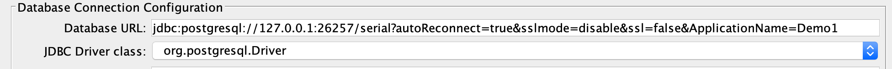

# Lab Coding Serializable Transactions Workshop

In this lab we will explore how to best use Serializable transactions with CockroachDB.

## Lab configurations
This lab is meant to done by developers, architectects, and administrators on their own. 
The presentation had several DEMOs which covered various topics important to coding with Serializable transactions.
Labs were peformed on a local Laptop "2018 Macbook Pro" using Jmeter to drive the varios transaction types.

You can create a similar enviornment on your laptop or use clusters in the cloud. I have included the JMETER file as an 
example but you are welcome to use other benchmarking tools or your own code. 

I encourage you to code in your language of choice to drive the transactions.  This will help to better cement these
concepts and make them second nature as you code and tune.

## Example Configuration
The presentation was done with the following:
* MacBook Pro 15" 2018 with 6 cores and 32GB RAM
* 3 node CRDB cluster

To install cockroachdb locally using one of the following methods.

**Downloads:**
* [mac brew install](https://www.cockroachlabs.com/docs/v20.1/install-cockroachdb-mac)
* [linux download](https://www.cockroachlabs.com/docs/v20.1/install-cockroachdb-linux)
* [windows download](https://www.cockroachlabs.com/docs/v20.1/install-cockroachdb-windows)

**Local Cluster Configs:**
* [3 node local](https://www.cockroachlabs.com/docs/v20.1/start-a-local-cluster)
* [single node](https://www.cockroachlabs.com/docs/stable/cockroach-start-single-node.html#insecure)

## JMETER 
I used Jmeter with the version 5.2.1 but newer versions should be fine.  The instructions to 
install are below, but I have created a [tar/gzip](https://github.com/cockroachlabs/workshop_labs/raw/master/jmeter/apache-jmeter-5.2.1.tar.gz) of my environment to short-cut the process.

**Install Instructions:**
* [Mac](https://medium.com/@sdanerib/run-jmeter-with-plugins-in-macos-8a6654fc0b38)
* [Windows](https://medium.com/@taufiq_ibrahim/installing-apache-jmeter-on-windows-10-62b7f53841f)
* [Linux](https://linuxhint.com/install_apache_jmeter_ubuntu/)

Once you have jmeter installed, you will need to add the following plugins and download the jmx file: 
* [plug-ins](/serial/jmeter_plugins.png)
* <a href="https://raw.githubusercontent.com/cockroachlabs/workshop_labs/master/serial/Serializable_Workshop_Demo.jmx" download="https://raw.githubusercontent.com/cockroachlabs/workshop_labs/master/serial/Serializable_Workshop_Demo.jmx">Download JMX File</a>

**TAR/GZIP of My Jmeter environment:** 


## Database Configuration
Run the following to create the test database and populate the table for the tests:

```sql
CREATE DATABASE serial;

USE serial;

CREATE TABLE alerts (
    id INT NOT NULL DEFAULT unique_rowid(),
    customer_id INT,
    alert_type STRING,
    severity INT,
    cstatus STRING,
    adesc STRING,
    id1 INT,
    id1_desc STRING,
    id2 INT,
    id2_desc STRING,
    created_at TIMESTAMP NOT NULL DEFAULT now(),
    updated_at TIMESTAMP NOT NULL DEFAULT now(),
    PRIMARY KEY (id),
    INDEX alerts_i_idx_1 (cstatus ASC, customer_id ASC, id1 ASC, severity ASC),
    INDEX alerts_i_idx_2 (customer_id ASC, id1 ASC, id1_desc ASC, id2 ASC),
    INDEX alerts_i_idx_3 (id2 ASC, id2_desc ASC, cstatus ASC)
);

insert into alerts
select 
a,
round(random()*10000)::INT,
'ALERT_TYPE',
round(random()*10)::INT,
concat('STATUS-',round(random()*10)::STRING),
'ADESC',
round(random()*1000)::INT,
'ID1_DESCRIPTION',
round(random()*5000)::INT,
'ID2_DESCRIPTION',
now(),
now()
from generate_series(1,1000000) as a;
```

You should now be ready to run the various scenarios to run the demos covered by the presentation.
Below, I will describe the setup, transactions, and number of threads used to simulate the various scenarios.
With this, you should be able to use the JMETER setup, generate the test code, or use another test tool 
to drive the cluster and experiment with serializable transactions.

## LAB TEST Scenarios
The following test scenarios are described below:
* Contention with Selects and Updates
* Bulk Updates disturbing Select performance
* Retries with Updates
* Implicit Transactions /w Select for Update (SFU)

For each one of these tests, it is helpful to configurate the `application_name` variable.
The AdminUI allows you to drill-down from the statements page the application_name.  This is configured in one
two ways:

* JDBC connect string.  I am using this method with JMETER to configure the Pool connection string. 


* Session Level parameter : `SET application_name='DEMO_1'`

### Demo #1 :: Contention with Selects and Updates
This test is to show the performance difference of various queries while running **updates** 
on the same set of rows... a tourture test.  If you are using Jmeter, it is marked as DEMO#1.

There are 5 total selects statements.  Four of them query the same rows that are being updated
and one that is querying a different set of rows as a baseline for no-contention.  There are three
different types of updates included.  Run ONE of the updates along with the 5 queries to understand
how they perform.   The 5 queries and 1 update are run in a thread group with 6 threads.  Feel free to 
experiment with the number of theads driving the workload based on your cluster configuration.


**Select Queries:**
```sql
-- select_high
--
BEGIN;
  SET TRANSACTION PRIORITY HIGH;
  SELECT * FROM alerts WHERE customer_id=9743;
COMMIT;

-- select_low
--
BEGIN;
  SET TRANSACTION PRIORITY LOW;
  SELECT * FROM alerts WHERE customer_id=9743;
COMMIT;

-- select_normal
--
BEGIN;
  SELECT * FROM alerts WHERE customer_id=9743;
COMMIT;

-- select_follower_read (implicit)
--
SELECT * FROM alerts  as of system time experimental_follower_read_timestamp()
WHERE customer_id=9743;

-- select_normal_different_id
--
SELECT * FROM alerts 
WHERE customer_id=9800;
```

The following UPDATE was RUN along with the queries:

```sql
BEGIN;

SET TRANSACTION PRIORITY LOW;
-- SET TRANSACTION PRIORITY NORMAL;
-- SET TRANSACTION PRIORITY HIGH;

  UPDATE alerts SET cstatus=cstatus, updated_at=now() 
  WHERE customer_id=9743;

COMMIT;
```

#### Q1
* What are your overall observations?

#### Q2
* Do the txn priorities effect the queries as expected?

#### Q3
* How do the follower read queries perform compared to the no-conflicting query?


### Demo #2 :: Bulk Updates disturbing Select performance
This scenaro simply runs bulk updates with various batch sizes while obeserving performance.
Basically, run one thread pool with 6 threads with one querie and one bulk update.  There are 
bulk updates with 100, 1000, 5000, and 10000 commits per transaction.  Run each update
individually along with the a normal select to see how it effects performance.

```sql
-- Implicit Select
--
SELECT * FROM alerts 
WHERE customer_id=9743;


-- Bulk Updates
--
-- 100 rows
BEGIN;

SET TRANSACTION PRIORITY HIGH;

UPDATE alerts SET cstatus=cstatus, updated_at=now() 
WHERE severity=${__Random(0,10)} LIMIT 100;

COMMIT;

-- 1000 rows
BEGIN;

SET TRANSACTION PRIORITY HIGH;

UPDATE alerts SET cstatus=cstatus, updated_at=now() 
WHERE severity=${__Random(0,10)} LIMIT 1000;

COMMIT;

-- 5000 rows
BEGIN;

SET TRANSACTION PRIORITY HIGH;

UPDATE alerts SET cstatus=cstatus, updated_at=now() 
WHERE severity=${__Random(0,10)} LIMIT 5000;

COMMIT;

-- 10000 rows
BEGIN;

SET TRANSACTION PRIORITY HIGH;

UPDATE alerts SET cstatus=cstatus, updated_at=now() 
WHERE severity=${__Random(0,10)} LIMIT 10000;

COMMIT;

-- 50000 rows
BEGIN;

SET TRANSACTION PRIORITY HIGH;

UPDATE alerts SET cstatus=cstatus, updated_at=now() 
WHERE severity=${__Random(0,10)} LIMIT 50000;

COMMIT;
```

#### Q4
* What are your overall observations with Bulk Updates?

#### Q5
* How does limiting the bulk update batch size effect query response time?


### Demo #3 :: Retries with Updates
Basically, this scenario does two runs and observes the retry errors while updating the SAME rows
throught a CLI.

First, run the following update with 3 threads using an update with TXN priority HIGH:

```sql
BEGIN;

SET TRANSACTION PRIORITY HIGH;

UPDATE alerts SET cstatus=cstatus, updated_at=now() 
WHERE customer_id=9743;

COMMIT;

```

While this is running, connect with the cockroach CLI to the serial database. After you type `BEGIN;` 
you will have to type a *carriage return* to OPEN the transaction... you will then get 
the `OPEN>` prompt and can proceed with the UPDATE and COMMIT.

```sql
root@:26257/defaultdb> use serial;
SET

Time: 421µs

root@:26257/serial> BEGIN;
Now adding input for a multi-line SQL transaction client-side (smart_prompt enabled).
Press Enter two times to send the SQL text collected so far to the server, or Ctrl+C to cancel.
You can also use \show to display the statements entered so far.
                 ->
BEGIN

Time: 133µs

root@:26257/serial  OPEN> UPDATE alerts SET cstatus=cstatus, updated_at=now()
WHERE customer_id=9743;
UPDATE 98

Time: 64.395ms

root@:26257/serial  OPEN> COMMIT;
ERROR: restart transaction: TransactionRetryWithProtoRefreshError: TransactionAbortedError(ABORT_REASON_CLIENT_REJECT): "sql txn" meta={id=4bd52e44 key=/Table/95/3/9743 pri=0.04830100 epo=0 ts=1600839484.354878000,0 min=1600839462.660598000,0 seq=98} lock=true stat=PENDING rts=1600839484.354878000,0 wto=false max=1600839463.160598000,0
SQLSTATE: 40001
root@:26257/serial>

```

Second, run the following update with 3 threads using an update with TXN priority LOW:

```sql
BEGIN;

SET TRANSACTION PRIORITY LOW;

UPDATE alerts SET cstatus=cstatus, updated_at=now() 
WHERE customer_id=9743;

COMMIT;

```

While this is running, connect with the cockroach CLI to the serial database. After you type `BEGIN;` 
you will have to type a *carriage return* to OPEN the transaction... you will then get 
the `OPEN>` prompt and can proceed with the UPDATE and COMMIT.

```sql
root@:26257/defaultdb> use serial;
SET

Time: 421µs

root@:26257/serial> BEGIN;
Now adding input for a multi-line SQL transaction client-side (smart_prompt enabled).
Press Enter two times to send the SQL text collected so far to the server, or Ctrl+C to cancel.
You can also use \show to display the statements entered so far.
                 ->
BEGIN

Time: 192µs

root@:26257/serial  OPEN> UPDATE alerts SET cstatus=cstatus, updated_at=now()
WHERE customer_id=9743;
ERROR: restart transaction: TransactionRetryWithProtoRefreshError: TransactionRetryError: retry txn (RETRY_WRITE_TOO_OLD - WriteTooOld flag converted to WriteTooOldError): "sql txn" meta={id=4009f04d key=/Table/95/3/9743 pri=0.00238321 epo=0 ts=1600839787.358442000,1 min=1600839785.348268000,0 seq=98} lock=true stat=PENDING rts=1600839787.358442000,1 wto=false max=1600839785.848268000,0
SQLSTATE: 40001
root@:26257/? ERROR> ROLLBACK;
ROLLBACK

Time: 2.133ms

```

#### Q6
* What happens to the running updates when the CLI gets the ERROR?

#### Q7
* What happens after running the ROLLBACK?

#### Q8
* What is the best size for batch updates or deletes?


### Demo #4 :: Implicit Transactions /w Select for Update (SFU)
This final test shows how IMPLICIT transactions perform with Select for Update.  This demo will run two tests
and enable / disable SFU for implicit transactions.

**Implicit Transactions with SFU... the default setting**

Make sure the cluster has the SFU setting enabled:
```sql
set cluster setting sql.defaults.implicit_select_for_update.enabled=true;
```

Run the following transaction with 3 threads for a few minutes.  Record the throughput and response times:

```sql
-- Update Transaction with SFU
-- 
UPDATE alerts SET cstatus=cstatus, updated_at=now() 
WHERE customer_id=9743;
```

**Implicit Transactions WITH noSFU**

Make sure the cluster has the SFU setting disabled:
```sql
set cluster setting sql.defaults.implicit_select_for_update.enabled=false;
```

Run the following transaction with 3 threads for a few minutes.  Record the throughput and response times:

```sql
-- Update Transaction with noSFU
-- 
UPDATE alerts SET cstatus=cstatus, updated_at=now() 
WHERE customer_id=9743;
```

#### Q9
* What are the retries with SFU enabled vs disabled?

#### Q10
* What are the differences in response times between SFU and noSFU?

#### Q11
* Why is the overall throughput so much better?