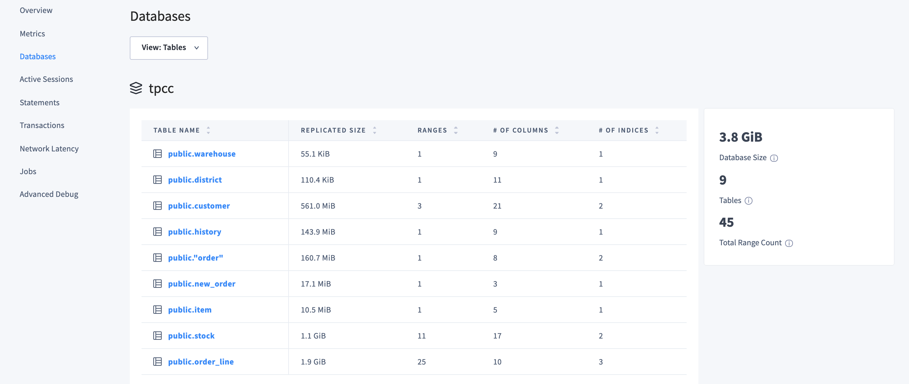

# Query Optimization - Student Labs

The following labs will take you through various query tuning scenarios and allow you to discover various ways to observe, diagnose, and optimize query performance with CockroachDB.

## Labs Prerequisites

1. A modern web browser
2. A SSH client:
    - Terminal (MacOS/Linux)
    - Powershell or Putty (Windows)

## Lab 0 - Create database and load data

SSH into the jumpbox using the IP address and SSH key provided by the instructor, for example:

```bash
ssh -i ~/workshop.pem ubuntu@<jumpbox-ip>
```

Once logged in the jumpbox, connect to the database

```bash
cockroach sql --insecure
```

At the SQL prompt, create your database by restoring a backup copy

```sql
CREATE DATABASE <your-name>;
USE <your-name>;
RESTORE tpcc.* FROM 's3://fabiog1901qq/tpcc?AUTH=implicit' WITH into_db = '<your-name>';
```

```text
        job_id       |  status   | fraction_completed |   rows   | index_entries |   bytes
---------------------+-----------+--------------------+----------+---------------+-------------
  635563845224169475 | succeeded |                  1 | 25054855 |       3000000 | 3594277955
(1 row)

Time: 59.368s total (execution 59.367s / network 0.001s)
```

```sql
SHOW TABLES;
```

```text
  schema_name | table_name | type  | owner | estimated_row_count
--------------+------------+-------+-------+----------------------
  public      | customer   | table | root  |             1500000
  public      | district   | table | root  |                 500
  public      | history    | table | root  |             1500000
  public      | item       | table | root  |              100000
  public      | new_order  | table | root  |              450000
  public      | order      | table | root  |             1500000
  public      | order_line | table | root  |            15004305
  public      | stock      | table | root  |             5000000
  public      | warehouse  | table | root  |                  50
(9 rows)

Time: 38ms total (execution 37ms / network 1ms)
```

## Lab 1 - Optimization

Run the following query and observe the performance.

```sql
SELECT ol_number, SUM(ol_quantity)
FROM order_line
WHERE ol_w_id > 30
   AND ol_amount > 9990
GROUP BY ol_number
ORDER BY ol_number;
```

```text
  ol_number | sum
------------+-------
          1 |  905
          2 |  805
          3 |  735
          4 | 1000
          5 |  750
          6 |  755
          7 |  665
          8 |  720
          9 |  465
         10 |  345
         11 |  415
         12 |  305
         13 |  230
         14 |  120
         15 |  100
(15 rows)

Time: 3.361s total (execution 3.362s / network -0.001s)
```

This is taking too long! We want the Response Time to be much faster. To view the query plan, we can use [the `EXPLAIN` command](https://www.cockroachlabs.com/docs/stable/explain.html).

Let's check the verbose query plan using `EXPLAIN (VERBOSE)` to see how we can optimize it

```sql
EXPLAIN (VERBOSE) SELECT ol_number, SUM(ol_quantity)
FROM order_line
WHERE ol_w_id > 30
   AND ol_amount > 9990
GROUP BY ol_number
ORDER BY ol_number;
```

```text
                                                info
-----------------------------------------------------------------------------------------------------
  distribution: full
  vectorized: true

  • sort
  │ columns: (ol_number, sum)
  │ ordering: +ol_number
  │ estimated row count: 15
  │ order: +ol_number
  │
  └── • group
      │ columns: (ol_number, sum)
      │ estimated row count: 15
      │ aggregate 0: sum(ol_quantity)
      │ group by: ol_number
      │
      └── • project
          │ columns: (ol_number, ol_quantity)
          │
          └── • filter
              │ columns: (ol_w_id, ol_number, ol_quantity, ol_amount)
              │ estimated row count: 4,276
              │ filter: ol_amount > 9990
              │
              └── • scan
                    columns: (ol_w_id, ol_number, ol_quantity, ol_amount)
                    estimated row count: 5,755,650 (38% of the table; stats collected 1 minute ago)
                    table: order_line@primary
                    spans: /31-
```

It is estimating the need to scan 5,755,650 rows, a lot! Let's confirm what fields make up the `primary` index of table `order_line`.

```sql
SHOW CREATE TABLE order_line;
```

```text
  table_name |                                                             create_statement
-------------+--------------------------------------------------------------------------------------------------------------------------------------------
  order_line | CREATE TABLE public.order_line (
             |     ol_o_id INT8 NOT NULL,
             |     ol_d_id INT8 NOT NULL,
             |     ol_w_id INT8 NOT NULL,
             |     ol_number INT8 NOT NULL,
             |     ol_i_id INT8 NOT NULL,
             |     ol_supply_w_id INT8 NULL,
             |     ol_delivery_d TIMESTAMP NULL,
             |     ol_quantity INT8 NULL,
             |     ol_amount DECIMAL(6,2) NULL,
             |     ol_dist_info CHAR(24) NULL,
             |     CONSTRAINT "primary" PRIMARY KEY (ol_w_id ASC, ol_d_id ASC, ol_o_id DESC, ol_number ASC),
             |     CONSTRAINT fk_ol_w_id_ref_order FOREIGN KEY (ol_w_id, ol_d_id, ol_o_id) REFERENCES public."order"(o_w_id, o_d_id, o_id),
             |     CONSTRAINT fk_ol_supply_w_id_ref_stock FOREIGN KEY (ol_supply_w_id, ol_i_id) REFERENCES public.stock(s_w_id, s_i_id),
             |     FAMILY "primary" (ol_o_id, ol_d_id, ol_w_id, ol_number, ol_i_id, ol_supply_w_id, ol_delivery_d, ol_quantity, ol_amount, ol_dist_info)
             | )
```

We can see that `primary` includes `ol_w_id` so it can leverage the index to quickly jump to the right key, but it doesn't include `ol_amount` which is a field used to filter.

We can create an index on `ol_amount` to reduce the rows to scan and improve the performance. For testing, we will create 2 indexes to show the value of `STORING`.

Before, however, let's gather an explain plan with statistics used by the optimizer. We use `EXPLAIN` with `OPT,VERBOSE` as parameters.

```sql
EXPLAIN (OPT,VERBOSE) SELECT ol_number, SUM(ol_quantity)
FROM order_line
WHERE ol_w_id > 30
   AND ol_amount > 9990
GROUP BY ol_number
ORDER BY ol_number;
```

```text
                                                                                                                                            info
---------------------------------------------------------------------------------------------------------------------------------------------------------------------------------------------------------------------------------------------------------------------------------------------
  sort
   ├── columns: ol_number:4 sum:13
   ├── immutable
   ├── stats: [rows=15, distinct(4)=15, null(4)=0]
   ├── cost: 7301015.17
   ├── key: (4)
   ├── fd: (4)-->(13)
   ├── ordering: +4
   ├── prune: (13)
   └── group-by
        ├── columns: ol_number:4 sum:13
        ├── grouping columns: ol_number:4
        ├── immutable
        ├── stats: [rows=15, distinct(4)=15, null(4)=0]
        ├── cost: 7301013.38
        ├── key: (4)
        ├── fd: (4)-->(13)
        ├── prune: (13)
        ├── select
        │    ├── columns: ol_w_id:3 ol_number:4 ol_quantity:8 ol_amount:9
        │    ├── immutable
        │    ├── stats: [rows=2911.02753, distinct(3)=19, null(3)=0, distinct(4)=15, null(4)=0, distinct(9)=357.531367, null(9)=0, distinct(3,9)=2911.02753, null(3,9)=0]
        │    │   histogram(3)=  0 155.12 0 157.44 0 152.81 0 155.89 0 152.03 0 150.49 0 150.49 0 169.78 0 148.18 0 150.49 0 169.78 0 148.95 0 137.37 0 153.58 0 151.26 0 142.77 0 136.6 0 161.29 0 166.7
        │    │                <---- 31 ----- 32 ----- 33 ----- 34 ----- 35 ----- 36 ----- 37 ----- 38 ----- 39 ----- 40 ----- 41 ----- 42 ----- 43 ----- 44 ----- 45 ----- 46 ---- 47 ----- 48 ---- 49 -
        │    │   histogram(9)=  0   0    1514.4  1396.6
        │    │                <--- 9990 -------- 9993.65
        │    ├── cost: 7300925.86
        │    ├── prune: (4,8)
        │    ├── interesting orderings: (+3)
        │    ├── scan order_line
        │    │    ├── columns: ol_w_id:3 ol_number:4 ol_quantity:8 ol_amount:9
        │    │    ├── constraint: /3/2/-1/4: [/31 - ]
        │    │    ├── stats: [rows=5659621.56, distinct(3)=19, null(3)=0]
        │    │    │   histogram(3)=  0 3.0159e+05 0 3.0609e+05 0 2.9708e+05 0 3.0309e+05 0 2.9558e+05 0 2.9258e+05 0 2.9258e+05 0 3.3009e+05 0 2.8808e+05 0 2.9258e+05 0 3.3009e+05 0 2.8958e+05 0 2.6708e+05 0 2.9858e+05 0 2.9408e+05 0 2.7758e+05 0 2.6558e+05 0 3.1359e+05 0 3.2409e+05
        │    │    │                <------ 31 --------- 32 --------- 33 --------- 34 --------- 35 --------- 36 --------- 37 --------- 38 --------- 39 --------- 40 --------- 41 --------- 42 --------- 43 --------- 44 --------- 45 --------- 46 --------- 47 --------- 48 --------- 49 ---
        │    │    ├── cost: 7244329.62
        │    │    └── interesting orderings: (+3)
        │    └── filters
        │         └── ol_amount:9 > 9990 [outer=(9), immutable, constraints=(/9: (/9990 - ]; tight)]
        └── aggregations
             └── sum [as=sum:13, outer=(8)]
                  └── ol_quantity:8
```

Cost is roughly calculated by:

- Estimating how much time each node in the query plan will use to process all results
- Modeling how data flows through the query plan

Adding keyword `ANALYZE` will both show the plan, in a graphical format, and execute it, too. This will show the query runtime performance

```sql
EXPLAIN ANALYZE SELECT ol_number, SUM(ol_quantity)
FROM order_line
WHERE ol_w_id > 30
   AND ol_amount > 9990
GROUP BY ol_number
ORDER BY ol_number;
```

```text
                                              info
-------------------------------------------------------------------------------------------------
  planning time: 435µs
  execution time: 3.1s
  distribution: full
  vectorized: true
  rows read from KV: 5,702,062 (411 MiB)
  cumulative time spent in KV: 4.1s
  maximum memory usage: 30 KiB
  network usage: 1.3 KiB (12 messages)
  regions: us-east-1

  • sort
  │ nodes: n1, n3
  │ regions: us-east-1
  │ actual row count: 15
  │ estimated row count: 15
  │ order: +ol_number
  │
  └── • group
      │ nodes: n1, n3
      │ regions: us-east-1
      │ actual row count: 15
      │ estimated row count: 15
      │ group by: ol_number
      │
      └── • filter
          │ nodes: n1, n3
          │ regions: us-east-1
          │ actual row count: 1,663
          │ estimated row count: 2,911
          │ filter: ol_amount > 9990
          │
          └── • scan
                nodes: n1, n3
                regions: us-east-1
                actual row count: 5,702,062
                KV rows read: 5,702,062
                KV bytes read: 411 MiB
                estimated row count: 5,659,622 (38% of the table; stats collected 1 minute ago)
                table: order_line@primary
                spans: [/31 - ]
```

Here's a [graphical output](https://cockroachdb.github.io/distsqlplan/decode.html#eJy8Vttu4zYQfe9XEPMUo0ositT1yc7G2xp17NRO0KatYSjWwBEgiVqK6sYN8ln9gX5ZITm7thytVs46-6ghZ3jOmeGhHiH7EIEHg9-vRv3hmPTH_dHtHwNycjGcXc9-HXXIbDAavLsmIlokeXyHUiNZHp-IaPEh9xMVqnWHvJ9OLomQAcpFFCZIfvt5MB2QYs_HRRiQv3JdZ0iY3iH98UUZ92ORJ-rTiuu6eof8NJ3cXJHz2-1RZDK9GEwrIdAgEQGO_Rgz8P4EChowmGuQSrHELBOyCD-Wm4bBA3i6BmGS5qoIzzVYCongPYIKVYTgwbV_F-EU_QBlt6gVoPLDqCy9JdRLZRj7cg0azFI_yTzSZXbX7ToO7dJT0OB9GCmUHum5u5Q8z7sYvBte9kegwSRXHulxreeABne-Wt5jRkSu0iJuOcXZKk-jnSDVOQMNhhOiwhg9ws44ZZZlZ0WBtcKMSPQDjxgWI5fhOWggxcdPQWZxalId5k8abAo-C5Apf4Xg0SetvUj91UriyldCdllVo16Buz--XYwn14vxzWh00qOdQqaby5Oe0amhWkfUBA3wAZe5CkXyzJaecW7HBdfYfyB_41IJGf6DAYkxFnJN_CgSS19h4BFq6OSX8HyP6xb-3Zrc-9n9C-Tzp60exhf12NbJk3IkMKhUKqs0KGa-gWKsRjDD_O_fdnLROrm2UrBDRmMmpELZtfdJ_vh6Ik5bHs00eIuO1vWzBF_b1LE4FWnXqe7eJ8nbznfB8kvYzQp22t7C9EMsjJ7u2NgRXIw57CV5y9B3TYyeuSa3LHPfxCh3X5qYoVu6aRotTewrMu1cSeN7mZhrWW2H-egeRo_oYfwtBDPqboXF38TFvjIbzy5mvdLFaqmw1kxe62M1RKaYpSLJcK-79ZX1ousYrHAzIpnI5RKvpFiWx2w-J2VeGQgwU5tVuvkYJpulAuBuMt1PprvJdiWZlmhUrZW2VvqMU5vatPTTQ6AY3wKl7umiLVtuOJ97XsVrNOrOmnVnjcm8SnY_mTcmu80nm43JVnOy9Z3HpXiCbIO739apZtTHnyzuPv8wVGHYjco7zco7hwzMkS6qZRsFjfnTD_8HAAD__xGesv4=), see also below screenshot if you can't open the link.  


In above plan, for example, we see that 2 nodes are required to execute the query: as `ol_w_id` is part of the primary key of index/table `order_line@primary`, the optimizer can easely apply the filter condition `WHERE ol_w_id > 30` by spanning only over the ranges where this condition is true. The ranges are spread over 2 nodes:

- Node3 spans ranges 31-37;
- Node1 spans ranges 37 till the end.

This is done by the `TableReader` process, and you can see that this process also applies the filter `ol_amount > 9990` as it reads through the rows. It outputs column `@4` and `@8`, that is, `ol_number` and `ol_quantity` in _batches_ of _tuples_ as the execution is **vectorized**.

The `Aggregator` process receives such tuples and:

- performs the grouping `by hash @1`, where `@1` is the first element in the tuple, `ol_number`;
- computes the sum `SUM(@2)` where `@2` is the second element in the tuple, `ol_quantity`.

The output is sent to the `Sorter` process that performs the `ORDER BY ol_number` part of the query (`ordered @1+`), before the gateway nodes sends back the result set to the client.

Refer to [our docs](https://www.cockroachlabs.com/docs/stable/explain-analyze#distsql-plan-viewer) for the complete instructions on how to read every section of the plan.

With this information at hand, let's proceed with creating the indexes

```sql
-- these will take few minutes to create
CREATE INDEX idx_ol_amount ON order_line(ol_amount);
-- same as above but storing ol_quantity as a value - useful for our sum()
CREATE INDEX idx_ol_amount_storing_ol_quantity ON order_line(ol_amount) STORING (ol_quantity);
```

Let's review again the Response Time by specifically selecting what Index to use. Remember, `primary` is the main index of the table.

```sql
-- using primary
SELECT ol_number, SUM(ol_quantity)
FROM order_line@primary
WHERE ol_w_id > 30
   AND ol_amount > 9990
GROUP BY ol_number
ORDER BY ol_number;

-- using the first index
SELECT ol_number, SUM(ol_quantity)
FROM order_line@idx_ol_amount
WHERE ol_w_id > 30
   AND ol_amount > 9990
GROUP BY ol_number
ORDER BY ol_number;

-- using the index that stores also the ol_quantity
SELECT ol_number, SUM(ol_quantity)
FROM order_line@idx_ol_amount_storing_ol_quantity
WHERE ol_w_id > 30
   AND ol_amount > 9990
GROUP BY ol_number
ORDER BY ol_number;
```

```text
  ol_number | sum
------------+-------
          1 |  905
          2 |  805
          3 |  735
          4 | 1000
          5 |  750
          6 |  755
          7 |  665
          8 |  720
          9 |  465
         10 |  345
         11 |  415
         12 |  305
         13 |  230
         14 |  120
         15 |  100
(15 rows)

Time: 2.837s total (execution 2.837s / network 0.001s)

  ol_number | sum
------------+-------
          1 |  905
          2 |  805
          3 |  735
          4 | 1000
          5 |  750
          6 |  755
          7 |  665
          8 |  720
          9 |  465
         10 |  345
         11 |  415
         12 |  305
         13 |  230
         14 |  120
         15 |  100
(15 rows)

Time: 22ms total (execution 21ms / network 1ms)

  ol_number | sum
------------+-------
          1 |  905
          2 |  805
          3 |  735
          4 | 1000
          5 |  750
          6 |  755
          7 |  665
          8 |  720
          9 |  465
         10 |  345
         11 |  415
         12 |  305
         13 |  230
         14 |  120
         15 |  100
(15 rows)

Time: 5ms total (execution 5ms / network 0ms)
```

Review the query plan of the original query to see what the optimizer will choose now that we have added the indexes.

```sql
EXPLAIN (VERBOSE) SELECT ol_number, SUM(ol_quantity)
FROM order_line
WHERE ol_w_id > 30
   AND ol_amount > 9990
GROUP BY ol_number
ORDER BY ol_number;
```

```text
                                                info
-----------------------------------------------------------------------------------------------------
  distribution: full
  vectorized: true

  • sort
  │ columns: (ol_number, sum)
  │ ordering: +ol_number
  │ estimated row count: 15
  │ order: +ol_number
  │
  └── • group
      │ columns: (ol_number, sum)
      │ estimated row count: 15
      │ aggregate 0: sum(ol_quantity)
      │ group by: ol_number
      │
      └── • project
          │ columns: (ol_number, ol_quantity)
          │
          └── • filter
              │ columns: (ol_w_id, ol_number, ol_quantity, ol_amount)
              │ estimated row count: 2,911
              │ filter: ol_w_id > 30
              │
              └── • scan
                    columns: (ol_w_id, ol_number, ol_quantity, ol_amount)
                    estimated row count: 3,126 (0.02% of the table; stats collected 14 minutes ago)
                    table: order_line@idx_ol_amount_storing_ol_quantity
                    spans: /9.99E+3/PrefixEnd-
```

Very good! As expected, the Optimizer chose `idx_ol_amount_storing_ol_quantity` over `primary` for the lower estimated rows required to be scanned (3,126 vs 5.5mio).

You might however wonder how storing `ol_quantity` in the 2nd index affected the speed of execution so drammatically. Pull the verbose plan for the query using the index `idx_ol_amount`

```sql
EXPLAIN (VERBOSE) SELECT ol_number, SUM(ol_quantity)
FROM order_line@idx_ol_amount
WHERE ol_w_id > 30
   AND ol_amount > 9990
GROUP BY ol_number
ORDER BY ol_number;
```

```text
                                                  info
---------------------------------------------------------------------------------------------------------
  distribution: full
  vectorized: true

  • sort
  │ columns: (ol_number, sum)
  │ ordering: +ol_number
  │ estimated row count: 15
  │ order: +ol_number
  │
  └── • group
      │ columns: (ol_number, sum)
      │ estimated row count: 15
      │ aggregate 0: sum(ol_quantity)
      │ group by: ol_number
      │
      └── • project
          │ columns: (ol_number, ol_quantity)
          │
          └── • index join
              │ columns: (ol_w_id, ol_number, ol_quantity, ol_amount)
              │ estimated row count: 4,819
              │ table: order_line@primary
              │ key columns: ol_w_id, ol_d_id, ol_o_id, ol_number
              │
              └── • filter
                  │ columns: (ol_o_id, ol_d_id, ol_w_id, ol_number, ol_amount)
                  │ estimated row count: 1,952
                  │ filter: ol_w_id > 30
                  │
                  └── • scan
                        columns: (ol_o_id, ol_d_id, ol_w_id, ol_number, ol_amount)
                        estimated row count: 5,038 (0.03% of the table; stats collected 20 seconds ago)
                        table: order_line@idx_ol_amount
                        spans: /9.99E+3/PrefixEnd-
```

As index `idx_ol_amount` doesn't store field `ol_quantity`, a join operation with `primary` is required to get this field to compute the sum operation.
This extra step is expensive and thus takes longer to execute: compare it with the plan selected by the optimizer, above.

When you are content with this lab, feel free to drop `idx_ol_amount`

```sql
DROP INDEX idx_ol_amount;
```

You can learn more about the the [Cost-Based Optimizer](https://www.cockroachlabs.com/docs/stable/cost-based-optimizer) in our docs.

Learn more about the [Vectorized Query Execution](https://www.cockroachlabs.com/docs/stable/vectorized-execution.html).

## Lab 2 - Joining mechanisms

Run the following query:

```sql
SELECT w_name, w_city, sum(ol_amount)
FROM order_line
INNER JOIN warehouse ON (w_id = ol_supply_w_id)
WHERE ol_supply_w_id > 40
GROUP BY 1,2;
```

```text
  w_name | w_city |     sum
---------+--------+---------------
  7      | 14     | 896184081.57
  7      | 19     | 449416001.35
  6      | 12     | 449354824.30
  9      | 11     | 447365923.46
  10     | 19     | 449060385.59
  9      | 17     | 451801641.36
  9      | 18     | 452314890.95
  9      | 20     | 452794529.04
(8 rows)

Time: 4.308s total (execution 4.308s / network 0.000s)
```

It's a bit slow... Check the query plan

```sql
EXPLAIN (VERBOSE) SELECT w_name, w_city, sum(ol_amount)
FROM order_line
INNER JOIN warehouse ON (w_id = ol_supply_w_id)
WHERE ol_supply_w_id > 40
GROUP BY 1,2;
```

```text
                                                  info
--------------------------------------------------------------------------------------------------------
  distribution: full
  vectorized: true

  • group
  │ columns: (w_name, w_city, sum)
  │ estimated row count: 9
  │ aggregate 0: sum(ol_amount)
  │ group by: w_name, w_city
  │
  └── • project
      │ columns: (ol_amount, w_name, w_city)
      │
      └── • hash join (inner)
          │ columns: (ol_supply_w_id, ol_amount, w_id, w_name, w_city)
          │ estimated row count: 2,680,769
          │ equality: (ol_supply_w_id) = (w_id)
          │ right cols are key
          │
          ├── • filter
          │   │ columns: (ol_supply_w_id, ol_amount)
          │   │ estimated row count: 2,680,769
          │   │ filter: ol_supply_w_id > 40
          │   │
          │   └── • scan
          │         columns: (ol_supply_w_id, ol_amount)
          │         estimated row count: 15,004,305 (100% of the table; stats collected 9 minutes ago)
          │         table: order_line@primary
          │         spans: FULL SCAN
          │
          └── • scan
                columns: (w_id, w_name, w_city)
                estimated row count: 9 (18% of the table; stats collected 27 minutes ago)
                table: warehouse@primary
                spans: /41-
```

It's using a **hash join**. For the sake of testing, let's put into question the choice taken by the Optimizer.
Let's force this query to use [all supported CockroachDB join methods](https://www.cockroachlabs.com/docs/stable/cost-based-optimizer#supported-join-algorithms): `LOOKUP`, `HASH`, `MERGE` and compare the Response Time.

```sql
-- INNER LOOKUP JOIN
SELECT w_name, w_city, sum(ol_amount)
FROM order_line
INNER LOOKUP JOIN warehouse ON (w_id = ol_supply_w_id)
WHERE ol_supply_w_id > 40
GROUP BY 1,2;
```

```text
  w_name | w_city |     sum
---------+--------+---------------
  10     | 19     | 449060385.59
  9      | 17     | 451801641.36
  9      | 11     | 447365923.46
  6      | 12     | 449354824.30
  9      | 18     | 452314890.95
  9      | 20     | 452794529.04
  7      | 14     | 896184081.57
  7      | 19     | 449416001.35
(8 rows)

Time: 5.402s total (execution 5.402s / network 0.000s)
```

```sql
-- INNER HASH JOIN
SELECT w_name, w_city, sum(ol_amount)
FROM order_line@primary
INNER HASH JOIN warehouse ON (w_id = ol_supply_w_id)
WHERE ol_supply_w_id > 40
GROUP BY 1,2;
```

```text
[...]
Time: 4.331s total (execution 4.330s / network 0.001s)
```

```sql
-- INNER MERGE JOIN
SELECT w_name, w_city, sum(ol_amount)
FROM order_line@primary
INNER MERGE JOIN warehouse ON (w_id = ol_supply_w_id)
WHERE ol_supply_w_id > 40
GROUP BY 1,2;
```

```text
[...]
Time: 10.177s total (execution 10.176s / network 0.000s)
```

The hash join was indeed the fastest, so the Optimizer chose correctly.
However, a `MERGE` join is usually the [preferred](https://www.cockroachlabs.com/docs/stable/joins#merge-joins) join mechanism.

Let's create an index on `ol_supply_w_id` storing also `ol_amount` so we avoid a full scan and a hash join.

```sql
CREATE INDEX idx_ol_supp_w_id ON order_line(ol_supply_w_id) STORING (ol_amount);

EXPLAIN (VERBOSE) SELECT w_name, w_city, sum(ol_amount)
FROM order_line
INNER JOIN warehouse ON (w_id = ol_supply_w_id)
WHERE ol_supply_w_id > 40
GROUP BY 1,2;
```

```text
                                               info
---------------------------------------------------------------------------------------------------
  distribution: full
  vectorized: true

  • group
  │ columns: (w_name, w_city, sum)
  │ estimated row count: 9
  │ aggregate 0: sum(ol_amount)
  │ group by: w_name, w_city
  │
  └── • project
      │ columns: (ol_amount, w_name, w_city)
      │
      └── • merge join (inner)
          │ columns: (ol_supply_w_id, ol_amount, w_id, w_name, w_city)
          │ estimated row count: 2,680,769
          │ equality: (ol_supply_w_id) = (w_id)
          │ right cols are key
          │ merge ordering: +"(ol_supply_w_id=w_id)"
          │
          ├── • scan
          │     columns: (ol_supply_w_id, ol_amount)
          │     ordering: +ol_supply_w_id
          │     estimated row count: 2,680,769 (18% of the table; stats collected 12 minutes ago)
          │     table: order_line@idx_ol_supp_w_id
          │     spans: /41-
          │
          └── • scan
                columns: (w_id, w_name, w_city)
                ordering: +w_id
                estimated row count: 9 (18% of the table; stats collected 30 minutes ago)
                table: warehouse@primary
                spans: /41-
```

Perfect, the Optimizer chooses the merge join using our new index. Let's see how it performs

```sql
SELECT w_name, w_city, sum(ol_amount)
FROM order_line
INNER JOIN warehouse ON (w_id = ol_supply_w_id)
WHERE ol_supply_w_id > 40
GROUP BY 1,2;
```

```text
  w_name | w_city |     sum
---------+--------+---------------
  10     | 19     | 449060385.59
  9      | 17     | 451801641.36
  9      | 18     | 452314890.95
  7      | 19     | 449416001.35
  7      | 14     | 896184081.57
  9      | 11     | 447365923.46
  6      | 12     | 449354824.30
  9      | 20     | 452794529.04
(8 rows)

Time: 2.539s total (execution 2.539s / network 0.000s)
```

Good job, we were able to cut Response Time in half! Mind, we still have to scan over 2.6mio rows.

Read more about Joins [in our docs](https://www.cockroachlabs.com/docs/stable/joins.html).

## Lab 3 - Time Travel Queries: reading a previous snapshot

The following report query is run to populate a dashboard within your application.

```sql
SELECT h_w_id, count(*)
FROM history
WHERE h_w_id < 10
GROUP BY 1
ORDER BY 1;
```

```text
  h_w_id | count
---------+--------
       0 | 30000
       1 | 30000
       2 | 30000
       3 | 30000
       4 | 30000
       5 | 30000
       6 | 30000
       7 | 30000
       8 | 30000
       9 | 30000
(10 rows)

Time: 158ms total (execution 156ms / network 1ms)
```

When experimenting, someone accidently uploaded some old data with today's date

```sql
INSERT INTO history (h_c_id, h_c_d_id, h_c_w_id, h_d_id, h_w_id, h_date, h_amount, h_data)
SELECT h_c_id, h_c_d_id, h_c_w_id, h_d_id, h_w_id, now(), h_amount, h_data
FROM history
WHERE h_w_id = 0;
```

Run the report query again to show the additional data.

```sql
SELECT h_w_id, count(*)
FROM history
WHERE h_w_id < 10
GROUP BY 1
ORDER BY 1;
```

```text
  h_w_id | count
---------+--------
       0 | 60000
       1 | 30000
       2 | 30000
       3 | 30000
       4 | 30000
       5 | 30000
       6 | 30000
       7 | 30000
       8 | 30000
       9 | 30000
```

You can use the `AS OF SYSTEM TIME` clause to query the table at a previous state. You can leverage this feature to exclude the recently added data.

```sql
SELECT h_w_id, count(*)
FROM history AS OF SYSTEM TIME '-1m'
WHERE h_w_id < 10
GROUP BY 1
ORDER BY 1;
```

```text
  h_w_id | count
---------+--------
       0 | 30000
       1 | 30000
       2 | 30000
       3 | 30000
       4 | 30000
       5 | 30000
       6 | 30000
       7 | 30000
       8 | 30000
       9 | 30000
(10 rows)

Time: 270ms total (execution 269ms / network 1ms)
```

Bingo! You can find more info about reading historical snapshot data using `AS OF SYSTEM TIME` in [here](https://www.cockroachlabs.com/docs/v20.1/as-of-system-time.html).

Time Travel Queries are also useful to resolve a hot spot condition by relaxing the requirement to read solely from the leaseholder and instead use all replicas for reading requests.
Read more in the [Follower Reads](https://www.cockroachlabs.com/docs/stable/topology-follower-reads.html) topology.

## Lab 4 - Query Tracing and Troubleshooting

Connect to the Admin UI at <http://ip-address:8080>. We are going to cover how to Monitor and Analyse our CockroachDB cluster.
You can find the [Overview](https://www.cockroachlabs.com/docs/stable/admin-ui-overview.html) page a great place to start to learn more about it.

From the Admin UI you can gain a lot of information related to your database: size, number of tables, vie the `CREATE TABLE` statements, table ranges and columns, etc.



From the above screenshot, we see that the database size is 3.8GiB spread over 9 tables and 45 ranges. The biggest table is `order_line` with 1.9 GiB in size.

Over to the **Statements** page, we can see the most recent statements being executed along with some statistics


Hover over a query and the full skeleton will appear. Click on the query to see more details, including the Logical Plan and Execution Stats


You can enable Diagnostics on any statement. Enable tracing on any query by clicking on the **Activate** link under the **Diagnostics** column.

Run the query again, then collect the **bundle zip file** from the AdminUI.


Alternatively, you can create the Statement Bundle from the SQL prompt:

```sql
EXPLAIN ANALYZE (DEBUG) SELECT w_name, w_city, sum(ol_amount)
FROM order_line
INNER JOIN warehouse ON (w_id = ol_supply_w_id)
WHERE ol_supply_w_id > 40
GROUP BY 1,2;
```

```text
                                        text
------------------------------------------------------------------------------------
  Statement diagnostics bundle generated. Download from the Admin UI (Advanced
  Debug -> Statement Diagnostics History), via the direct link below, or using
  the command line.
  Admin UI: http://roach-newyork-1:8080
  Direct link: http://roach-newyork-1:8080/_admin/v1/stmtbundle/612293770916331521
  Command line: cockroach statement-diag list / download
```

Explore the data gathered for query execution. This data will be helpful if you are experiencing a performance issues and need advise from Cockroach Labs.

Let's start [Jaeger](https://www.jaegertracing.io/) to view the trace file. You will need Docker on your laptop

```bash
docker run --rm -d --name jaeger \
  -e COLLECTOR_ZIPKIN_HTTP_PORT=9411 \
  -p 5775:5775/udp \
  -p 6831:6831/udp \
  -p 6832:6832/udp \
  -p 5778:5778 \
  -p 16686:16686 \
  -p 14268:14268 \
  -p 14250:14250 \
  -p 9411:9411 \
  jaegertracing/all-in-one:1.18
```

Open the Jaeger UI at <http://localhost:16686> and import the `trace-jaeger.json` file collected in the statement bundle.


From here you can analyse every step of its execution and discover possible bottlenecks.

## Final thoughts

Congratulations! You are now familiar with many of the techniques used to optimize the performance of your cluster, you have a deeper understanding of the architecture and the role that secondary indexes can play. You also practiced with troubleshooting and diagnosing a slow running query.

Some suggested material to further expand on this topic are found in our docs:

- [Performance Overview](https://www.cockroachlabs.com/docs/stable/performance.html)
- [Monitoring and Alerting](https://www.cockroachlabs.com/docs/stable/monitoring-and-alerting.html)
- [SQL Best Practices](https://www.cockroachlabs.com/docs/stable/performance-best-practices-overview.html)
- [EXPLAIN](https://www.cockroachlabs.com/docs/stable/explain.html)
- [EXPLAIN ANALYZE](https://www.cockroachlabs.com/docs/stable/explain-analyze.html)
- [Column Families](https://www.cockroachlabs.com/docs/stable/column-families.html)
- [Vectorized Query Execution](https://www.cockroachlabs.com/docs/stable/vectorized-execution.html)
- [Cost Based Optimizer](https://www.cockroachlabs.com/docs/stable/cost-based-optimizer.html)
- [Indexes including Covered Indexes](https://www.cockroachlabs.com/docs/stable/indexes.html)
- [Time Travel Queries](https://www.cockroachlabs.com/docs/stable/as-of-system-time.html)

Blog:

- [Cost-Based Optimizer](https://www.cockroachlabs.com/blog/cost-based-optimizer-20-1/)
