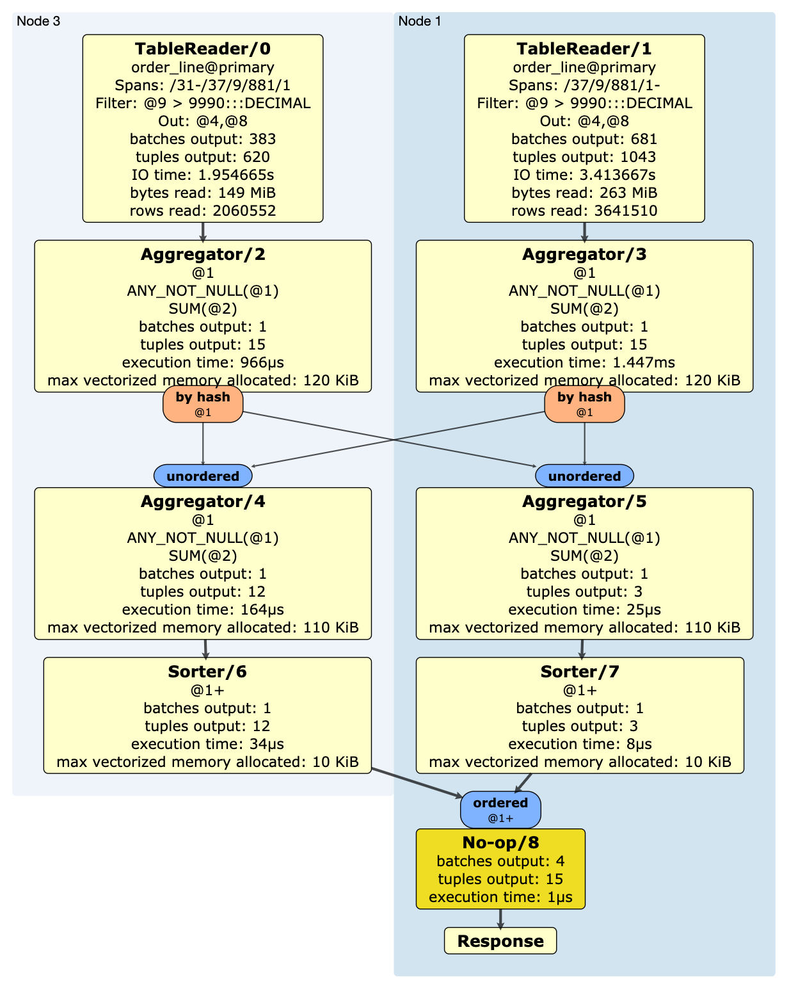

# Query Optimization - Student Labs

The following labs will take you through various query tuning scenarios and allow you to discover various ways to observe, diagnose, and optimize query performance with CockroachDB.

## Labs Prerequisites

1. Build the dev cluster following [these instructions](/infrastructure/multi-region-local-docker-cluster.md).

2. You also need:

    - a modern web browser,
    - a SQL client:
      - [Cockroach SQL client](https://www.cockroachlabs.com/docs/stable/install-cockroachdb-linux)
      - `psql`
      - [DBeaver Community edition](https://dbeaver.io/download/) (SQL tool with built-in CockroachDB plugin)

## Lab 0 - Create database and load data

Connect to any node and run the [workload simulator](https://www.cockroachlabs.com/docs/stable/cockroach-workload.html). Please note that loading the data can take up to 5 minutes.

You have 2 options to create the database:

- restoring it from a backup - fast
- recreating it from scratch - slow

### Restoring from backup

```bash
docker run --name minio --rm -d \
  -p 9000:9000 \
  -v tpcc50w-data:/data \
  minio/minio server /data

# attach networks
docker network connect us-west2-net minio
docker network connect us-east4-net minio
docker network connect eu-west2-net minio
```

Connect to the database

```bash
# use cockroach sql, defaults to localhost:26257
cockroach sql --insecure -d tpcc

# or use the --url param for any another host:
cockroach sql --url "postgresql://localhost:26258/tpcc?sslmode=disable"

# or use psql
psql -h localhost -p 26257 -U root tpcc
```

Restore the entire database from the backup, it will take about 5 minutes

```sql
RESTORE FROM 's3://cockroach?AWS_ENDPOINT=http://minio:9000&AWS_ACCESS_KEY_ID=minioadmin&AWS_SECRET_ACCESS_KEY=minioadmin';
```

```text
        job_id       |  status   | fraction_completed |   rows   | index_entries |   bytes
---------------------+-----------+--------------------+----------+---------------+-------------
  604334058000646147 | succeeded |                  1 | 25054972 |       8000190 | 3656062370
(1 row)

Time: 267.900s total (execution 267.897s / network 0.003s)
```

---

### Recreating workload

Alternatively, recreate the TPCC workload - it will take about 30 minutes

```bash
docker exec -it roach-newyork-1 bash -c "./cockroach workload init tpcc --drop --db tpcc --warehouses 8 postgres://root@127.0.0.1:26257?sslmode=disable"
```

---

## Lab 1 - Optimization

Run the following query and observe the performance.

```sql
USE tpcc;

SELECT ol_number, SUM(ol_quantity)
FROM order_line
WHERE ol_w_id > 30
   AND ol_amount > 9990
GROUP BY ol_number
ORDER BY ol_number;
```

```text
  ol_number | sum
------------+-------
          1 |  905
          2 |  805
          3 |  735
          4 | 1000
          5 |  750
          6 |  755
          7 |  665
          8 |  720
          9 |  465
         10 |  345
         11 |  415
         12 |  305
         13 |  230
         14 |  120
         15 |  100
(15 rows)

Time: 2.464s total (execution 2.464s / network -0.001s)
```

This is taking too long! We want the Response Time to be much faster. Let's check the query plan for this query using `EXPLAIN` to see how we can optimize it

```sql
EXPLAIN SELECT ol_number, SUM(ol_quantity)
FROM order_line
WHERE ol_w_id > 30
   AND ol_amount > 9990
GROUP BY ol_number
ORDER BY ol_number;
```

```text
         tree         |        field        |    description
----------------------+---------------------+---------------------
                      | distribution        | full
                      | vectorized          | true
  sort                |                     |
   │                  | order               | +ol_number
   └── group          |                     |
        │             | group by            | ol_number
        └── filter    |                     |
             │        | filter              | ol_amount > 9990
             └── scan |                     |
                      | estimated row count | 5652121
                      | table               | order_line@primary
                      | spans               | [/31 - ]
```

Let's confirm what fields make up the `primary` index of table `order_line`.

```sql
SHOW CREATE TABLE order_line;
```

```text
  table_name |                                                             create_statement
-------------+--------------------------------------------------------------------------------------------------------------------------------------------
  order_line | CREATE TABLE public.order_line (
             |     ol_o_id INT8 NOT NULL,
             |     ol_d_id INT8 NOT NULL,
             |     ol_w_id INT8 NOT NULL,
             |     ol_number INT8 NOT NULL,
             |     ol_i_id INT8 NOT NULL,
             |     ol_supply_w_id INT8 NULL,
             |     ol_delivery_d TIMESTAMP NULL,
             |     ol_quantity INT8 NULL,
             |     ol_amount DECIMAL(6,2) NULL,
             |     ol_dist_info CHAR(24) NULL,
             |     CONSTRAINT "primary" PRIMARY KEY (ol_w_id ASC, ol_d_id ASC, ol_o_id DESC, ol_number ASC),
             |     CONSTRAINT fk_ol_w_id_ref_order FOREIGN KEY (ol_w_id, ol_d_id, ol_o_id) REFERENCES public."order"(o_w_id, o_d_id, o_id),
             |     CONSTRAINT fk_ol_supply_w_id_ref_stock FOREIGN KEY (ol_supply_w_id, ol_i_id) REFERENCES public.stock(s_w_id, s_i_id),
             |     FAMILY "primary" (ol_o_id, ol_d_id, ol_w_id, ol_number, ol_i_id, ol_supply_w_id, ol_delivery_d, ol_quantity, ol_amount, ol_dist_info)
             | )
```

We can see that `primary` includes `ol_w_id` so it can leverage the index to quickly jump to the right key, but it doesn't include `ol_amount` or `ol_number` which are other fields used to filter, group and order by our query.

We can create an index on `ol_amount` to improve the performance. For testing, we will create 2 indexes to show the value of `STORING`.

Before, however, let's gather an explain plan with statistics used by the optimizer. We use `EXPLAIN` with `OPT,VERBOSE` as parameters.

```sql
EXPLAIN (OPT,VERBOSE) SELECT ol_number, SUM(ol_quantity)
FROM order_line
WHERE ol_w_id > 30
   AND ol_amount > 9990
GROUP BY ol_number
ORDER BY ol_number;
```

```text
                                                                                                                                            text
--------------------------------------------------------------------------------------------------------------------------------------------------------------------------------------------------------------------------------------------------------------------------------------------
  sort
   ├── columns: ol_number:4 sum:13
   ├── immutable
   ├── stats: [rows=15, distinct(4)=15, null(4)=0]
   ├── cost: 7291383.79
   ├── key: (4)
   ├── fd: (4)-->(13)
   ├── ordering: +4
   ├── prune: (13)
   └── group-by
        ├── columns: ol_number:4 sum:13
        ├── grouping columns: ol_number:4
        ├── immutable
        ├── stats: [rows=15, distinct(4)=15, null(4)=0]
        ├── cost: 7291382.31
        ├── key: (4)
        ├── fd: (4)-->(13)
        ├── prune: (13)
        ├── select
        │    ├── columns: ol_w_id:3 ol_number:4 ol_quantity:8 ol_amount:9
        │    ├── immutable
        │    ├── stats: [rows=4715.93429, distinct(3)=19, null(3)=0, distinct(4)=15, null(4)=0, distinct(9)=800.634516, null(9)=0, distinct(3,9)=4715.93429, null(3,9)=0]
        │    │   histogram(3)=  0 259.15 0 242.87 0 247.88 0 245.37 0 260.4 0 246.63 0 232.86 0 234.11 0 269.16 0 225.34 0 259.15 0 226.59 0 276.67 0 274.17 0 261.65 0 252.88 0 246.63 0 249.13 0 205.31
        │    │                <---- 31 ----- 32 ----- 33 ----- 34 ---- 35 ----- 36 ----- 37 ----- 38 ----- 39 ----- 40 ----- 41 ----- 42 ----- 43 ----- 44 ----- 45 ----- 46 ----- 47 ----- 48 ----- 49 -
        │    │   histogram(9)=  0   0    3321.2  1394.8
        │    │                <--- 9990 -------- 9998.19
        │    ├── cost: 7291240.66
        │    ├── prune: (4,8)
        │    ├── interesting orderings: (+3)
        │    ├── scan order_line
        │    │    ├── columns: ol_w_id:3 ol_number:4 ol_quantity:8 ol_amount:9
        │    │    ├── constraint: /3/2/-1/4: [/31 - ]
        │    │    ├── stats: [rows=5652121.42, distinct(3)=19, null(3)=0]
        │    │    │   histogram(3)=  0 3.1059e+05 0 2.9108e+05 0 2.9708e+05 0 2.9408e+05 0 3.1209e+05 0 2.9558e+05 0 2.7908e+05 0 2.8058e+05 0 3.2259e+05 0 2.7008e+05 0 3.1059e+05 0 2.7158e+05 0 3.316e+05 0 3.2859e+05 0 3.1359e+05 0 3.0309e+05 0 2.9558e+05 0 2.9858e+05 0 2.4607e+05
        │    │    │                <------ 31 --------- 32 --------- 33 --------- 34 --------- 35 --------- 36 --------- 37 --------- 38 --------- 39 --------- 40 --------- 41 --------- 42 -------- 43 --------- 44 --------- 45 --------- 46 --------- 47 --------- 48 --------- 49 ---
        │    │    ├── cost: 7234719.42
        │    │    └── interesting orderings: (+3)
        │    └── filters
        │         └── ol_amount:9 > 9990 [outer=(9), immutable, constraints=(/9: (/9990 - ]; tight)]
        └── aggregations
             └── sum [as=sum:13, outer=(8)]
                  └── ol_quantity:8
```

TODO: definition of cost

Adding keyword `ANALYZE` will both show the plan, in a graphical format, and execute it, too. This will show the query runtime performance

```sql
EXPLAIN ANALYZE SELECT ol_number, SUM(ol_quantity)
FROM order_line
WHERE ol_w_id > 30
   AND ol_amount > 9990
GROUP BY ol_number
ORDER BY ol_number;
```

```text
  automatic |                                                                                                                                                                                                                                                                                                                                                                                                                                                                                                                                                                                                                  url
------------+-----------------------------------------------------------------------------------------------------------------------------------------------------------------------------------------------------------------------------------------------------------------------------------------------------------------------------------------------------------------------------------------------------------------------------------------------------------------------------------------------------------------------------------------------------------------------------------------------------------------------------------------------------------------------------------------------------------------------------------------------------------------------------------------------------------------------------------------------------------------------------------------------------------------------------------------------------------------------------------------------------------------------------------------------------------------------------------------------------------------------------------------------------------------------------------------------------------------------------------------
    true    | https://cockroachdb.github.io/distsqlplan/decode.html#eJzEld9u4kYUxu_7FKNzFdQJ9oz_-wqyYVtUAikkatMWIQcfEUu2hx2Pu6FRHqsv0CerbNIFE6_X2SzpJWd8hu_7nePPD5B9iMGHwa-Xo_5wTPrj_ujmtwE5OR_OrmY_jzpkNhgN3l0RES_SPLlFSUmWJyciXnzIg1RFatMh76eTCyJkiHIRRymSX34cTAekeObjIgrJH7muG0gMvUP64_OyHiQiT9V_J57n6R3yw3RyfUnObnZ_RSbT88G0UgIKqQhxHCSYgf87GEDBAgo2zCmspVhilglZHD2UDw7De_B1ClG6zlVRnlNYCongP4CKVIzgw1VwG-MUgxClpgOFEFUQxeX1O1O9tYySQG6AwmwdpJlPNIOdaqauMV3j3DA1BhTeR7FC6ZOet-_N9_3zwbvhRX8EFCa58knPpD0XKNwGanmHGRG5Whd1y_KAgsrX8V7R0wtVwwlRUYI-4V3LsG3Gs6J_ozAjEoPQJ5xZ5CI6AwpSfPxU9BxXd2yYP1LY3vcEIVPBCsFnj7Q9qP5qJXEVKCE1XuXUK8z3xzeL8eRqMb4ejU56rFOgur446fFOjVP23CcrBon3uMxVJNInt06XMzspvCbBPfkTl0rI6C8MSYKJkBsSxLFYBgpDnzCuk5-iswOvO_m3G3IXZHfPlM8fdzz4Z3ns7snTci0wrNxU3tJAzDwGMV5DjDH-z9_tgLE6YDsYxkuWYyakQqnZhza_f4UV023rpNmIWTHCaqdaN9NSfu1gx-JUrDW3-vShTbPljjObFT4_p96qqOftw4y9IMz2g-z0WySZ7jx379hGNclMh3uud5hkzLNrkszhhue2TbIvUNp7L423SjKr6zj_W5Lxb5hk1hGIGXWvhcmOEmRf2I2nIHO-MsjqnLitjXxtjtX4mGK2FmmGB7Otv1kvZo7hCrcLkolcLvFSimWZ-9ufk7KvLISYqe0p2_4YptujQuB-MztsZvvNvNLMSjWqNkrbfjF41zINl7NWtLn7CfdLVDuvUV23Hrxr6w4z3Oy5Et4I32iGbzQ2m0eBbzKrxobZqMRrtmE1NtvNzfabL6Dp6rx2ls1SjrBVpuM5Hn_dq-A0wneb4bvHW8DaD0bX8pykID9__O7fAAAA__-YlMyf
```



With this information at hand, let's proceed with creating the indexes

```sql
-- these will take few minutes to create
CREATE INDEX idx_ol_amount ON order_line(ol_amount);
-- same as above but storing ol_quantity as a value - useful for our sum()
CREATE INDEX idx_ol_amount_storing ON order_line(ol_amount) STORING (ol_quantity);
```

Let's review again the Response Time by specifically selecting what Index to use. Remember, `primary` is the main index of the table.

```sql
-- using primary
SELECT ol_number, SUM(ol_quantity)
FROM order_line@primary
WHERE ol_w_id > 30
   AND ol_amount > 9990
GROUP BY ol_number
ORDER BY ol_number;

-- using the first index
SELECT ol_number, SUM(ol_quantity)
FROM order_line@idx_ol_amount
WHERE ol_w_id > 30
   AND ol_amount > 9990
GROUP BY ol_number
ORDER BY ol_number;

-- using the index that stores also the ol_quantity
SELECT ol_number, SUM(ol_quantity)
FROM order_line@idx_ol_amount_storing
WHERE ol_w_id > 30
   AND ol_amount > 9990
GROUP BY ol_number
ORDER BY ol_number;
```

```text
  ol_number | sum
------------+-------
          1 |  905
          2 |  805
          3 |  735
          4 | 1000
          5 |  750
          6 |  755
          7 |  665
          8 |  720
          9 |  465
         10 |  345
         11 |  415
         12 |  305
         13 |  230
         14 |  120
         15 |  100
(15 rows)

Time: 2.967s total (execution 2.968s / network -0.001s)

  ol_number | sum
------------+-------
          1 |  905
          2 |  805
          3 |  735
          4 | 1000
          5 |  750
          6 |  755
          7 |  665
          8 |  720
          9 |  465
         10 |  345
         11 |  415
         12 |  305
         13 |  230
         14 |  120
         15 |  100
(15 rows)

Time: 757ms total (execution 757ms / network 1ms)

  ol_number | sum
------------+-------
          1 |  905
          2 |  805
          3 |  735
          4 | 1000
          5 |  750
          6 |  755
          7 |  665
          8 |  720
          9 |  465
         10 |  345
         11 |  415
         12 |  305
         13 |  230
         14 |  120
         15 |  100
(15 rows)

Time: 7ms total (execution 6ms / network 1ms)
```

Review the query plan of the original query to see what the optimizer will choose

```sql
EXPLAIN SELECT ol_number, SUM(ol_quantity)
FROM order_line
WHERE ol_w_id > 30
   AND ol_amount > 9990
GROUP BY ol_number
ORDER BY ol_number;
```

```text
         tree         |        field        |           description
----------------------+---------------------+-----------------------------------
                      | distribution        | full
                      | vectorized          | true
  sort                |                     |
   │                  | order               | +ol_number
   └── group          |                     |
        │             | group by            | ol_number
        └── filter    |                     |
             │        | filter              | ol_w_id > 30
             └── scan |                     |
                      | estimated row count | 2722
                      | table               | order_line@idx_ol_amount_storing
                      | spans               | (/9990 - ]
```

Very good! As expected, the Optimizer choose the most efficient index, `idx_ol_amount_storing`.

You might wonder how storing `ol_quantity` in the 2nd index affected the speed of execution. Pull the plan for the query using the first index

```sql
EXPLAIN SELECT ol_number, SUM(ol_quantity)
FROM order_line@idx_ol_amount
WHERE ol_w_id > 30
   AND ol_amount > 9990
GROUP BY ol_number
ORDER BY ol_number;
```

```text
            tree           |        field        |       description
---------------------------+---------------------+---------------------------
                           | distribution        | full
                           | vectorized          | true
  sort                     |                     |
   │                       | order               | +ol_number
   └── group               |                     |
        │                  | group by            | ol_number
        └── index join     |                     |
             │             | table               | order_line@primary
             └── filter    |                     |
                  │        | filter              | ol_w_id > 30
                  └── scan |                     |
                           | estimated row count | 2722
                           | table               | order_line@idx_ol_amount
                           | spans               | (/9990 - ]
```

As index `idx_ol_amount` doesn't have `ol_quantity`, a join operation with `primary` is required to get this field to compute the sum operation.
This extra steps is expensive and thus takes longer to execute.

You can the 2nd index now

```sql
DROP INDEX idx_ol_amount;
```

## Lab 2 - Joining mechanisms

Run the following query:

```sql
SELECT w_name, w_city, sum(ol_amount)
FROM order_line
INNER JOIN warehouse ON (w_id = ol_supply_w_id)
WHERE ol_supply_w_id > 40
GROUP BY 1,2;
```

```text
  w_name | w_city |     sum
---------+--------+---------------
  10     | 19     | 449060385.59
  9      | 17     | 451801641.36
  9      | 18     | 452314890.95
  9      | 11     | 447365923.46
  7      | 14     | 896184081.57
  6      | 12     | 449354824.30
  9      | 20     | 452794529.04
  7      | 19     | 449416001.35
(8 rows)

Time: 7.249s total (execution 7.252s / network -0.004s)
```

It's a bit slow... Check the query plan

```sql
EXPLAIN SELECT w_name, w_city, sum(ol_amount)
FROM order_line
INNER JOIN warehouse ON (w_id = ol_supply_w_id)
WHERE ol_supply_w_id > 40
GROUP BY 1,2;
```

```text
         tree         |        field        |        description
----------------------+---------------------+----------------------------
                      | distribution        | full
                      | vectorized          | true
  group               |                     |
   │                  | group by            | w_name, w_city
   └── hash join      |                     |
        │             | equality            | (ol_supply_w_id) = (w_id)
        │             | right cols are key  |
        ├── filter    |                     |
        │    │        | filter              | ol_supply_w_id > 40
        │    └── scan |                     |
        │             | estimated row count | 15004305
        │             | table               | order_line@primary
        │             | spans               | FULL SCAN
        └── scan      |                     |
                      | estimated row count | 9
                      | table               | warehouse@primary
                      | spans               | [/41 - ]
```

Let's force this query to use all join methods: `LOOKUP`, `HASH`, `MERGE`.

```sql
-- INNER LOOKUP
SELECT w_name, w_city, sum(ol_amount)
FROM order_line
INNER LOOKUP JOIN warehouse ON (w_id = ol_supply_w_id)
WHERE ol_supply_w_id > 40
GROUP BY 1,2;
```

```text
  w_name | w_city |     sum
---------+--------+---------------
  9      | 11     | 447365923.46
  6      | 12     | 449354824.30
  7      | 14     | 896184081.57
  9      | 20     | 452794529.04
  10     | 19     | 449060385.59
  9      | 18     | 452314890.95
  9      | 17     | 451801641.36
  7      | 19     | 449416001.35
(8 rows)

Time: 10.233s total (execution 10.218s / network 0.015s)
```

```sql
-- INNER HASH JOIN
SELECT w_name, w_city, sum(ol_amount)
FROM order_line@primary
INNER HASH JOIN warehouse ON (w_id = ol_supply_w_id)
WHERE ol_supply_w_id > 40
GROUP BY 1,2;
```

```text
Time: 10.213s total (execution 10.198s / network 0.015s)
```

```sql
-- INNER MERGE JOIN
SELECT w_name, w_city, sum(ol_amount)
FROM order_line@primary
INNER MERGE JOIN warehouse ON (w_id = ol_supply_w_id)
WHERE ol_supply_w_id > 40
GROUP BY 1,2;
```

```text
Time: 11.760s total (execution 11.746s / network 0.014s)
```

A `MERGE` join would be our best mechanism. Let's create an index to store `ol_supply_w_id` so we avoid a full scan.

```sql
CREATE INDEX idx_ol_supp_w_id ON order_line(ol_supply_w_id) STORING (ol_amount);

EXPLAIN SELECT w_name, w_city, sum(ol_amount)
FROM order_line
INNER JOIN warehouse ON (w_id = ol_supply_w_id)
WHERE ol_supply_w_id > 40
GROUP BY 1,2;
```

```text
       tree       |        field        |         description
------------------+---------------------+------------------------------
                  | distribution        | full
                  | vectorized          | true
  group           |                     |
   │              | group by            | w_name, w_city
   └── merge join |                     |
        │         | equality            | (ol_supply_w_id) = (w_id)
        │         | right cols are key  |
        ├── scan  |                     |
        │         | estimated row count | 2688021
        │         | table               | order_line@idx_ol_supp_w_id
        │         | spans               | [/41 - ]
        └── scan  |                     |
                  | estimated row count | 9
                  | table               | warehouse@primary
                  | spans               | [/41 - ]

```

Perfect, we have a merge join using our new index

```sql
SELECT w_name, w_city, sum(ol_amount)
FROM order_line
INNER JOIN warehouse ON (w_id = ol_supply_w_id)
WHERE ol_supply_w_id > 40
GROUP BY 1,2;
```

```text
  w_name | w_city |     sum
---------+--------+---------------
  6      | 12     | 449354824.30
  10     | 19     | 449060385.59
  9      | 18     | 452314890.95
  9      | 17     | 451801641.36
  9      | 11     | 447365923.46
  9      | 20     | 452794529.04
  7      | 14     | 896184081.57
  7      | 19     | 449416001.35
(8 rows)

Time: 3.420s total (execution 3.421s / network -0.001s)
```

## Lab 3 - Performance

The following report query is run to populate a dashboard within your application.

```sql
SELECT h_w_id, count(*)
FROM history
WHERE h_w_id < 10
GROUP BY 1
ORDER BY 1;
```

```text
  h_w_id | count
---------+--------
       0 | 30000
       1 | 30000
       2 | 30000
       3 | 30000
       4 | 30000
       5 | 30000
       6 | 30000
       7 | 30000
       8 | 30000
       9 | 30000
(10 rows)

Time: 1.990s total (execution 1.983s / network 0.007s)
```

When experimenting, someone accidently uploaded some old data with todays date. Please run the following query:

```sql
INSERT INTO history (h_c_id, h_c_d_id, h_c_w_id, h_d_id, h_w_id, h_date, h_amount, h_data)
SELECT h_c_id, h_c_d_id, h_c_w_id, h_d_id, h_w_id, now(), h_amount, h_data
FROM history
WHERE h_w_id = 0;
```

Run the report query again to show the additional data.

```sql
SELECT h_w_id, count(*)
FROM history
WHERE h_w_id < 10
GROUP BY 1
ORDER BY 1;
```

```text
  h_w_id | count
---------+--------
       0 | 60000
       1 | 30000
       2 | 30000
       3 | 30000
       4 | 30000
       5 | 30000
       6 | 30000
       7 | 30000
       8 | 30000
       9 | 30000
```

You can use the `AS OF SYSTEM TIME` clause to query the table at a previous state. You can leverage this feature to exclude the recently added data.

```sql
SELECT h_w_id, count(*) AS snapshot_count
FROM history AS OF SYSTEM TIME '-1hr'
WHERE h_w_id < 10
GROUP BY 1
ORDER BY 1;
```

```text
  h_w_id | snapshot_count
---------+-----------------
       0 |          30000
       1 |          30000
       2 |          30000
       3 |          30000
       4 |          30000
       5 |          30000
       6 |          30000
       7 |          30000
       8 |          30000
       9 |          30000
```

Bingo! You can find more info about `AS OF SYSTEM TIME` in the [docs](https://www.cockroachlabs.com/docs/v20.1/as-of-system-time.html).

## Lab 4 - Query Troubleshooting

Connect to the Admin UI at <http://localhost:8080>.

From the Admin UI you can gain a lot of information related to your database: size, number of tables, vie the `CREATE TABLE` statements, table ranges and columns, etc.


From the above screenshot, we see that the database size is 2.9GiB spread over 9 tables and 35 ranges. The biggest table is `stock` with 1.1 GiB in size.

Over to the **Statements** page, we can see the most recent statements being executed along with some statistics


The query that is taking the most time is our query with the `merge join` operation, taking a little over 7 seconds on avarage.
You can click on the query to see more details, including the Logical Plan and Execution Stats

You can enable Diagnostics on any statement. Enable tracing on the history query by clicking on the **Activate** link under the **Diagnostics** column.

Run the query again.

```sql
SELECT h_w_id, count(*)
FROM history
WHERE h_w_id < 10
GROUP BY 1
ORDER BY 1;
```

Collect the stmt-bundle from the AdminUI.


Explore the data gathered for query execution. This data will be helpful if you are experiencing a performance issues and need advise from Cockroach Labs.

Let's start [Jaeger](https://www.jaegertracing.io/) to view the trace file

```bash
docker run --rm -d --name jaeger \
  -e COLLECTOR_ZIPKIN_HTTP_PORT=9411 \
  -p 5775:5775/udp \
  -p 6831:6831/udp \
  -p 6832:6832/udp \
  -p 5778:5778 \
  -p 16686:16686 \
  -p 14268:14268 \
  -p 14250:14250 \
  -p 9411:9411 \
  jaegertracing/all-in-one:1.18
```

Open the Jaeger UI at <http://localhost:16686> and import the `trace-jaeger.json` file collected in the statement bundle.


From here you can analyse every step of its execution and find out possible bottlenecks.

Congratulations! You are now familiar with many of the techniques used to optimize the performance of your cluster, you have a deeper understanding of the architecture and the role that secondary indexes can play, and got practice with troubleshooting and diagnosing a slow running query!
