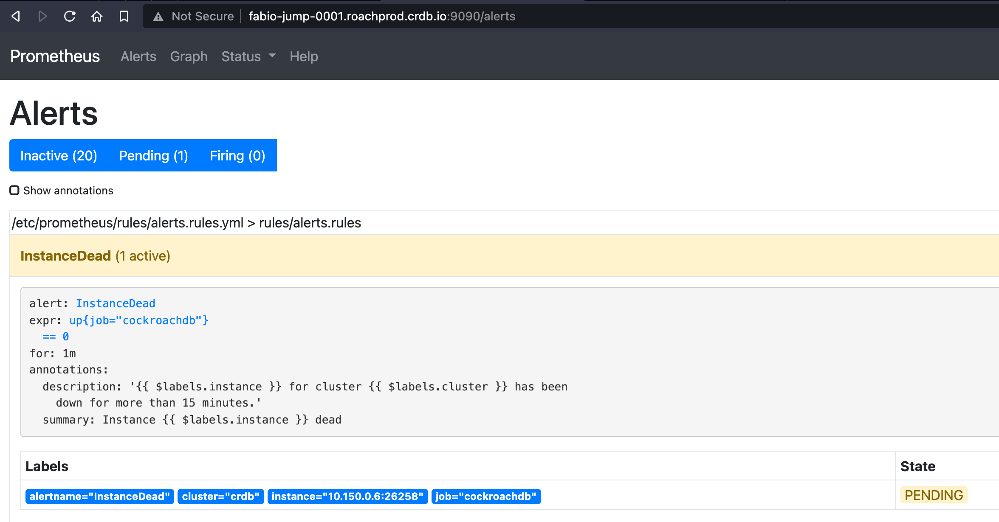

# Monitoring Overview - Demo

## Create secure 3 nodes single region cluster

```bash
# cluster
roachprod create ${USER}-demo -n=3 --gce-machine-type=n2-standard-2 --gce-zones="us-east4-a" --gce-local-ssd-count=1
roachprod stage ${USER}-demo release latest
roachprod start ${USER}-demo --secure 

# jumpboxes
roachprod create ${USER}-jump -n=1 --gce-machine-type=n2-standard-2 --gce-zones="us-east4-a" --local-ssd=False
roachprod stage ${USER}-jump release latest
roachprod stage ${USER}-jump workload

# fetch certs and upload them to jumpboxes
roachprod get ${USER}-demo:1 certs.tar
roachprod put ${USER}-jump certs.tar
roachprod run ${USER}-jump "tar xvf certs.tar"

# get IP..
IP=`roachprod ip ${USER}-demo:1`

# ... and use it here
roachprod run ${USER}-jump "sudo apt-get install -y haproxy"
roachprod run ${USER}-jump  "./cockroach gen haproxy --certs-dir=certs --host=${IP}"
roachprod run ${USER}-jump "sudo sed -i 's/1m/10m/g' haproxy.cfg"
roachprod run ${USER}-jump "sudo cp haproxy.cfg /etc/haproxy/haproxy.cfg"
roachprod run ${USER}-jump "sudo systemctl restart haproxy"

# open sql terminal...
roachprod sql ${USER}-jump:1 --secure -- -e "SET CLUSTER SETTING cluster.organization = 'Workshop';"
roachprod sql ${USER}-jump:1 --secure -- -e "SET CLUSTER SETTING enterprise.license = '$(lic)';"
roachprod sql ${USER}-jump:1 --secure -- -e "CREATE USER ${USER} WITH password '${USER}'; GRANT admin TO ${USER};"
```

## Install Prometheus, AlertManager, Grafana on the Jumpbox server

Log into the jumpbox server,

```bash
roachprod ssh ${USER}-jump:1
```

then execute these commands

```bash
# add repos and install components
sudo apt install -y apt-transport-https
sudo apt install -y software-properties-common wget
wget -q -O - https://packages.grafana.com/gpg.key | sudo apt-key add -
echo "deb https://packages.grafana.com/oss/deb stable main" | sudo tee -a /etc/apt/sources.list.d/grafana.list
sudo apt update
sudo apt install -y prometheus prometheus-alertmanager grafana
```

On another terminal, pull the list of the cluster IP addresses

```bash
$ for i in `rp ip ${USER}-demo`; do echo -n "'$i:26258', "; done
'10.128.0.3:26258', '10.128.0.2:26258', '10.128.0.4:26258', 
```

Then, download the `prometheus.yml` file so you can edit it on your laptop

```bash
wget https://raw.githubusercontent.com/cockroachdb/cockroach/master/monitoring/prometheus.yml
```

Edit the `prometheus.yml` file as follows - notice the `targets` and the use of `https`

```yaml
# Prometheus configuration for cockroach clusters.
# Requires prometheus 2.X
#
# Run with:
# $ prometheus -config.file=prometheus.yml
global:
  scrape_interval: 10s
  evaluation_interval: 10s

rule_files:
- "rules/alerts.rules.yml"
- "rules/aggregation.rules.yml"

# Alert manager running on the same host:
alerting:
  alertmanagers:
  - path_prefix: "/alertmanager/"
    static_configs:
    - targets:
      - localhost:9093

scrape_configs:
  - job_name: alertmgt
    static_configs:
    - targets: ['localhost:9093']

  - job_name: 'cockroachdb'
    metrics_path: '/_status/vars'
    # Insecure mode:
    # scheme: 'http'
    # Secure mode:
    scheme: 'https'
    tls_config:
      insecure_skip_verify: true

    static_configs:
    - targets: ['10.128.0.3:26258', '10.128.0.2:26258', '10.128.0.4:26258']
      labels:
        cluster: 'crdb'
```

Copy the file on the jumpbox server, then move it to the default prometheus config directory

```bash
sudo mv prometheus.yml /etc/prometheus/prometheus.yml 

# download rules
sudo mkdir /etc/prometheus/rules
sudo wget -P /etc/prometheus/rules https://raw.githubusercontent.com/cockroachdb/cockroach/master/monitoring/rules/aggregation.rules.yml
sudo wget -P /etc/prometheus/rules https://raw.githubusercontent.com/cockroachdb/cockroach/master/monitoring/rules/alerts.rules.yml

# change the InstanceDead timeout from 15m to 1m
sudo sed -i 's/15m/1m/g' /etc/prometheus/rules/alerts.rules.yml

# restart all services
sudo systemctl restart prometheus
sudo systemctl restart prometheus-alertmanager
sudo systemctl restart grafana-server
```

You can now open 2 tabs in your browser with the IP address of the jumpbox server at ports 9090 (Prometheus) and 3000 (Grafana).

## Capturing metrics using Prometheus + Grafana

Confirm Prometheus can successfully connect to the CockroachDB cluster and to the AlertManager service


Confirm Prometheus can scrape the metrics from the CockroachDB cluster by pulling any of the metrics


Configure Grafana to read from Prometheus:

1. Login into Grafana with admin/admin
2. Configuration > Data Sources > Prometheus
3. use <http://localhost:9090> as the server address
4. Save & Test

You should get a confirmation that the connection is successful.

Download the Grafana dashboard JSON files from our [repo](https://github.com/cockroachdb/cockroach/tree/master/monitoring/grafana-dashboards):

```bash
wget https://raw.githubusercontent.com/cockroachdb/cockroach/master/monitoring/grafana-dashboards/changefeeds.json
wget https://raw.githubusercontent.com/cockroachdb/cockroach/master/monitoring/grafana-dashboards/distributed.json
wget https://raw.githubusercontent.com/cockroachdb/cockroach/master/monitoring/grafana-dashboards/hardware.json
wget https://raw.githubusercontent.com/cockroachdb/cockroach/master/monitoring/grafana-dashboards/overview.json
wget https://raw.githubusercontent.com/cockroachdb/cockroach/master/monitoring/grafana-dashboards/queues.json
wget https://raw.githubusercontent.com/cockroachdb/cockroach/master/monitoring/grafana-dashboards/replication.json
wget https://raw.githubusercontent.com/cockroachdb/cockroach/master/monitoring/grafana-dashboards/runtime.json  
wget https://raw.githubusercontent.com/cockroachdb/cockroach/master/monitoring/grafana-dashboards/slow_request.json
wget https://raw.githubusercontent.com/cockroachdb/cockroach/master/monitoring/grafana-dashboards/sql.json
wget https://raw.githubusercontent.com/cockroachdb/cockroach/master/monitoring/grafana-dashboards/storage.json
```

In Grafana, upload them all by clicking on '+' > Import, then confirm you can pull the metrics correctly.

## Test Alerts being fired to Alertmanager

On your local terminal, stop a node

```bash
roachprod stop ${USER}-demo:3
```

You should soon see Prometheus take notice of the unavailable node



After about 1 minute, the alert is also fired to AlertManager


You can restart the node

```bash
roachprod start ${USER}-demo:3 --secure
```

To confirm AlertManager received it, check the chart in Prom, which is scraping metrics from AlertManager itself


## Logging

Create a `logs.yaml` file

```yaml
file-defaults:
  max-file-size: 10MiB
  max-group-size: 100MiB
  buffered-writes: true
  filter: INFO
  format: json-fluent
  redact: false
  redactable: true
  exit-on-error: true
  auditable: false
fluent-defaults:
  filter: INFO
  redact: false
  redactable: true
  exit-on-error: false
  auditable: false
sinks:
  file-groups:
    default:
      channels:
      - DEV
      - OPS
      - HEALTH
      - STORAGE
    audit:
      channels:
      - SENSITIVE_ACCESS
      - SESSIONS
      - USER_ADMIN
      - PRIVILEGES
      - SQL_SCHEMA
    debug:
      channels:
      - SQL_EXEC
      - SQL_PERF
      - SQL_INTERNAL_PERF
  stderr:
    channels: all
    filter: NONE
    format: json
    redact: false
    redactable: true
    exit-on-error: true
capture-stray-errors:
  enable: true
  max-group-size: 100MiB
```

Upload it to n1, then restart the node

```bash
roachprod put ${USER}-demo:1 logs.yaml

# restart the node, reading the file
roachprod stop ${USER}-demo:1 
# below won't work
#roachprod start ${USER}-demo:1 --secure --args="--log-config-file=logs.yaml"
```

ssh into the node, and start the process manually.

```bash
./cockroach start --certs-dir certs  --listen-addr=:26257 --http-addr=:26258 --advertise-addr=10.150.0.9:26257 --join=35.199.39.137:26257 --store path=/mnt/data1/cockroach,attrs=store1 --cache=25% --locality=cloud=gce,region=us-east4,zone=us-east4-a --max-sql-memory=25% --log-config-file=logs.yaml --background
```
