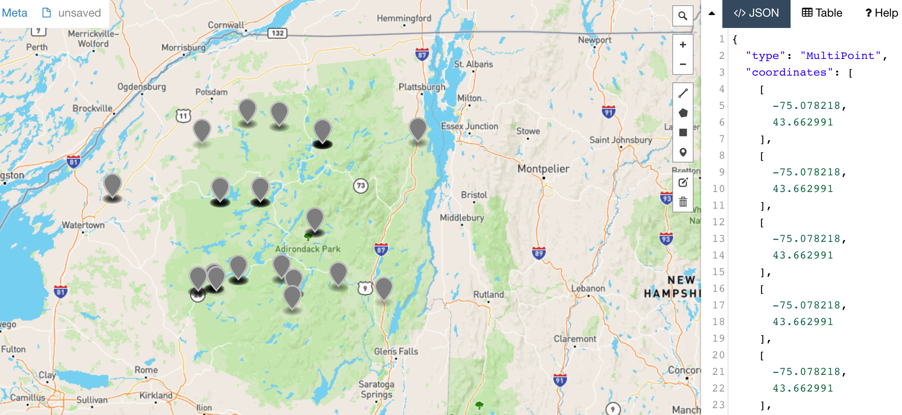
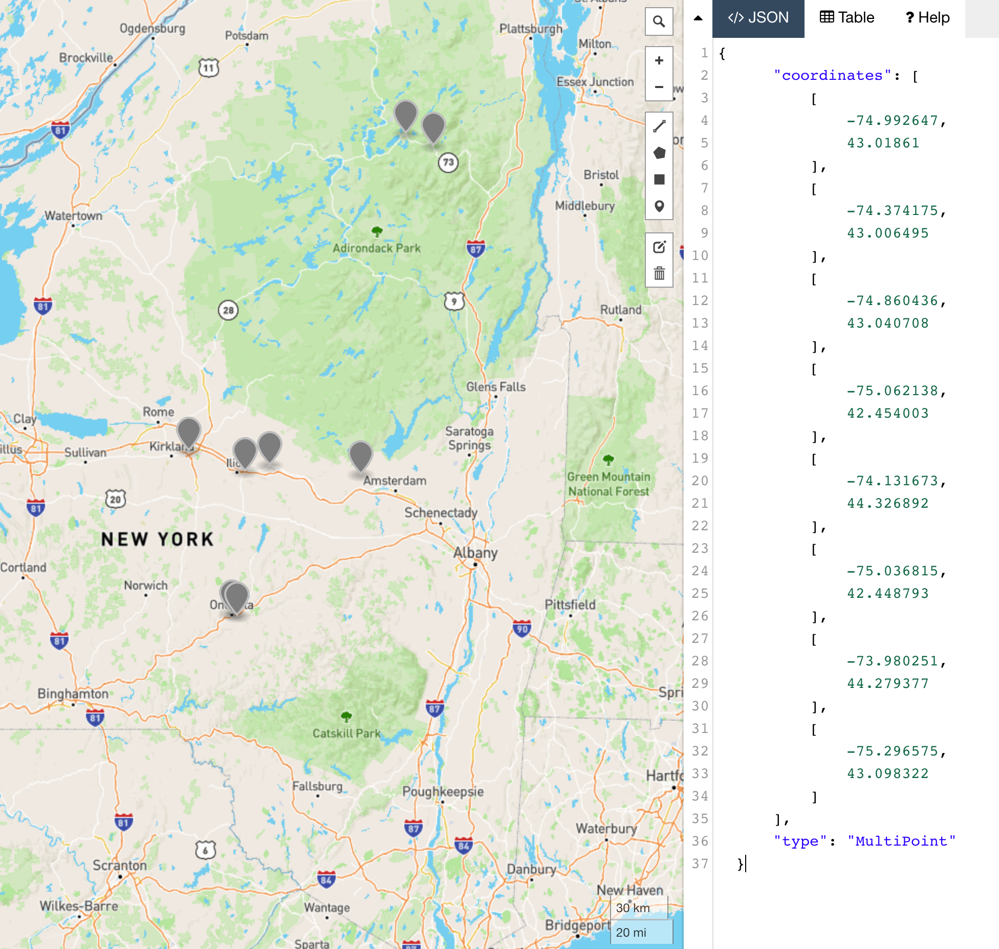
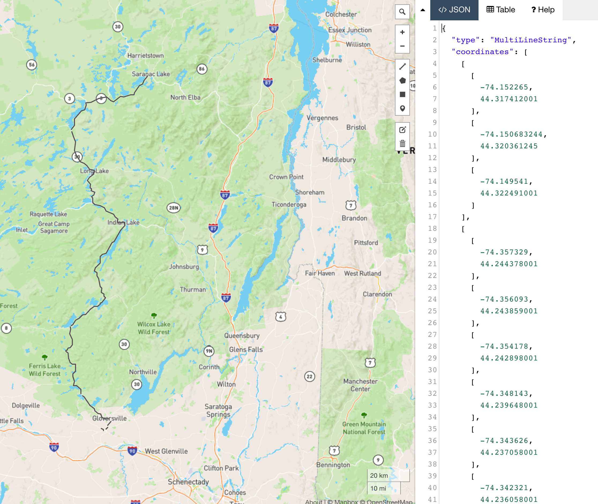

# Spatial Data - Student Labs

## Overview

In these labs, we will explore the following [spatial features](https://www.cockroachlabs.com/docs/stable/spatial-features.html) supported by CockroachDB:

- How to put together separate spatial data sets to ask and answer potentially interesting questions.
- How to use various built-in functions for operating on spatial data.
- How to create indexes on spatial data.
- Performing joins on spatial data, and how to use EXPLAIN to make sure we are using indexes effectively.
- How to quickly visualize the output of our queries using free tools like <https://geojson.io>

We use the following datasets:

- NY State bird sighting data from the years 2000-2019, taken from the North American Breeding Bird Survey (NABBS), see [here](https://www.sciencebase.gov/catalog/item/52b1dfa8e4b0d9b325230cd9).

- Road data from the US National Atlas - Major Roads of the United States data set, [here](https://www.sciencebase.gov/catalog/item/581d052be4b08da350d524ce).

- Bookstores information scraped from the American Booksellers Association website's member directory, [here](https://bookweb.org/member_directory/search/ABAmember).

## Labs Prerequisites

1. Build the single region dev cluster:

    - [Local](https://www.cockroachlabs.com/docs/v20.2/start-a-local-cluster)
    - [Docker](/infrastructure/single-region-local-docker-cluster.md).

2. You also need:

    - a modern web browser,
    - a SQL client:
      - [Cockroach SQL client](https://www.cockroachlabs.com/docs/stable/install-cockroachdb-linux)
      - `psql`
      - [DBeaver Community edition](https://dbeaver.io/download/) (SQL tool with built-in CockroachDB plugin)

## Lab 0 - Create database and load data

Connect to the database

```bash
# use cockroach sql, defaults to localhost:26257
cockroach sql --insecure

# or use the --url param for any another host:
cockroach sql --url "postgresql://localhost:26257/defaultdb?sslmode=disable"

# or use psql
psql -h localhost -p 26257 -U root defaultdb
```

```sql
IMPORT TABLE birds (
    id INT8 NOT NULL,
    name VARCHAR NOT NULL,
    "family" VARCHAR NOT NULL,
    genus VARCHAR NOT NULL,
    species VARCHAR NOT NULL,
    "order" VARCHAR NOT NULL,
    CONSTRAINT "primary" PRIMARY KEY (id ASC),
    INDEX birds_name_idx (name ASC),
    FAMILY "primary" (id, name, "family", genus, species, "order")
) CSV DATA (
    'https://github.com/cockroachlabs/workshop_labs/raw/master/spatial-data/data/birds.csv.gz'
) WITH skip = '1';

IMPORT TABLE routes (
    id INT8 NOT NULL,
    name VARCHAR NOT NULL,
    country VARCHAR NOT NULL,
    state VARCHAR NOT NULL,
    geom GEOMETRY NOT NULL,
    CONSTRAINT "primary" PRIMARY KEY (id ASC),
    INVERTED INDEX geom_idx_1 (geom),
    FAMILY "primary" (id, name, country, state, geom)
) CSV DATA (
    'https://github.com/cockroachlabs/workshop_labs/raw/master/spatial-data/data/routes.csv.gz'
) WITH skip = '1';

IMPORT TABLE observations (
    id UUID NOT NULL DEFAULT gen_random_uuid(),
    country VARCHAR NOT NULL,
    state VARCHAR NOT NULL,
    route_id INT8 NULL,
    year INT8 NOT NULL,
    bird_id INT8 NULL,
    count INT8 NOT NULL,
    CONSTRAINT "primary" PRIMARY KEY (id ASC),
    INDEX observations_bird_id_idx (bird_id ASC),
    FAMILY "primary" (id, country, state, route_id, year, bird_id, count)
) CSV DATA (
    'https://github.com/cockroachlabs/workshop_labs/raw/master/spatial-data/data/observations.csv.gz'
) WITH skip = '1';

IMPORT TABLE bookstores (
    id UUID NOT NULL DEFAULT gen_random_uuid(),
    name STRING NOT NULL,
    url STRING NULL,
    phone STRING NULL,
    address STRING NOT NULL,
    street STRING NOT NULL,
    city STRING NOT NULL,
    state STRING NOT NULL,
    zip STRING NOT NULL,
    description STRING NULL,
    geom GEOMETRY NULL,
    CONSTRAINT "primary" PRIMARY KEY (id ASC),
    INVERTED INDEX geom_idx_1 (geom),
    FAMILY "primary" (id, name, url, phone, address, street, city, state, zip, description, geom)
) CSV DATA (
    'https://github.com/cockroachlabs/workshop_labs/raw/master/spatial-data/data/bookstores.csv.gz'
) WITH skip = '1', nullif = 'NULL';

IMPORT TABLE bookstore_routes (
    id UUID NOT NULL DEFAULT gen_random_uuid(),
    name VARCHAR NULL,
    start_store_id UUID NULL,
    end_store_id UUID NULL,
    geom GEOMETRY NOT NULL,
    CONSTRAINT "primary" PRIMARY KEY (id ASC),
    FAMILY "primary" (id, name, start_store_id, end_store_id, geom)
) CSV DATA (
    'https://github.com/cockroachlabs/workshop_labs/raw/master/spatial-data/data/bookstore_routes.csv.gz'
) WITH skip = '1';

IMPORT TABLE roads (
    gid INT8 NOT NULL DEFAULT unique_rowid(),
    prime_name VARCHAR(50) NULL,
    secondary VARCHAR(30) NULL,
    prefix_dir VARCHAR(10) NULL,
    pre_type VARCHAR(30) NULL,
    name VARCHAR(30) NULL,
    street_typ VARCHAR(10) NULL,
    suffix_dir VARCHAR(10) NULL,
    interstate VARCHAR(20) NULL,
    us_route VARCHAR(20) NULL,
    st_route VARCHAR(20) NULL,
    qualifier VARCHAR(5) NULL,
    trans_type VARCHAR(5) NULL,
    fcode VARCHAR(2) NULL,
    state_fips VARCHAR(2) NULL,
    state VARCHAR(2) NULL,
    miles DECIMAL NULL,
    kilometers DECIMAL NULL,
    geom GEOMETRY(MULTILINESTRING) NULL,
    CONSTRAINT "primary" PRIMARY KEY (gid ASC),
    INVERTED INDEX geom_idx_1 (geom),
    INDEX roads_state_idx (state ASC),
    FAMILY "primary" (gid, prime_name, secondary, prefix_dir, pre_type, name, street_typ, suffix_dir, interstate, us_route, st_route, qualifier, trans_type, fcode, state_fips, state, miles, kilometers, geom )
) CSV DATA (
    'https://github.com/cockroachlabs/workshop_labs/raw/master/spatial-data/data/roads.csv.gz'
) WITH skip = '1';


SHOW TABLES;
```

```text
  schema_name |    table_name    | type  | owner | estimated_row_count
--------------+------------------+-------+-------+----------------------
  public      | birds            | table | root  |                 756
  public      | bookstore_routes | table | root  |                  56
  public      | bookstores       | table | root  |                2913
  public      | observations     | table | root  |               85731
  public      | roads            | table | root  |              225838
  public      | routes           | table | root  |                 129
(6 rows)
```

## Lab 1 - ST_Collect() and ST_AsGeoJSON()

In this lab the goal is to find the Common Loon sightings by the NABBS in the years 2000-2019 in NY state.

First, we create a list of all of the sightings of the Common Loon.

Then, we use the `ST_Collect()` function, which collects geometries into a `GeometryCollection`.

Finally, we take the `GeometryCollection` object and use the `ST_AsGeoJSON()` function to convert it to the [GeoJSON](https://www.cockroachlabs.com/docs/stable/geojson.html) format, which is much more extensible and user friendly, too.

```sql
WITH loon_sightings AS (
    SELECT
        (st_collect(routes.geom)) AS the_geom
    FROM
        birds
        JOIN observations ON birds.id = observations.bird_id
        JOIN routes ON observations.route_id = routes.id
    WHERE
        birds.name = 'Common Loon'
)
SELECT
    ST_AsGeoJSON(the_geom)
FROM
    loon_sightings;
```

```text
                                                                                                                                                                                                            st_asgeojson
--------------------------------------------------------------------------------------------------------------------------------------------------------------------------------------------------------------------------------------------------------------------------------------------------------------------------------------------------------------------------------------------------------------------------------------------------------------------------------------------------------------------------------------------------------------------------------------------------------------------------------------------------------------------------------------------------------------------------------------------------------------------------------------------------------------------------------------------------------------------------------------------------------------------------------------------------------------------------------------------------------------------------------------------------------------------------------------------------------------------------------------------------------------------------------------------------------------------------------------------------------------------------------------------------------------------------------------------------------------------------------------------------------------------------------------------------------------------------------------------------------------------------------------------------------------------------------------------------------------------------------------------------------------------------------------------------------------------------------------------------------------------------------------------------------------------------------------------------------------------------------------------------------------------------------------------------------------------------------------------------------------------------------------------------------------------------------------------------------------------------------------------------------------------------------------------------------------------------------------------------------------------------------------------------------------------------------------------------------------------------------------------------------------------------------------------------------------------------------------------------------------------------------------------------------------------------------------------------------------------------------------------------------------------------------------------
  {"type":"MultiPoint","coordinates":[[-75.078218,43.662991],[-75.078218,43.662991],[-75.078218,43.662991],[-75.078218,43.662991],[-75.078218,43.662991],[-75.078218,43.662991],[-75.078218,43.662991],[-74.389678,43.652701],[-74.389678,43.652701],[-74.389678,43.652701],[-74.389678,43.652701],[-74.389678,43.652701],[-74.389678,43.652701],[-74.389678,43.652701],[-74.389678,43.652701],[-74.389678,43.652701],[-74.9492509,43.6625207],[-74.473788,43.726581],[-74.473788,43.726581],[-74.473788,43.726581],[-74.234828,43.971271],[-74.234828,43.971271],[-74.234828,43.971271],[-74.234828,43.971271],[-74.234828,43.971271],[-74.234828,43.971271],[-74.3975289,43.5654587],[-74.3975289,43.5654587],[-74.7918689,43.7217467],[-74.7918689,43.7217467],[-74.7918689,43.7217467],[-74.7918689,43.7217467],[-74.7918689,43.7217467],[-74.7918689,43.7217467],[-74.7918689,43.7217467],[-74.7918689,43.7217467],[-74.0622389,43.6884937],[-74.0622389,43.6884937],[-73.7371009,43.6098217],[-75.0557089,44.4354227],[-74.9230359,44.1319167],[-74.9230359,44.1319167],[-74.9230359,44.1319167],[-74.9230359,44.1319167],[-74.9230359,44.1319167],[-74.9230359,44.1319167],[-74.9230359,44.1319167],[-74.9230359,44.1319167],[-74.9230359,44.1319167],[-74.9230359,44.1319167],[-74.9230359,44.1319167],[-74.1807169,44.4319917],[-74.1807169,44.4319917],[-74.1807169,44.4319917],[-74.1807169,44.4319917],[-74.1807169,44.4319917],[-74.1807169,44.4319917],[-74.1807169,44.4319917],[-74.1807169,44.4319917],[-74.1807169,44.4319917],[-74.1807169,44.4319917],[-74.1807169,44.4319917],[-74.1807169,44.4319917],[-74.1807169,44.4319917],[-74.1807169,44.4319917],[-74.1807169,44.4319917],[-74.1807169,44.4319917],[-74.1807169,44.4319917],[-74.7210849,44.5376687],[-74.7210849,44.5376687],[-74.7210849,44.5376687],[-73.4887779,44.4433387],[-73.4887779,44.4433387],[-75.7014799,44.1487467],[-75.7014799,44.1487467],[-75.7014799,44.1487467],[-75.7014799,44.1487467],[-75.7014799,44.1487467],[-74.9852279,42.0781957],[-74.9852279,42.0781957],[-74.966888,43.679941],[-74.966888,43.679941],[-74.966888,43.679941],[-74.966888,43.679941],[-74.966888,43.679941],[-74.966888,43.679941],[-74.966888,43.679941],[-74.966888,43.679941],[-74.966888,43.679941],[-74.966888,43.679941],[-74.966888,43.679941],[-74.492148,44.522881],[-74.492148,44.522881],[-74.492148,44.522881],[-74.6305979,44.1294587],[-74.6305979,44.1294587],[-74.6305979,44.1294587],[-74.6305979,44.1294587],[-74.6305979,44.1294587],[-74.6305979,44.1294587],[-74.6305979,44.1294587],[-74.6305979,44.1294587],[-74.6305979,44.1294587],[-74.6305979,44.1294587],[-74.6305979,44.1294587]]}
```

Copy the output of the query and paste it into <http://geojson.io> to see what it looks like.



## Lab 2 - ST_Area(), ST_ConvexHull() and ST_Transform()

In this lab, the goal is to find the area of the Loon's sightings range.

As before, we create a list of all of the sightings of the Common Loon into a `GeometryCollection` object.

Then, we calculate the convex hull of object using `ST_ConvexHull()`.

We need to note that because the `routes` data uses [SRID 4326](https://www.cockroachlabs.com/docs/stable/srid-4326.html), the resulting area is measured in degrees and we need to cast it into a `GEOGRAPHY` object before using `ST_Area()` to calculate the area, which we convert to square km.

```sql
WITH loon_sightings AS (
    SELECT
        (st_collect(routes.geom)) AS the_geom
    FROM
        birds
        JOIN observations ON birds.id = observations.bird_id
        JOIN routes ON observations.route_id = routes.id
    WHERE
        birds.name = 'Common Loon'
)
SELECT
    st_area(st_convexhull(the_geom)::GEOGRAPHY) / 1000 ^ 2 AS area_km_squared
    -- alternatively, using ST_Transform
    -- st_area(ST_Transform(st_convexhull(the_geom), 26986)) / 1000 ^ 2 AS area_km_squared
FROM
    loon_sightings;
```

```text
   area_km_squared
----------------------
  27003.820075269043
(1 row)
```

## lab 3 - ST_Contain()

In this lab, the goal is to find bookstores that lie within the Loon's habitat range.

Similar to the previous labs, let's build a CTE that returns the convex hull of Common Loon habitat.
We then join the result with the `bookstores` table to check whether a bookstore's location is contained by the loon habitat by making use of the [`ST_Contains()` function](https://www.cockroachlabs.com/docs/stable/st_contains.html).

```sql
WITH loon_sightings AS (
    SELECT
        st_convexhull(st_collect(routes.geom)) AS loon_hull
    FROM
        birds
        JOIN observations ON birds.id = observations.bird_id
        JOIN routes ON observations.route_id = routes.id
    WHERE
        birds.name = 'Common Loon'
)
SELECT
    name, street, city, state
FROM
    loon_sightings
    JOIN bookstores ON ST_Contains(loon_hull, geom)
ORDER BY
    geom;
```

```text
                        name                       |        street         |      city      | state
---------------------------------------------------+-----------------------+----------------+--------
  Blacktree Books                                  | 5006 state Highway 23 | Oneonta        | NY
  The Green Toad Bookstore                         | 198 Main St           | Oneonta        | NY
  The Treehouse Reading and Arts Center            | 587 Main St Ste 304   | New York Mills | NY
  Gansevoort House Books at Gems Along the Mohawk  | 800 Mohawk St         | Herkimer       | NY
  Gansevoort House Books at The Shoppes at 25 West | 25 W Mill Street      | Little Falls   | NY
  Mysteries On Main Street                         | 144 W Main St         | Johnstown      | NY
  The Bookstore Plus Music &amp; Art               | 2491 Main St          | Lake Placid    | NY
  The Book Nook (Saranac Lake, NY)                 | 7 Broadway            | Saranac Lake   | NY
(8 rows)
```

Let's put the locations on a map using `ST_AsGeoJSON()`.

```sql
WITH loon_sightings AS (
    SELECT
        st_convexhull(st_collect(routes.geom)) AS loon_hull
    FROM
        birds
        JOIN observations ON birds.id = observations.bird_id
        JOIN routes ON observations.route_id = routes.id
    WHERE
        birds.name = 'Common Loon'
)
SELECT
    jsonb_pretty(ST_AsGeoJSON(ST_Collect(geom)) :: JSONB) AS bookstore_loc
FROM
    loon_sightings
    JOIN bookstores ON ST_Contains(loon_hull, geom);
```

```text
       bookstore_loc
----------------------------
  {
      "coordinates": [
          [
              -74.992647,
              43.01861
          ],
          [
              -74.374175,
              43.006495
          ],
          [
              -74.860436,
              43.040708
          ],
          [
              -75.062138,
              42.454003
          ],
          [
              -74.131673,
              44.326892
          ],
          [
              -75.036815,
              42.448793
          ],
          [
              -73.980251,
              44.279377
          ],
          [
              -75.296575,
              43.098322
          ]
      ],
      "type": "MultiPoint"
  }
(1 row)
```



## Lab 4 - ST_Distance()

THe goal is to get a list of the most often sighted birds within 10 miles of The Book Nook in Saranac Lake, NY.

Build a CTE that returns the `geom` of the bookstore we want to visit, The Book Nook.

Use `ST_Distance()`, which returns the distance in meters between geography_a and geography_b, to list the names and observation totals (sums) of birds whose habitats are within 10 miles of the location of the bookstore.

```sql
WITH the_book_nook AS (
    SELECT geom FROM bookstores WHERE name = 'The Book Nook (Saranac Lake, NY)'
)
SELECT
    birds.name,
    SUM(observations.COUNT) AS sightings
FROM
    birds
    JOIN observations ON birds.id = observations.bird_id
    JOIN routes ON observations.route_id = routes.id,
    the_book_nook
WHERE
    ST_Distance(
        the_book_nook.geom :: GEOGRAPHY,
        routes.geom :: GEOGRAPHY
    ) < (1609 * 10)
GROUP BY
    birds.name
ORDER BY
    sightings DESC
LIMIT
    25;
```

```text
                   name                  | sightings
-----------------------------------------+------------
  Red-eyed Vireo                         |      2557
  White-throated Sparrow                 |       928
  Hermit Thrush                          |       924
  American Robin                         |       691
  Ovenbird                               |       650
  American Crow                          |       528
  (Myrtle Warbler) Yellow-rumped Warbler |       506
  Chipping Sparrow                       |       465
  Black-capped Chickadee                 |       390
  Yellow-bellied Sapsucker               |       359
  Blue-headed Vireo                      |       357
  Blue Jay                               |       345
  Winter Wren                            |       344
  Cedar Waxwing                          |       272
  Blackburnian Warbler                   |       248
  Magnolia Warbler                       |       236
  Black-throated Green Warbler           |       226
  Common Grackle                         |       218
  Red-breasted Nuthatch                  |       209
  Common Yellowthroat                    |       184
  Northern Parula                        |       175
  Nashville Warbler                      |       164
  Red-winged Blackbird                   |       152
  Least Flycatcher                       |       128
  American Redstart                      |       123
(25 rows)
```

Note how, if you pull the query plan using `EXPLAIN (VERBOSE)`, the optimizer uses the `ST_DWithinexclusive` [accelarated function](https://www.cockroachlabs.com/docs/v20.2/spatial-data.html#performance) instead of `ST_Distance()`.

```text
                        tree                        |        field        |                          description                           |                       columns                        | ordering
----------------------------------------------------+---------------------+----------------------------------------------------------------+------------------------------------------------------+-----------
                                                    | distribution        | full                                                           |                                                      |
                                                    | vectorized          | true                                                           |                                                      |
  limit                                             |                     |                                                                | (name, sightings)                                    |
   │                                                | estimated row count | 25                                                             |                                                      |
   │                                                | count               | 25                                                             |                                                      |
   └── sort                                         |                     |                                                                | (name, sum)                                          | -sum
        │                                           | estimated row count | 756                                                            |                                                      |
        │                                           | order               | -sum                                                           |                                                      |
        └── group                                   |                     |                                                                | (name, sum)                                          |
             │                                      | estimated row count | 756                                                            |                                                      |
             │                                      | aggregate 0         | sum(count)                                                     |                                                      |
             │                                      | group by            | name                                                           |                                                      |
             └── project                            |                     |                                                                | (name, count)                                        |
                  └── hash join (inner)             |                     |                                                                | (route_id, bird_id, count, id, geom, geom, id, name) |
                       │                            | estimated row count | 26401                                                          |                                                      |
                       │                            | equality            | (bird_id) = (id)                                               |                                                      |
                       │                            | right cols are key  |                                                                |                                                      |
                       ├── hash join (inner)        |                     |                                                                | (route_id, bird_id, count, id, geom, geom)           |
                       │    │                       | estimated row count | 31245                                                          |                                                      |
                       │    │                       | equality            | (route_id) = (id)                                              |                                                      |
                       │    ├── scan                |                     |                                                                | (route_id, bird_id, count)                           |
                       │    │                       | estimated row count | 85731                                                          |                                                      |
                       │    │                       | table               | observations@primary                                           |                                                      |
                       │    │                       | spans               | FULL SCAN                                                      |                                                      |
                       │    └── cross join (inner)  |                     |                                                                | (id, geom, geom)                                     |
                       │         │                  | estimated row count | 40                                                             |                                                      |
                       │         │                  | pred                | st_dwithinexclusive(geom::GEOGRAPHY, geom::GEOGRAPHY, 16090.0) |                                                      |
                       │         ├── scan           |                     |                                                                | (id, geom)                                           |
                       │         │                  | estimated row count | 129                                                            |                                                      |
                       │         │                  | table               | routes@primary                                                 |                                                      |
                       │         │                  | spans               | FULL SCAN                                                      |                                                      |
                       │         └── render         |                     |                                                                | (geom)                                               |
                       │              │             | estimated row count | 1                                                              |                                                      |
                       │              │             | render 0            | geom                                                           |                                                      |
                       │              └── filter    |                     |                                                                | (city, state, geom)                                  |
                       │                   │        | estimated row count | 1                                                              |                                                      |
                       │                   │        | filter              | (state = 'NY') AND (city = 'Saranac Lake')                     |                                                      |
                       │                   └── scan |                     |                                                                | (city, state, geom)                                  |
                       │                            | estimated row count | 2913                                                           |                                                      |
                       │                            | table               | bookstores@primary                                             |                                                      |
                       │                            | spans               | FULL SCAN                                                      |                                                      |
                       └── scan                     |                     |                                                                | (id, name)                                           |
                                                    | estimated row count | 756                                                            |                                                      |
                                                    | table               | birds@birds_name_idx                                           |                                                      |
                                                    | spans               | FULL SCAN                                                      |                                                      |
(45 rows)
```

## Lab 5 - ST_Length()

In this final lab, we want to find the distance of the route from Mysteries on Main Street in Johnstown, NY to The Book Nook in Saranac Lake, NY

```sql
SELECT
    st_length(geom :: GEOGRAPHY) / 1000 AS km
FROM
    bookstore_routes
WHERE
    end_store_id = (
        SELECT id FROM bookstores WHERE name = 'Mysteries On Main Street'
    )
    AND start_store_id = (
        SELECT id FROM bookstores WHERE name = 'The Book Nook (Saranac Lake, NY)'
    );
```

```text
          km
----------------------
  213.48808505371238
(1 row)
```

We can pull the route too. Paste the GeoJSON output into <geojson.io> to view the route on the map.

```sql
SELECT
    ST_AsGeoJSON(geom)
FROM
    bookstore_routes
WHERE
    end_store_id = (
        SELECT id FROM bookstores WHERE name = 'Mysteries On Main Street'
    )
    AND start_store_id = (
        SELECT id FROM bookstores WHERE name = 'The Book Nook (Saranac Lake, NY)'
    );
```

```text
{"type":"MultiLineString","coordinates":[[[-74.152265,44.317412001],[-74.150683244,44.320361245],[-74.149541,44.322491001]],[[-74.357329,44.244378001],[-74.356093,44.243859001],[-74.354178,44.242898001],[-74.348143,44.239648001],[-74.343626,44.237058001],[-74.342321,44.236058001],[-74.341749001,44.235410001],[-74.33975,44.232579001],[-74.339208,44.231977001],[-74.338667001,44.231599001],[-74.337461,44.231248001],[-74.326169,44.228478001],[-74.324681,44.228200001],[-74.322827,44.228066001],[-74.319936001,44.228040001],[-74.318920999,44.228200001],[-74.316251,44.228909001],[-74.315228,44.229337001],[-74.313824,44.230576001],[-74.310864,44.234299001],[-74.308766,44.236287001],[-74.30769,44.237137001],[-74.306668,44.237778001],[-74.305104,44.238369001],[-74.300305,44.239258001],[-74.298489,44.239849001],[-74.296765,44.240559001],[-74.293965,44.241978001],[-74.285755,44.246469001],[-74.284199,44.246998001],[-74.283496,44.247158001],[-74.278659999,44.246807001],[-74.277065,44.246487001],[-74.27103,44.244926001],[-74.269977,44.244766001],[-74.268862,44.244926001],[-74.267528001,44.245315001],[-74.264667,44.246425001],[-74.263103,44.246887001],[-74.262439,44.246956001],[-74.261516,44.246887001],[-74.258806999,44.246215001],[-74.258105,44.246128001],[-74.256106,44.246376001],[-74.249583,44.248748001],[-74.242563999,44.250486001],[-74.240374,44.251056001],[-74.237955,44.251956001],[-74.236117,44.252757001],[-74.234713,44.253264001],[-74.233477,44.253375001],[-74.232264001,44.253214001],[-74.230066,44.252714001],[-74.228067,44.252554001],[-74.224855,44.252695001],[-74.222374999,44.253027001],[-74.220468,44.253485001],[-74.219284999,44.253916001],[-74.218202,44.254465001],[-74.217285999,44.255606001],[-74.216554001,44.256914001],[-74.216272,44.258444001],[-74.216172,44.260206001],[-74.215837,44.261663001],[-74.215417,44.262537001],[-74.215105,44.262884001],[-74.210526,44.266176001],[-74.209443,44.267164001],[-74.205635,44.272016001],[-74.204712,44.272855001],[-74.203781,44.273633001],[-74.20137,44.275014001],[-74.199875,44.276155001],[-74.189735,44.286454001],[-74.1883,44.287625001],[-74.187415,44.288033001],[-74.186333,44.288353001],[-74.184364869,44.288747417],[-74.184364734,44.288747444],[-74.180854001,44.289451001],[-74.178374,44.290524001],[-74.177191,44.291213001],[-74.176085,44.292084001],[-74.175354,44.292725001],[-74.174521,44.293915001],[-74.173979,44.295353001],[-74.173468,44.297363001],[-74.172934001,44.298374001],[-74.166349,44.306545001],[-74.165144,44.308003001],[-74.160711,44.311824001],[-74.159916999,44.312461001],[-74.157789,44.313514001],[-74.154476999,44.315021001],[-74.153623,44.315642001],[-74.152265,44.317412001]],[[-74.464373,44.224200001],[-74.462122,44.224250001],[-74.461046,44.224318001],[-74.455468999,44.22478],[-74.442636406,44.225904612],[-74.437326,44.226370001],[-74.436273,44.226599001],[-74.416718001,44.232618001],[-74.398811,44.238371001],[-74.396683,44.238729001],[-74.390892,44.239401001],[-74.386916999,44.240198001],[-74.376418001,44.242708001],[-74.37461,44.243078001],[-74.369964,44.243669001],[-74.358573,44.244409001],[-74.357329,44.244378001]],[[-74.538494,44.124160001],[-74.537784999,44.125049001],[-74.534733,44.128341001],[-74.533054,44.129662001],[-74.531116,44.130992001],[-74.528957,44.132541001],[-74.527345325,44.134460927],[-74.527338703,44.134468817],[-74.527332393,44.134476334],[-74.525867,44.136222001],[-74.525164999,44.137359001],[-74.524524,44.138992001],[-74.524012999,44.140750001],[-74.522853,44.151859001],[-74.522876,44.154721001],[-74.523166,44.156341001],[-74.523501999,44.157512001],[-74.523822,44.158702001],[-74.523914,44.160320001],[-74.523753999,44.161079001],[-74.523371,44.161991001],[-74.521656,44.164352001],[-74.518795,44.167732001],[-74.517734,44.168800001],[-74.515415,44.170791001],[-74.512392,44.173229001],[-74.511211,44.174079001],[-74.507396,44.176181001],[-74.500621,44.180629001],[-74.492266,44.190040001],[-74.487185,44.193339001],[-74.485827,44.194141001],[-74.480456,44.196220001],[-74.478991,44.196551001],[-74.474985,44.197211001],[-74.472384001,44.197902001],[-74.471864933,44.198667258],[-74.471781,44.198791001],[-74.471609775,44.199419986],[-74.47160767,44.199427717],[-74.471357398,44.200347074],[-74.471238999,44.200782001],[-74.470742999,44.204081001],[-74.470324,44.205100001],[-74.470011,44.205630001],[-74.468932391,44.207118271],[-74.468927664,44.207124794],[-74.467852,44.208609001],[-74.464525,44.213050001],[-74.462816,44.215560001],[-74.462626,44.216022001],[-74.462687,44.217509001],[-74.46288977,44.21846686],[-74.46306,44.219271001],[-74.463861,44.220321001],[-74.464914999,44.221049001],[-74.465776999,44.221599001],[-74.466311,44.222030001],[-74.466249999,44.222491001],[-74.465655,44.223059001],[-74.464373,44.224200001]],[[-74.529117,44.099819001],[-74.531985,44.102500001],[-74.532741,44.103572001],[-74.533183,44.104492001],[-74.533435,44.106109001],[-74.533527,44.108600001],[-74.534061,44.111190001],[-74.534503,44.112152001],[-74.535045,44.113109001],[-74.536502999,44.115379001],[-74.537357,44.116381001],[-74.537456,44.116455001]],[[-74.472935039,44.000000001],[-74.479534023,44.002542684],[-74.479984937,44.002716429],[-74.480005378,44.002724305],[-74.480329,44.002849001],[-74.48677,44.005149001],[-74.49295,44.007480001],[-74.496628,44.009689001],[-74.498024,44.010719001],[-74.499611,44.012371001],[-74.501511,44.014541001],[-74.503151,44.016508001],[-74.508523,44.023811001],[-74.511529,44.027950001],[-74.514778999,44.032821001],[-74.515222,44.034469001],[-74.515473999,44.036991001],[-74.516015,44.039112001],[-74.517175,44.041202001],[-74.517816,44.042251001],[-74.519449,44.044540001],[-74.520181,44.045272001],[-74.521486,44.046760001],[-74.52189,44.047332001],[-74.522234,44.048221],[-74.522074,44.052341001],[-74.521654,44.055591001],[-74.520983,44.059932001],[-74.520051,44.065921001],[-74.519023544,44.072237853],[-74.519022043,44.072247084],[-74.518511,44.075389001],[-74.518381,44.076869001],[-74.518374,44.078979001],[-74.518503,44.079730001],[-74.518976,44.081382001],[-74.519572001,44.082641001],[-74.52122,44.085311001],[-74.525523,44.093051001],[-74.52682,44.095809001],[-74.528056,44.098220001],[-74.5291102,44.099808753],[-74.529115821,44.099817225],[-74.529117,44.099819001]],[[-74.419277,43.968522001],[-74.420169,43.969804001],[-74.420413,43.970281001],[-74.420604,43.971353001],[-74.420643889,43.971779185],[-74.420644773,43.971788634],[-74.42081,43.973554001],[-74.421245,43.974141001],[-74.421848,43.974301001],[-74.426426993,43.974695925],[-74.42644422,43.974697411],[-74.427425,43.974782001],[-74.42815,43.975010001],[-74.428618155,43.975309199],[-74.428626193,43.975314337],[-74.429577,43.975922001],[-74.43047,43.976590001],[-74.431927,43.977391001],[-74.435977,43.978982001],[-74.437787,43.979302001],[-74.439526,43.979302001],[-74.443196,43.979050001],[-74.444340001,43.979092001],[-74.445003999,43.979191001],[-74.446484,43.979640001],[-74.449117,43.980812001],[-74.451276,43.981953001],[-74.453779,43.983780001],[-74.456640001,43.986951001],[-74.460989,43.992531001],[-74.461897,43.993790001],[-74.4634,43.995430001],[-74.464407001,43.996460001],[-74.465362,43.997082001],[-74.472935039,44.000000001]],[[-74.430422635,43.855487245],[-74.430823844,43.859778886],[-74.432091,43.864603001],[-74.430741,43.872534001],[-74.430741,43.873312001],[-74.431092,43.874205001],[-74.431824999,43.875052001],[-74.432267,43.875433001],[-74.433274,43.876513001],[-74.433854,43.877634001],[-74.433946,43.878454001],[-74.433725001,43.879091001],[-74.432962,43.880034001],[-74.431573,43.881113001],[-74.427842,43.882784001],[-74.424844,43.884363001],[-74.424027,43.884882001],[-74.418244,43.889235],[-74.417732,43.889895001],[-74.417481,43.890444001],[-74.417428,43.891023001],[-74.417481,43.891981001],[-74.417992999,43.893305001],[-74.418686999,43.894175001],[-74.419221,43.894613001],[-74.420586,43.895502001],[-74.422838,43.896364001],[-74.424661,43.896803001],[-74.428651,43.896982001],[-74.434976,43.898191001],[-74.435762,43.898394001],[-74.436464,43.898992001],[-74.436815,43.899541001],[-74.437037001,43.900682001],[-74.437006,43.902284001],[-74.436844816,43.902957433],[-74.436815,43.903082001],[-74.436568249,43.903468348],[-74.436564,43.903475001],[-74.435687001,43.905462001],[-74.435648,43.906812001],[-74.435877,43.907381001],[-74.436884,43.908254001],[-74.437456,43.908434001],[-74.439768,43.909033001],[-74.440714,43.909444001],[-74.442675,43.910814001],[-74.443247,43.911241001],[-74.443949,43.912252001],[-74.444194,43.912843001],[-74.444163,43.913831001],[-74.443477,43.917234001],[-74.443286,43.917814001],[-74.442683,43.918993001],[-74.442408,43.919753002],[-74.441707,43.924302001],[-74.442027,43.925031001],[-74.44321,43.926824001],[-74.444118,43.927891001],[-74.444727999,43.928422001],[-74.455486001,43.936163001],[-74.457503769,43.936996535],[-74.457628577,43.938124354],[-74.456197485,43.939437358],[-74.452444415,43.94344539],[-74.450565344,43.945532689],[-74.449504442,43.946317113],[-74.446375524,43.948497454],[-74.446308501,43.948545699],[-74.4417465,43.951936699],[-74.441713582,43.95196156],[-74.441577106,43.952073562],[-74.44144825,43.95219425],[-74.441440603,43.952201926],[-74.440944602,43.952701927],[-74.440831562,43.952823108],[-74.440719559,43.952959582],[-74.440616724,43.953103091],[-74.440523492,43.953253017],[-74.440440267,43.95340872],[-74.440417621,43.953455787],[-74.440279357,43.953750403],[-74.439810963,43.954070359],[-74.438161986,43.954733199],[-74.435710574,43.955480195],[-74.435629767,43.955506216],[-74.435464532,43.955568406],[-74.435303719,43.955641268],[-74.435303325,43.955641463],[-74.434326325,43.956123464],[-74.434253446,43.956160804],[-74.429912445,43.958468803],[-74.429830017,43.958514493],[-74.429792382,43.958536629],[-74.428869382,43.95908963],[-74.428757089,43.959160725],[-74.428613582,43.959263561],[-74.428602976,43.959271742],[-74.425443975,43.961720742],[-74.425061746,43.963823434],[-74.423999,43.966344001],[-74.419277,43.968522001]],[[-74.430422635,43.855487245],[-74.422981,43.853304001],[-74.422035,43.852503001],[-74.421463,43.851863001],[-74.42086,43.850794001],[-74.420173,43.849055001],[-74.417701001,43.847792001],[-74.416725,43.847434001],[-74.411512999,43.845713001],[-74.410461,43.845374001],[-74.405379,43.845622001],[-74.404302999,43.845653001],[-74.402564,43.845443001],[-74.391691,43.843593001],[-74.389043999,43.842933001],[-74.386389,43.842044001],[-74.383202099,43.84067843],[-74.383194658,43.840675242],[-74.383008908,43.840595648],[-74.380788,43.839644001],[-74.378271,43.838885001],[-74.370183,43.837283001],[-74.369199,43.836986001],[-74.367238,43.835895001],[-74.366452,43.835223001],[-74.362378,43.829894001],[-74.361927,43.829215001],[-74.360920001,43.826236001],[-74.360073,43.825275001],[-74.359158,43.824615001],[-74.356823,43.823444001],[-74.351642,43.821704001],[-74.350788,43.821453001],[-74.345065,43.820084001],[-74.339946,43.819373001],[-74.338977001,43.819164001],[-74.33768,43.818595001],[-74.336580999,43.817832001],[-74.334681,43.816055001],[-74.333987,43.815483001],[-74.33301,43.815112001],[-74.332346,43.815025001],[-74.328997,43.815135001],[-74.328265,43.815044001],[-74.32606,43.814525001],[-74.324885,43.814014001],[-74.323565,43.813075001],[-74.317789,43.807224001],[-74.316904,43.805984001],[-74.315865999,43.804916001],[-74.314164,43.803356001],[-74.312616,43.802234001],[-74.309617,43.800743001],[-74.304787,43.798774001],[-74.303597,43.798156002],[-74.302544,43.797374001],[-74.302017,43.796764001],[-74.301766,43.795703001],[-74.301293,43.789993001],[-74.301239,43.788345001],[-74.30156,43.787366001],[-74.301964,43.786903001],[-74.303009,43.785984001],[-74.303856,43.785053001],[-74.303766,43.784523001],[-74.303169,43.783584001],[-74.30237657,43.782755241],[-74.302368102,43.782746385],[-74.301773,43.782124001],[-74.300392,43.781143001],[-74.299507001,43.780723001],[-74.298248001,43.780403001],[-74.296165,43.780174001],[-74.294173999,43.780174001],[-74.293197,43.780403001],[-74.289786,43.781475001],[-74.283652001,43.782913001],[-74.281074,43.783226001],[-74.276053,43.783065001],[-74.266203,43.782344001],[-74.265295,43.782203001]],[[-74.363938,43.502013001],[-74.366326,43.504158001],[-74.367432,43.504927001],[-74.368592001,43.505598001],[-74.3695,43.506236001],[-74.369966,43.506716001],[-74.371263,43.508746001],[-74.371728,43.510188002],[-74.371759,43.510878001],[-74.371072,43.513346001],[-74.371126,43.514128001],[-74.371263001,43.514609001],[-74.371606001,43.515086001],[-74.372988,43.516226001],[-74.37459,43.516986001],[-74.377199,43.518266001],[-74.385432,43.522406001],[-74.386088,43.523017001],[-74.386408999,43.523497001],[-74.386691,43.524646001],[-74.386532553,43.526017531],[-74.38653144,43.526027172],[-74.386442444,43.526797514],[-74.386409,43.527087001],[-74.385913,43.528948001],[-74.385119,43.531458001],[-74.383929,43.534228001],[-74.383212,43.535826001],[-74.383021,43.537089001],[-74.382983,43.538138001],[-74.383334,43.538897001],[-74.384273,43.540125001],[-74.385593,43.541586001],[-74.390468001,43.545298001],[-74.391071,43.546008002],[-74.391918,43.547678001],[-74.395001,43.555265001],[-74.395131,43.556048001],[-74.395283,43.557879001],[-74.395321,43.561217001],[-74.395543,43.562746001],[-74.395909,43.563776],[-74.396512,43.564509001],[-74.397519,43.565466001],[-74.398803582,43.566517366],[-74.398814559,43.56652635],[-74.399221,43.566859001],[-74.399824,43.567705001],[-74.399944999,43.568259001],[-74.399945,43.569647001],[-74.399221,43.572188001],[-74.39919,43.573626001],[-74.399662,43.574797001],[-74.40064,43.575918001],[-74.404486,43.579416001],[-74.405202999,43.580538001],[-74.405584,43.581227001],[-74.405916539,43.5819675],[-74.405920409,43.581976118],[-74.406069135,43.582307303],[-74.407255,43.584948001],[-74.407721,43.586386001],[-74.408263,43.588358001],[-74.408606,43.591215001],[-74.408484,43.592638001],[-74.408454,43.594439001],[-74.408896,43.595877001],[-74.409934,43.596907001],[-74.410712,43.597319001],[-74.414336,43.598826001],[-74.418052,43.600195001],[-74.418937,43.600676001],[-74.419784,43.601568001],[-74.420166,43.602099001],[-74.420356,43.602716001],[-74.420326,43.603445001],[-74.419976,43.604178001],[-74.417839,43.607267001],[-74.416397,43.610147001],[-74.414604,43.614607001],[-74.414423322,43.616825244],[-74.412448675,43.618905862],[-74.40718547,43.621568425],[-74.402912985,43.623921388],[-74.397525939,43.62776043],[-74.395234896,43.628936913],[-74.392262735,43.632218675],[-74.39075766,43.634708852],[-74.389909772,43.637358042],[-74.388159464,43.640096794],[-74.387494889,43.644231168],[-74.387252,43.646085001],[-74.387122,43.646905001],[-74.387222,43.647615001],[-74.387664,43.648465001],[-74.388618,43.649698001],[-74.388953999,43.650544001],[-74.389282339,43.651568593],[-74.389285046,43.651577041],[-74.389527445,43.652333453],[-74.389847852,43.655810221],[-74.388573718,43.658372116],[-74.385712295,43.660061454],[-74.378887271,43.663353982],[-74.375864153,43.663837969],[-74.373971827,43.663959237],[-74.371619282,43.665055508],[-74.369785751,43.66516015],[-74.365134387,43.665658299],[-74.363288,43.666715001],[-74.362213,43.667745001],[-74.360854,43.669385001],[-74.360518,43.669934001],[-74.360167,43.670827001],[-74.356002,43.676476001],[-74.349882999,43.683015001],[-74.344527,43.687794001],[-74.343077,43.689374001],[-74.342131,43.691105001],[-74.340582,43.694836001],[-74.339514,43.696484],[-74.335066,43.700436001],[-74.334242,43.701874001],[-74.333174,43.704007001],[-74.331496,43.707844001],[-74.330802,43.709084001],[-74.330076,43.709927001],[-74.329352001,43.710366001],[-74.328215,43.710705001],[-74.324652001,43.710957001],[-74.320875,43.711563001],[-74.319922,43.711865001],[-74.319266,43.712277001],[-74.313734,43.718174001],[-74.313069,43.719135001],[-74.312566999,43.720524001],[-74.311713,43.722103001],[-74.309912,43.724556001],[-74.302595001,43.732204001],[-74.299216,43.735523001],[-74.297856999,43.736393001],[-74.294798006,43.740837095],[-74.294792616,43.740844925],[-74.292921,43.743564001],[-74.290266,43.747505001],[-74.289922999,43.747887001],[-74.287932,43.748733001],[-74.287207,43.749325001],[-74.286703,43.750084001],[-74.285567,43.752563001],[-74.285345,43.753802001],[-74.284903,43.754875001],[-74.283926,43.756206001],[-74.282431,43.757225001],[-74.278173999,43.761955001],[-74.276846,43.763714001],[-74.27561,43.764866001],[-74.274252,43.765823001],[-74.270308,43.768245001],[-74.265844,43.770633001],[-74.264074,43.773136001],[-74.263722,43.773906001],[-74.263662,43.775093001],[-74.263884,43.776195001],[-74.264570001,43.777404001],[-74.264853,43.778395001],[-74.265265,43.781635001],[-74.265295,43.782203001]],[[-74.538405,43.399411001],[-74.534987,43.400719001],[-74.533636,43.401360001],[-74.531745,43.402501001],[-74.530805999,43.403229001],[-74.529921,43.404080001],[-74.527311,43.407731001],[-74.526495,43.409058001],[-74.524985001,43.412920001],[-74.524451,43.413998001],[-74.523793,43.414979001],[-74.523108,43.415730001],[-74.522154001,43.416398001],[-74.521093999,43.417008001],[-74.518043001,43.418500001],[-74.513304,43.420670001],[-74.508344,43.422768001],[-74.507361,43.423131001],[-74.499571001,43.426739001],[-74.497915,43.427628001],[-74.495504,43.429299001],[-74.488104,43.434572002],[-74.486913001,43.435559001],[-74.483991,43.437459001],[-74.480543,43.439400001],[-74.476689,43.440937001],[-74.474523,43.441449001],[-74.473745,43.441516001],[-74.472646,43.441288001],[-74.47054,43.440808001],[-74.468564,43.440540001],[-74.467183,43.440702001],[-74.465771,43.441201001],[-74.457173,43.447567001],[-74.453511,43.450928001],[-74.452411999,43.452049001],[-74.451405,43.452919001],[-74.445484001,43.457390001],[-74.440525,43.460407001],[-74.43845,43.461510001],[-74.435283,43.462418001],[-74.432674,43.463798001],[-74.430072,43.466109001],[-74.428562001,43.466999001],[-74.423259001,43.469658001],[-74.421505,43.470231001],[-74.420529,43.470428001],[-74.414973,43.471008001],[-74.412081,43.470958001],[-74.411082001,43.470890001],[-74.408251,43.470256001],[-74.407214,43.470119001],[-74.406328,43.470231001],[-74.405237,43.470639001],[-74.404421,43.471187001],[-74.403751968,43.471760018],[-74.40374812,43.471763313],[-74.402247,43.473049001],[-74.398798,43.475128001],[-74.397257,43.475996001],[-74.395281,43.476959001],[-74.394808,43.477138001],[-74.39409,43.477649001],[-74.392458,43.479358001],[-74.392168001,43.479747001],[-74.389879,43.481849001],[-74.388879,43.482417001],[-74.388063,43.482768001],[-74.384286001,43.483890001],[-74.38231,43.484687001],[-74.379548,43.485988001],[-74.378007,43.487247001],[-74.37459,43.490497001],[-74.371728001,43.493628001],[-74.368516,43.497519001],[-74.368081,43.498088001],[-74.366921,43.499526001],[-74.363938,43.502013001]],[[-74.517516,43.229490001],[-74.517511546,43.229491206],[-74.51715,43.229589001],[-74.516121,43.230180001],[-74.515517999,43.231168001],[-74.515166985,43.234115798],[-74.516126976,43.235651784],[-74.516352909,43.23601328],[-74.516358236,43.236021803],[-74.516627882,43.236453236],[-74.517407028,43.237621954],[-74.517309635,43.23869328],[-74.516725275,43.241225503],[-74.516335703,43.242783794],[-74.516451181,43.24314947],[-74.516596508,43.243609679],[-74.516599124,43.243617961],[-74.517504421,43.246484736],[-74.517504421,43.249114353],[-74.517789825,43.250826773],[-74.517791285,43.250835533],[-74.517991388,43.25203615],[-74.517699208,43.253497048],[-74.517991387,43.25447098],[-74.519257499,43.255152732],[-74.522958442,43.255931877],[-74.528899427,43.255931877],[-74.534353447,43.255055339],[-74.534409397,43.255065212],[-74.534613985,43.255101316],[-74.534616201,43.255101707],[-74.536009132,43.255347518],[-74.539125714,43.256224057],[-74.540781399,43.258464101],[-74.541755331,43.259340641],[-74.543216229,43.260119786],[-74.544190161,43.261483291],[-74.544287555,43.263236368],[-74.545346767,43.265596244],[-74.547662904,43.26791238],[-74.54885406,43.269831465],[-74.549383463,43.271419675],[-74.550640795,43.272809358],[-74.551104022,43.274265215],[-74.552295179,43.275654897],[-74.553486335,43.276846053],[-74.553817212,43.277706333],[-74.55342016,43.278831314],[-74.552824581,43.280088646],[-74.553023108,43.281015101],[-74.553684861,43.282338608],[-74.553817212,43.283926816],[-74.553883387,43.286242954],[-74.553618685,43.287764988],[-74.553287809,43.289353196],[-74.553221634,43.291272281],[-74.553817213,43.293654593],[-74.556202148,43.296330374],[-74.55620838,43.296337366],[-74.556530402,43.296698659],[-74.557439202,43.297789221],[-74.557853909,43.298286869],[-74.561625903,43.299875077],[-74.563942041,43.300603006],[-74.565265548,43.301198584],[-74.567250809,43.303316195],[-74.566593,43.306008001],[-74.565959,43.306329001],[-74.565021001,43.306668001],[-74.564342,43.306809001],[-74.562518,43.306870001],[-74.561672,43.307118001],[-74.560832,43.307580001],[-74.56026,43.308179001],[-74.559603999,43.309251001],[-74.559513,43.310868001],[-74.557223999,43.314487001],[-74.556812,43.314969001],[-74.556179,43.315419001],[-74.551799,43.317689001],[-74.550791999,43.318028001],[-74.550205,43.318139001],[-74.54932,43.318120001],[-74.548602,43.317998001],[-74.546553305,43.317435031],[-74.546540117,43.317431407],[-74.546535,43.317430001],[-74.545314,43.317448001],[-74.543769359,43.317982042],[-74.54346,43.318089001],[-74.541895334,43.319480577],[-74.541874268,43.319499312],[-74.541227786,43.320074278],[-74.537982,43.322961001],[-74.536966999,43.324059001],[-74.534404,43.326890001],[-74.534053,43.327348001],[-74.534023,43.328469001],[-74.534145,43.329949001],[-74.53445,43.331300001],[-74.534633,43.335969001],[-74.534572,43.336610001],[-74.533748,43.339700001],[-74.532902,43.341908001],[-74.532711,43.342562001],[-74.532711,43.344109001],[-74.533154001,43.347749001],[-74.533329,43.348180001],[-74.534245,43.348569001],[-74.535931,43.348920001],[-74.539784,43.352101001],[-74.540059001,43.352578001],[-74.5425,43.359578001],[-74.542431,43.360329001],[-74.544652,43.365231001],[-74.545285,43.366009001],[-74.546719999,43.368889001],[-74.546911,43.369328],[-74.546941,43.370099001],[-74.546910434,43.37081979],[-74.546910043,43.370828991],[-74.546743,43.374768001],[-74.54523859,43.380839868],[-74.545236318,43.380849039],[-74.544607,43.383389001],[-74.544165,43.384350001],[-74.543592,43.385129001],[-74.543226,43.386269001],[-74.543211,43.387047001],[-74.543211,43.393700001],[-74.543363,43.395100001],[-74.543692001,43.395955001]],[[-74.523337,43.190378001],[-74.523589,43.190599001],[-74.524406,43.191679001],[-74.524398,43.193460001],[-74.526046,43.199522001],[-74.526756,43.201952001],[-74.526946,43.202500001],[-74.527358,43.203001001],[-74.528816,43.204241001],[-74.529228,43.204851001],[-74.530654,43.209131001],[-74.530807,43.211530001],[-74.531021,43.219041001],[-74.53099,43.219652001],[-74.530456,43.220411001],[-74.530075,43.220682001],[-74.529297,43.220998001],[-74.527389,43.221368001],[-74.526168,43.222299],[-74.52523,43.223351001],[-74.524131,43.225301],[-74.523285,43.226121001],[-74.520644999,43.228219001],[-74.519776,43.228719001],[-74.518394,43.229248001],[-74.517552345,43.229479983],[-74.517516,43.229490001]],[[-74.489522,43.144732001],[-74.487653,43.146842001],[-74.486974,43.147891001],[-74.486386,43.149222001],[-74.486196,43.149931001],[-74.486257,43.151370001],[-74.486982,43.157683001],[-74.487302,43.158499001],[-74.487553068,43.15885108],[-74.487558704,43.158858983],[-74.487645,43.158980001],[-74.488584,43.159922001],[-74.488995999,43.160261001],[-74.492902,43.163321001],[-74.493688,43.163782001],[-74.494749,43.164259001],[-74.498129,43.165240001],[-74.499593,43.166041002],[-74.506094,43.169752001],[-74.50688,43.170550001],[-74.507994,43.172289001],[-74.508909,43.172949001],[-74.509619,43.173319001],[-74.511809,43.174372001],[-74.512953,43.174563001],[-74.514395,43.174440001],[-74.516836999,43.174101001],[-74.517744999,43.174101001],[-74.522367999,43.174429001],[-74.525397,43.174822001],[-74.526427,43.175142001],[-74.527365999,43.175741001],[-74.527617001,43.176222001],[-74.527709,43.177180001],[-74.526206,43.180349001],[-74.524421,43.182619001],[-74.523757,43.183832001],[-74.523505,43.184771001],[-74.523482798,43.184871668],[-74.523481108,43.184879335],[-74.523350626,43.185470982],[-74.522689,43.188471001],[-74.522567,43.189432001],[-74.522849,43.189939001],[-74.523337,43.190378001]],[[-74.481137,43.137126001],[-74.477955,43.136122001],[-74.474796,43.133918001],[-74.473491999,43.132907001],[-74.469212,43.127990001],[-74.467541,43.125544001],[-74.462276001,43.121722001],[-74.461239002,43.120872001],[-74.451899999,43.111972001],[-74.44482,43.104675001],[-74.442248,43.100520001],[-74.441287,43.099738001],[-74.438442511,43.098239949],[-74.43842793,43.098232271],[-74.433276,43.095519001],[-74.427227,43.092842001],[-74.424792,43.092453001],[-74.423205,43.091941001],[-74.422495,43.091514001],[-74.421168,43.090263001],[-74.420733,43.089435001],[-74.420069,43.087520001],[-74.419657,43.084262001],[-74.418360001,43.081066001],[-74.416842,43.078594001],[-74.416178,43.077903001],[-74.409875999,43.074226001],[-74.402719,43.070606001],[-74.401857,43.070297001],[-74.396333,43.069805001],[-74.389688,43.068142001],[-74.388277001,43.067131001],[-74.383843,43.061993001],[-74.382844,43.060459001],[-74.381737,43.057114001],[-74.380936,43.055908001],[-74.37941,43.054917001],[-74.374505,43.053871001],[-74.373430143,43.05371745],[-74.372559,43.053593001],[-74.367921,43.052548001],[-74.366035999,43.051289001]],[[-74.366035999,43.051289001],[-74.365227,43.050747001],[-74.3619,43.050244001],[-74.360909,43.050106001],[-74.359956,43.050152001],[-74.354088001,43.051007001],[-74.352554,43.051045001],[-74.351057999,43.050888001],[-74.348739,43.050381001],[-74.346245,43.050488001]],[[-74.352012,43.027703001],[-74.350357,43.028802001],[-74.34217,43.035565001],[-74.335830001,43.039841001]],[[-74.360901,43.013665001],[-74.358557,43.013592001],[-74.357467,43.013772001],[-74.356567,43.014214001],[-74.353729,43.016545001],[-74.351463001,43.017712001]],[[-74.385208,43.015484001],[-74.384799414,43.015297285],[-74.374367565,43.010530139],[-74.374315078,43.009100739],[-74.374314756,43.009091976],[-74.374214,43.006348001]]]}
```



Congratulations, you reach the end of the labs! This workshop just scratches the surface of the many capabilities and possibilities offered by the PostGIS library.

## Reference

- [Spatial Features](https://www.cockroachlabs.com/docs/stable/spatial-features.html) (Official Docs)

- [Spatial Functions](https://www.cockroachlabs.com/docs/v20.2/functions-and-operators.html#spatial-functions)

- [GeoJSON](https://www.cockroachlabs.com/docs/stable/geojson.html)

- [Introducing Distributed Spatial Data in Free, Open Source CockroachDB](https://www.cockroachlabs.com/blog/spatial-data/) (blog post)

- [What’s So Special About Spatial Data?](https://www.cockroachlabs.com/blog/spatial-data-types/) (blog post)

- [YouTube: CockroachDB - Spatial Data Types | Spatial Data Use Cases | Spatial Databases](https://www.youtube.com/watch?v=Jhr-whgj65c)

- [PostGIS project home](https://postgis.net)

- [What is the purpose of PostGIS on PostgreSQL?](https://gis.stackexchange.com/questions/223487/what-is-the-purpose-of-postgis-on-postgresql)
