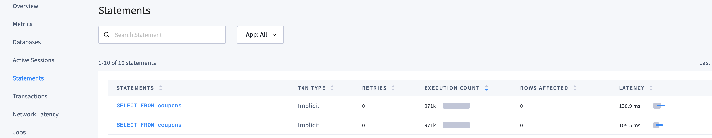
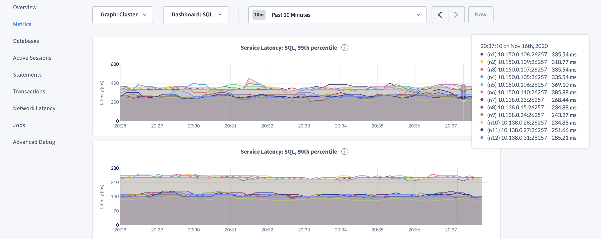
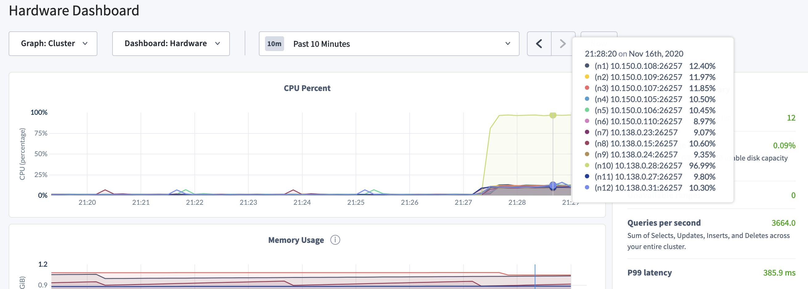

# Troubleshooting Workshop - Student labs

This workshop walks through the process of troubleshooting a problematic cluster.

## Lab 0 - Understanding the Problem

The customer complains about high latency and spike in CPU usage for some nodes during their load test.
They ask for your help to lower latencies and improve CPU utilization to achieve higher throughput.

You ask the DBA to provide you with the required information to replicate the issue on your side:

- the cluster configuration: CPUs, MEM, Storage, Networking, location, CockroachDB version, etc.
- the data, in form of a database backup file.
- the workload run, in form of SQL queries.

The customer informs you the UAT environment runs on 12 nodes across 4 datacenters in 2 regions, US East and US West.
They are using CockroachDB v20.2.x on 4 vCPUs/16GB Mem instances with standard storage.

The customer sent you the tarball with the backup files, `load.tar.gz`, and the SQL queries run as part of the load test, `workload.sql`.

## Lab 1 - Recreate the customer environment

### Create the CockroachDB cluster

Create the CockroachDB cluster on GCP

```bash
# default machine type is n1-standard-4 (4 vCPUs / 16GB MEM)
roachprod create `whoami`-labs -c gce -n 12 --gce-zones us-east1-b,us-east1-c,us-west1-b,us-west1-c
roachprod stage `whoami`-labs release v20.2.0
roachprod start `whoami`-labs
roachprod adminurl `whoami`-labs
```

Open Admin UI and confirm nodes are grouped into 4 zones, and zones are grouped into 2 regions.


Check the latency: should be minimal within zones of the same region.


Upload the backup tarball file and restore the database tables.

```bash
roachprod put `whoami`-labs:1 load.tar.gz
roachprod run `whoami`-labs:1 "tar xvf load.tar.gz"
roachprod run `whoami`-labs:1 "sudo mkdir -p /mnt/data1/cockroach/extern/"
roachprod run `whoami`-labs:1 "sudo mv load /mnt/data1/cockroach/extern/"
roachprod sql `whoami`-labs:1
```

At the SQL prompt:

```sql
-- add enterprise license
SET CLUSTER SETTING cluster.organization = 'ABC Corp';
SET CLUSTER SETTING enterprise.license = 'xxxx-yyyy-zzzz';

RESTORE offers,coupons FROM 'nodelocal://1/load';
```

```text
        job_id       |  status   | fraction_completed |  rows   | index_entries |   bytes
---------------------+-----------+--------------------+---------+---------------+-------------
  606935886222589953 | succeeded |                  1 | 7309726 |      14619446 | 1203433654
(1 row)

Time: 1m8.146552901s
```

Cool, you've successfully created the cluster and restored the data!

### Create the jumpbox server

Next, open a new terminal window. We will refer to this terminal as the **Jumpbox Terminal**.
Let's create a Jumpbox server from which to run the workload to simulate the App.

```bash
roachprod create `whoami`-jump -c gce -n 1
roachprod stage `whoami`-jump release v20.2.0
roachprod put `whoami`-jump workload.sql
# get the internal IP
roachprod ip `whoami`-labs:1
# ssh into the jumpbox
roachprod ssh `whoami`-jump
```

In the jumpbox, download the standalone `workload` binary, used to run the load test.

```bash
wget https://edge-binaries.cockroachdb.com/cockroach/workload.LATEST -O workload; chmod 755 workload
```

Test connection to CockroachDB, make sure to substitute the IP address accordingly

```bash
./cockroach sql -e "SHOW TABLES;" --url 'postgres://root@<ip>:26257?sslmode=disable'
```

You should see below output:

```text
  schema_name | table_name | type  | estimated_row_count
--------------+------------+-------+----------------------
  public      | coupons    | table |             7309720
  public      | offers     | table |                   0
(2 rows)

Time: 677ms
```

Good, the Jumpbox can connect to the cluster!

## Lab 2 - Analyse the CockroachDB cluster

Before running the workload, let's review the database we just imported, as well as analyze the SQL queries in the workload.

Open a new Terminal, the **SQL Terminal**, and connect to n1

```bash
roachprod sql `whoami`-labs:1
```

We've imported 2 tables, let's see what they look like in terms of size, columns, ranges, indexes. You can view these details using the AdminUI and/or with the `SHOW RANGES` command.


```sql
SHOW CREATE TABLE coupons;
SHOW RANGES FROM TABLE coupons;
```

`coupons` has 2 secondary indexes. Notice how the leaseholder of the ranges are spread across both regions (check the `lease_holder_locality` column).

```text
  table_name |                                         create_statement
-------------+----------------------------------------------------------------------------------------------------
  coupons    | CREATE TABLE public.coupons (
             |     id INT8 NOT NULL,
             |     code STRING NOT NULL,
             |     channel STRING NOT NULL,
             |     pid INT8 NOT NULL,
             |     exp_date DATE NOT NULL,
             |     status STRING NOT NULL,
             |     created TIMESTAMPTZ NULL DEFAULT now():::TIMESTAMPTZ,
             |     modified TIMESTAMPTZ NULL DEFAULT now():::TIMESTAMPTZ,
             |     start_date DATE NOT NULL,
             |     CONSTRAINT "primary" PRIMARY KEY (id ASC, code ASC),
             |     INDEX coupons_pid_idx (pid ASC),
             |     INDEX coupons_code_id_idx (code ASC, id ASC) STORING (channel, status, exp_date, start_date),
             |     FAMILY "primary" (id, code, channel, pid, exp_date, status, created, modified, start_date)
             | )
(1 row)

Time: 818ms total (execution 818ms / network 0ms)

                   start_key                  |                   end_key                   | range_id | range_size_mb | lease_holder |           lease_holder_locality           | replicas |                                                          replica_localities
----------------------------------------------+---------------------------------------------+----------+---------------+--------------+-------------------------------------------+----------+----------------------------------------------------------------------------------------------------------------------------------------
  NULL                                        | /201/"0091f193-2e9b-4b1b-a860-a1b931c94a45" |       42 |             0 |           12 | cloud=gce,region=us-west1,zone=us-west1-c | {1,8,12} | {"cloud=gce,region=us-east4,zone=us-east4-b","cloud=gce,region=us-west1,zone=us-west1-b","cloud=gce,region=us-west1,zone=us-west1-c"}
  /201/"0091f193-2e9b-4b1b-a860-a1b931c94a45" | /400033/"1148sx0rvfqw"                      |      110 |    233.341283 |            1 | cloud=gce,region=us-east4,zone=us-east4-b | {1,8,11} | {"cloud=gce,region=us-east4,zone=us-east4-b","cloud=gce,region=us-west1,zone=us-west1-b","cloud=gce,region=us-west1,zone=us-west1-c"}
  /400033/"1148sx0rvfqw"                      | /400044/"11c8vvly94m2"                      |      109 |    232.505187 |           11 | cloud=gce,region=us-west1,zone=us-west1-c | {1,8,11} | {"cloud=gce,region=us-east4,zone=us-east4-b","cloud=gce,region=us-west1,zone=us-west1-b","cloud=gce,region=us-west1,zone=us-west1-c"}
  /400044/"11c8vvly94m2"                      | NULL                                        |       51 |    211.510939 |            5 | cloud=gce,region=us-east4,zone=us-east4-c | {3,5,7}  | {"cloud=gce,region=us-east4,zone=us-east4-b","cloud=gce,region=us-east4,zone=us-east4-c","cloud=gce,region=us-west1,zone=us-west1-b"}
(4 rows)

Time: 782ms total (execution 782ms / network 0ms)
```

```sql
SHOW CREATE TABLE offers;
SHOW RANGES FROM TABLE offers;
```

```text
  table_name |                          create_statement
-------------+----------------------------------------------------------------------
  offers     | CREATE TABLE public.offers (
             |     id INT8 NOT NULL,
             |     code STRING NOT NULL,
             |     token STRING NOT NULL,
             |     created TIMESTAMPTZ NOT NULL DEFAULT now():::TIMESTAMPTZ,
             |     modified TIMESTAMPTZ NOT NULL DEFAULT now():::TIMESTAMPTZ,
             |     CONSTRAINT "primary" PRIMARY KEY (id ASC, code ASC, token ASC),
             |     INDEX offers_token_idx (token ASC),
             |     FAMILY "primary" (id, code, token, created, modified)
             | )
(1 row)

Time: 821ms total (execution 820ms / network 0ms)

  start_key | end_key | range_id | range_size_mb | lease_holder |           lease_holder_locality           | replicas |                                                          replica_localities
------------+---------+----------+---------------+--------------+-------------------------------------------+----------+----------------------------------------------------------------------------------------------------------------------------------------
  NULL      | NULL    |       36 |             0 |           10 | cloud=gce,region=us-west1,zone=us-west1-c | {4,8,10} | {"cloud=gce,region=us-east4,zone=us-east4-c","cloud=gce,region=us-west1,zone=us-west1-b","cloud=gce,region=us-west1,zone=us-west1-c"}
(1 row)

Time: 608ms total (execution 608ms / network 0ms)
```

Notice how table `offers` has 1 secondary index, and the table is empty (`range_size_mb` is 0).

Now, let's inspect the workload that's run against this database. Here's a formatted view of the 2 queries in `workload.sql`.

Please note, `1` and `2` are placeholder for variables, the customer has not supplied those so we hardcoded using `1` and `2`.

```sql
-- Q1
SELECT DISTINCT c.id, c.code, c.channel, c.status, c.exp_date, c.start_date
FROM coupons AS c
WHERE (((c.status = 'ACTIVE')
  AND (c.exp_date >= current_date()))
  AND (c.start_date <= current_date()))
  AND (c.pid = '1')

UNION

SELECT c.id, c.code, c.channel, c.status, c.exp_date, c.start_date
FROM coupons AS c, offers AS o
WHERE (((((c.id = o.id)
  AND (c.code = o.code))
  AND (c.status = 'ACTIVE'))
  AND (c.exp_date >= current_date()))
  AND (c.start_date <= current_date()))
  AND (o.token = '2');

-- Q2
SELECT c.id, c.code, c.channel, c.status, c.exp_date, c.start_date
FROM coupons AS c, offers AS o
WHERE (((((c.id = o.id)
  AND (c.code = o.code))
  AND (c.status = 'ACTIVE'))
  AND (c.exp_date >= current_date()))
  AND (c.start_date <= current_date()))
  AND (o.token = '1');
```

So Q2 is basically the second part of Q1, and it's a join query between the 2 tables. Q1 also has a `SELECT DISTINCT` part, too.

## Lab 3 - Simulate the load test

Back to your host, get the full list of DB URLs. Save it for later.

```bash
$ roachprod pgurl `whoami`-labs
'postgres://root@10.150.0.108:26257?sslmode=disable' 'postgres://root@10.150.0.109:26257?sslmode=disable' 'postgres://root@10.150.0.107:26257?sslmode=disable' 'postgres://root@10.150.0.105:26257?sslmode=disable' 'postgres://root@10.150.0.106:26257?sslmode=disable' 'postgres://root@10.150.0.110:26257?sslmode=disable' 'postgres://root@10.138.0.23:26257?sslmode=disable' 'postgres://root@10.138.0.15:26257?sslmode=disable' 'postgres://root@10.138.0.24:26257?sslmode=disable' 'postgres://root@10.138.0.28:26257?sslmode=disable' 'postgres://root@10.138.0.27:26257?sslmode=disable' 'postgres://root@10.138.0.31:26257?sslmode=disable'
```

In the Jumpbox Terminal, run the workload simulation passing all URLs. We are running this workload with 512 active connections, which is far more than the cluster is designed for, which is approximately 12 nodes \* 4 vCPUs \* 4 Active Connections per vCPU = 192 Active Connections. We do so to simulate the highest load.

```bash
./workload run querybench --query-file workload.sql --db=defaultdb --concurrency=512 'postgres://root@10.150.0.110:26257?sslmode=disable' 'postgres://root@10.150.0.95:26257?sslmode=disable' 'postgres://root@10.150.0.111:26257?sslmode=disable' 'postgres://root@10.150.0.109:26257?sslmode=disable' 'postgres://root@10.150.0.92:26257?sslmode=disable' 'postgres://root@10.150.0.93:26257?sslmode=disable' 'postgres://root@10.138.0.2:26257?sslmode=disable' 'postgres://root@10.138.0.8:26257?sslmode=disable' 'postgres://root@10.138.0.9:26257?sslmode=disable' 'postgres://root@10.138.0.18:26257?sslmode=disable' 'postgres://root@10.138.0.10:26257?sslmode=disable' 'postgres://root@10.138.0.39:26257?sslmode=disable'
```

You should see the output similar to below:

```text
_elapsed___errors__ops/sec(inst)___ops/sec(cum)__p50(ms)__p95(ms)__p99(ms)_pMax(ms)
33.0s        0         1622.9         1562.2    176.2    285.2    318.8    369.1  1: SELECT DISTINCT c.id, c.code, c.channel, c.status, c.exp_date, c.start_date FROM coupons AS c WHERE (((c.status = 'ACTIVE') AND (c.exp_date >= current_date())) AND (c.start_date <= current_date())) AND (c.pid = '1') UNION SELECT c.id, c.code, c.channel, c.status, c.exp_date, c.start_date FROM coupons AS c, offers AS o WHERE (((((c.id = o.id) AND (c.code = o.code)) AND (c.status = 'ACTIVE')) AND (c.exp_date >= current_date())) AND (c.start_date <= current_date())) AND (o.token = '2')
33.0s        0         1559.9         1553.5    151.0    218.1    285.2    302.0  2: SELECT c.id, c.code, c.channel, c.status, c.exp_date, c.start_date FROM coupons AS c, offers AS o WHERE (((((c.id = o.id) AND (c.code = o.code)) AND (c.status = 'ACTIVE')) AND (c.exp_date >= current_date())) AND (c.start_date <= current_date())) AND (o.token = '1')
34.0s        0         1515.6         1560.8    167.8    335.5    469.8    520.1  1: SELECT DISTINCT c.id, c.code, c.channel, c.status, c.exp_date, c.start_date FROM coupons AS c WHERE (((c.status = 'ACTIVE') AND (c.exp_date >= current_date())) AND (c.start_date <= current_date())) AND (c.pid = '1') UNION SELECT c.id, c.code, c.channel, c.status, c.exp_date, c.start_date FROM coupons AS c, offers AS o WHERE (((((c.id = o.id) AND (c.code = o.code)) AND (c.status = 'ACTIVE')) AND (c.exp_date >= current_date())) AND (c.start_date <= current_date())) AND (o.token = '2')
34.0s        0         1630.7         1555.7    130.0    285.2    469.8    469.8  2: SELECT c.id, c.code, c.channel, c.status, c.exp_date, c.start_date FROM coupons AS c, offers AS o WHERE (((((c.id = o.id) AND (c.code = o.code)) AND (c.status = 'ACTIVE')) AND (c.exp_date >= current_date())) AND (c.start_date <= current_date())) AND (o.token = '1')
35.0s        0         1616.4  
```

While it runs, check the Metrics in the AdminUI. Open the **Hardware** dashboard to see if you can replicate the spike in high CPU usage.


Notice how node 10 and 7 have very high CPU usage compared to all other nodes. Take notice in the **Summary** of the values for QPS and P99 latency, too.

Check the latency for these 2 queries. Open the **Statements** page or review the scrolling stats in your terminal.



Check also the **SQL** dashboard



Stop the workload now. You can definitely replicate the customer scenario: high CPU spikes and high latency.

## Lab 4 - Analyze the Queries

Switch to the SQL Terminal. We want to pull the query plan for each query

### Q1 Query Plan

Let's start with Q1, and let's break it down into 2 parts, and let's pull the plan for the 1st part. Again, here the value `1` is a placeholder for a value passed by the application.

```sql
EXPLAIN (VERBOSE) SELECT DISTINCT c.id, c.code, c.channel, c.status, c.exp_date, c.start_date
FROM coupons AS c
WHERE (((c.status = 'ACTIVE')
  AND (c.exp_date >= current_date()))
  AND (c.start_date <= current_date()))
  AND (c.pid = '1');
```

```text
          tree         |        field        |                                      description                                      |                        columns                         | ordering
-----------------------+---------------------+---------------------------------------------------------------------------------------+--------------------------------------------------------+-----------
                       | distribution        | local                                                                                 |                                                        |
                       | vectorized          | false                                                                                 |                                                        |
  project              |                     |                                                                                       | (id, code, channel, status, exp_date, start_date)      |
   │                   | estimated row count | 0                                                                                     |                                                        |
   └── filter          |                     |                                                                                       | (id, code, channel, pid, exp_date, status, start_date) |
        │              | estimated row count | 0                                                                                     |                                                        |
        │              | filter              | ((status = 'ACTIVE') AND (exp_date >= '2020-11-16')) AND (start_date <= '2020-11-16') |                                                        |
        └── index join |                     |                                                                                       | (id, code, channel, pid, exp_date, status, start_date) |
             │         | estimated row count | 0                                                                                     |                                                        |
             │         | table               | coupons@primary                                                                       |                                                        |
             │         | key columns         | id, code                                                                              |                                                        |
             └── scan  |                     |                                                                                       | (id, code, pid)                                        |
                       | estimated row count | 0                                                                                     |                                                        |
                       | table               | coupons@coupons_pid_idx                                                               |                                                        |
                       | spans               | /1-/2                                                                                 |                                                        |
```

So the optimizer is leveraging index `coupons@coupons_pid_idx` to filter rows that have that specific `pid`, but then it has to do a join with `primary` to fetch `status`, `exp_date` and `start_date` to finish the rest of the `WHERE`, and `SELECT`, clauses.

Wouldn't it be better if it didn't have to do this join and instead accessing just 1 index?

### Q2 Query Plan

Let's now pull the plan for Q2.

```sql
EXPLAIN (VERBOSE) SELECT c.id, c.code, c.channel, c.status, c.exp_date, c.start_date
FROM coupons AS c, offers AS o
WHERE (((((c.id = o.id)
  AND (c.code = o.code))
  AND (c.status = 'ACTIVE'))
  AND (c.exp_date >= current_date()))
  AND (c.start_date <= current_date()))
  AND (o.token = '1');
```

```text
            tree           |         field         |                                      description                                      |                              columns                               | ordering
---------------------------+-----------------------+---------------------------------------------------------------------------------------+--------------------------------------------------------------------+-----------
                           | distribution          | full                                                                                  |                                                                    |
                           | vectorized            | false                                                                                 |                                                                    |
  project                  |                       |                                                                                       | (id, code, channel, status, exp_date, start_date)                  |
   │                       | estimated row count   | 0                                                                                     |                                                                    |
   └── lookup join (inner) |                       |                                                                                       | (id, code, token, id, code, channel, exp_date, status, start_date) |
        │                  | estimated row count   | 0                                                                                     |                                                                    |
        │                  | table                 | coupons@coupons_code_id_idx                                                           |                                                                    |
        │                  | equality              | (code, id) = (code,id)                                                                |                                                                    |
        │                  | equality cols are key |                                                                                       |                                                                    |
        │                  | pred                  | ((status = 'ACTIVE') AND (exp_date >= '2020-11-16')) AND (start_date <= '2020-11-16') |                                                                    |
        └── scan           |                       |                                                                                       | (id, code, token)                                                  |
                           | estimated row count   | 1                                                                                     |                                                                    |
                           | table                 | offers@offers_token_idx                                                               |                                                                    |
                           | spans                 | /"1"-/"1"/PrefixEnd                                                                   |                                                                    |

```

Here we see that the optimizer is choosing an index to filter from the `offers` table and join with `coupons`, which is fine.

## Lab 5 - Addressing the Hotspot

Let's tackle the high CPU usage issue first. Why is it so, why is node 10 using all the CPU?
We can start by trying to isolate the issue by running only Q2 in our workload, and let's see if the problem persist.

Update `workload.sql` by commenting Q1 out, then restart the workload. Give it a couple of minutes, and you should see that n10 is hot again, so we know that Q2 is the culprit.



Let's see if we have a hot range.

Upload file `hot.py` to the jumpbox, or run it locally on a new terminal if you prefer

```bash
$ python3 hot.py --numtop 10 --host `whoami`-labs-0001.roachprod.crdb.io --adminport 26258 --dbport 26257  
rank    rangeId QPS     lh      nodes              DBname, TableName, IndexName
  1:    36      1680    10      [4, 8, 10]         ['defaultdb', 'offers', 'offers_token_idx']
  2:    6       49      5       [1, 6, 5, 12, 9]   ['defaultdb', 'coupons', 'coupons_pid_idx']
  3:    26      16      6       [1, 6, 5, 7, 10]
  4:    35      12      8       [5, 3, 8, 11, 7]
  5:    4       8       5       [5, 12, 8]
  6:    11      3       2       [2, 5, 11, 7, 10]
  7:    2       2       11      [4, 2, 12, 9, 11]
  8:    7       2       2       [2, 1, 6, 8, 11]
  9:    3       1       12      [2, 1, 5, 12, 8]
 10:    31      1       3       [4, 3, 12, 9, 7]
```

So it looks like rangeId 36 on node 10 is hot. What's in that range, why that range?

Back to your SQL terminal, show the ranges for `offers@offers_token_idx`, since the query plan showed it's using this index

```sql
SHOW RANGES FROM INDEX offers@offers_token_idx;
```

```text
  start_key | end_key | range_id | range_size_mb | lease_holder |           lease_holder_locality           | replicas |                                                          replica_localities
------------+---------+----------+---------------+--------------+-------------------------------------------+----------+----------------------------------------------------------------------------------------------------------------------------------------
  NULL      | NULL    |       36 |             0 |           10 | cloud=gce,region=us-west1,zone=us-west1-c | {4,8,10} | {"cloud=gce,region=us-east4,zone=us-east4-c","cloud=gce,region=us-west1,zone=us-west1-b","cloud=gce,region=us-west1,zone=us-west1-c"}
```

Bingo! We found rangeId 36.
As `offers` is empty, so is index `offers@offers_token_idx`, there is just one range for that table and if you have a join operation going on, inevitably CockroachDB will always want to access that range to do the join, causing the hotspot.

We need to ask our customer:

- why is a join operation sent against an empty table;
- why is the table empty.

If the table were full, you'd have multiple ranges spread across the cluster and the load would be balanced, removing the hotspot on node 10. Let's prove our theory.

The customer provides you with some data, `offers.csv.gz`. Stop the workload, then upload the data to the cluster and import it into `offers`.

On your Host Terminal

```bash
roachprod put `whoami`-labs:1 offers.csv.gz
roachprod run `whoami`-labs:1 "gunzip offers.csv.gz"
roachprod run `whoami`-labs:1 "sudo mv offers.csv /mnt/data1/cockroach/extern/"
```

In your SQL terminal

```sql
IMPORT INTO offers (id, code, token, created, modified)
    CSV DATA ('nodelocal://1/offers.csv');
```

You should now have about 2 million rows in `offers`.
If you rerun the workload, however, you'd still see the spike because the `token` value to search is hardcoded to `1`, so you'd still hit the same range over and over.

Instead, let's pick `token` values that are located at specific intervals in the KV store of the index, so we know we will hit different ranges.

```sql
SELECT token FROM offers@offers_token_idx LIMIT 1 OFFSET 1; -- then increment of ~250,000
```

We can use this data to create a new workload file, `q2.sql`. Scroll below text to the right to see the tokens.
Notice they are in lexicographical order.

```sql
-- scroll to the right!
SELECT c.id, c.code, c.channel, c.status, c.exp_date, c.start_date FROM coupons AS c, offers AS o WHERE (((((c.id = o.id) AND (c.code = o.code)) AND (c.status = 'ACTIVE')) AND (c.exp_date >= current_date())) AND (c.start_date <= current_date())) AND (o.token = '000016aa-57a4-18fd-9a60-e599462b43e0');
SELECT c.id, c.code, c.channel, c.status, c.exp_date, c.start_date FROM coupons AS c, offers AS o WHERE (((((c.id = o.id) AND (c.code = o.code)) AND (c.status = 'ACTIVE')) AND (c.exp_date >= current_date())) AND (c.start_date <= current_date())) AND (o.token = '1fde0504-6a32-0578-75f0-7d25b87996b4');
SELECT c.id, c.code, c.channel, c.status, c.exp_date, c.start_date FROM coupons AS c, offers AS o WHERE (((((c.id = o.id) AND (c.code = o.code)) AND (c.status = 'ACTIVE')) AND (c.exp_date >= current_date())) AND (c.start_date <= current_date())) AND (o.token = '3fe561ed-a778-891e-228c-21cd77254201');
SELECT c.id, c.code, c.channel, c.status, c.exp_date, c.start_date FROM coupons AS c, offers AS o WHERE (((((c.id = o.id) AND (c.code = o.code)) AND (c.status = 'ACTIVE')) AND (c.exp_date >= current_date())) AND (c.start_date <= current_date())) AND (o.token = '5fe1efc3-a038-2e27-816c-7f082b223af0');
SELECT c.id, c.code, c.channel, c.status, c.exp_date, c.start_date FROM coupons AS c, offers AS o WHERE (((((c.id = o.id) AND (c.code = o.code)) AND (c.status = 'ACTIVE')) AND (c.exp_date >= current_date())) AND (c.start_date <= current_date())) AND (o.token = '7fdcaac7-6f19-1599-a476-934cf7cd061a');
SELECT c.id, c.code, c.channel, c.status, c.exp_date, c.start_date FROM coupons AS c, offers AS o WHERE (((((c.id = o.id) AND (c.code = o.code)) AND (c.status = 'ACTIVE')) AND (c.exp_date >= current_date())) AND (c.start_date <= current_date())) AND (o.token = '9ff60a37-6ab3-5e2e-67a2-4552a44b2231');
SELECT c.id, c.code, c.channel, c.status, c.exp_date, c.start_date FROM coupons AS c, offers AS o WHERE (((((c.id = o.id) AND (c.code = o.code)) AND (c.status = 'ACTIVE')) AND (c.exp_date >= current_date())) AND (c.start_date <= current_date())) AND (o.token = 'c009288d-8e63-224e-4db6-9ec31441987a');
SELECT c.id, c.code, c.channel, c.status, c.exp_date, c.start_date FROM coupons AS c, offers AS o WHERE (((((c.id = o.id) AND (c.code = o.code)) AND (c.status = 'ACTIVE')) AND (c.exp_date >= current_date())) AND (c.start_date <= current_date())) AND (o.token = 'e00d75b0-9bbf-6c69-6620-2d312813806e');
SELECT c.id, c.code, c.channel, c.status, c.exp_date, c.start_date FROM coupons AS c, offers AS o WHERE (((((c.id = o.id) AND (c.code = o.code)) AND (c.status = 'ACTIVE')) AND (c.exp_date >= current_date())) AND (c.start_date <= current_date())) AND (o.token = 'fffff710-1de1-64de-652e-3111c1fc71c7');
```

Run workload `q2.sql` for a while, at least 5 minutes to give time to Cockroach to reassign leaseholders around the ranges of the cluster.
Check the **Hardware** dashboard again


Much better, good job! Let's see how the ranges for the index are spread out:

```sql
SELECT lease_holder, lease_holder_locality FROM [SHOW RANGES FROM INDEX offers@offers_token_idx];
```

```text
  lease_holder |           lease_holder_locality
---------------+--------------------------------------------
            10 | cloud=gce,region=us-west1,zone=us-west1-c
            10 | cloud=gce,region=us-west1,zone=us-west1-c
             1 | cloud=gce,region=us-east4,zone=us-east4-b
             4 | cloud=gce,region=us-east4,zone=us-east4-c
            11 | cloud=gce,region=us-west1,zone=us-west1-c
```

Better! On average we can expect the load to be spread across 5 ranges in 4 nodes.

## Lab 6 - Addressing the Latency

### Understanding where the latency comes from

On the SQL Terminal, let's run a few queries and see the Response Time. Mind, in your cluster the Response Time might vary as ranges can be located on different zones.

Show my locality first

```sql
SHOW LOCALITY;
```

```text
                  locality
---------------------------------------------
  cloud=gce,region=us-east4,zone=us-east4-b
(1 row)

Time: 2ms total (execution 1ms / network 0ms)
```

Ok, I'm in US East. Let's run the first part of Q1 using a randomly picked valid `c.pid`.

```sql
SELECT DISTINCT c.id, c.code, c.channel, c.status, c.exp_date, c.start_date
FROM coupons AS c
WHERE (((c.status = 'ACTIVE')
  AND (c.exp_date >= current_date()))
  AND (c.start_date <= current_date()))
  AND (c.pid = '3124791208')
;
```

```text
    id   |     code     | channel | status |         exp_date          |        start_date
---------+--------------+---------+--------+---------------------------+----------------------------
  400033 | 10ug031bch0f | ONLINE  | ACTIVE | 2020-11-20 00:00:00+00:00 | 2020-11-05 00:00:00+00:00
(1 row)

Time: 68ms total (execution 67ms / network 0ms)
```

Response Time is 68ms, a little too much. Why is it so? Let's check where the range that has this row is located.

From the query plan we pulled above, we see that it's using index `coupons_pid_idx`. Find the key of the index

```sql
SHOW INDEX FROM coupons;
```

```text
  table_name |     index_name      | non_unique | seq_in_index | column_name | direction | storing | implicit
-------------+---------------------+------------+--------------+-------------+-----------+---------+-----------
  coupons    | primary             |   false    |            1 | id          | ASC       |  false  |  false
  coupons    | primary             |   false    |            2 | code        | ASC       |  false  |  false
  
  coupons    | coupons_pid_idx     |    true    |            1 | pid         | ASC       |  false  |  false
  coupons    | coupons_pid_idx     |    true    |            2 | id          | ASC       |  false  |   true
  coupons    | coupons_pid_idx     |    true    |            3 | code        | ASC       |  false  |   true
  
  coupons    | coupons_code_id_idx |    true    |            1 | code        | ASC       |  false  |  false
  coupons    | coupons_code_id_idx |    true    |            2 | id          | ASC       |  false  |  false
  coupons    | coupons_code_id_idx |    true    |            3 | channel     | N/A       |  true   |  false
  coupons    | coupons_code_id_idx |    true    |            4 | status      | N/A       |  true   |  false
  coupons    | coupons_code_id_idx |    true    |            5 | exp_date    | N/A       |  true   |  false
  coupons    | coupons_code_id_idx |    true    |            6 | start_date  | N/A       |  true   |  false
```

Cool, for `coupons@coupons_pid_idx` the key is `pid id code`.
Let's pull the correct range

```sql
SHOW RANGE FROM INDEX coupons@coupons_pid_idx FOR ROW(3124791208, 400033, '10ug031bch0f');
```

```text
             start_key             |              end_key              | range_id | lease_holder |           lease_holder_locality           | replicas |                                                          replica_localities
-----------------------------------+-----------------------------------+----------+--------------+-------------------------------------------+----------+----------------------------------------------------------------------------------------------------------------------------------------
  /2945789655/385668/"us625n6ljf0" | /3405705299/400044/"11bh0t1jnl8t" |       67 |            3 | cloud=gce,region=us-east1,zone=us-east1-b | {3,7,10} | {"cloud=gce,region=us-east1,zone=us-east1-b","cloud=gce,region=us-west1,zone=us-west1-b","cloud=gce,region=us-west1,zone=us-west1-c"}
```

Ok, the range is local, this should only take 1ms.. From the query plan we see that there is a join with `coupons@primary` to fetch the other columns.
Let's see how long that takes

```sql
SELECT * FROM  coupons@primary WHERE id = 400033 AND code = '10ug031bch0f';
```

```text
    id   |     code     | channel |    pid     |         exp_date          | status |             created              |           modified            |        start_date
---------+--------------+---------+------------+---------------------------+--------+----------------------------------+-------------------------------+----------------------------
  400033 | 10ug031bch0f | ONLINE  | 3124791208 | 2020-11-20 00:00:00+00:00 | ACTIVE | 2020-09-18 22:37:55.976397+00:00 | 2020-09-18 22:37:55.972+00:00 | 2020-11-05 00:00:00+00:00
(1 row)

Time: 65ms total (execution 65ms / network 0ms)
```

65ms! Let's do the same exercise as before and find out where this range is located.

```sql
SHOW RANGE FROM TABLE coupons FOR ROW(400033, '10ug031bch0f');
```

```text
                   start_key                  |        end_key         | range_id | lease_holder |           lease_holder_locality           | replicas |                                                          replica_localities
----------------------------------------------+------------------------+----------+--------------+-------------------------------------------+----------+----------------------------------------------------------------------------------------------------------------------------------------
  /201/"0091f193-2e9b-4b1b-a860-a1b931c94a45" | /400033/"1148sx0rvfqw" |       71 |            7 | cloud=gce,region=us-west1,zone=us-west1-b | {4,7,12} | {"cloud=gce,region=us-east1,zone=us-east1-c","cloud=gce,region=us-west1,zone=us-west1-b","cloud=gce,region=us-west1,zone=us-west1-c"}
```

A-ha! This table is in US West, so we're paying the latency price to go to the other region to fetch the data.

The problem is twofold: sub-optimal tables/indexes, cross-regional reads.

### Part 1 - Optimize the table primary and secondary indexes

Let's optimize the first part of Q1 by removing the need to join with `coupons@primary`.
We need to create an index similar to `coupons@coupons_pid_idx` that stores the fields required by the query.
Also, index `coupons@coupons_code_id_idx` seems to be redundant, so we drop it.

```sql
DROP INDEX coupons@coupons_code_id_idx;
DROP INDEX coupons@coupons_pid_idx;
CREATE INDEX coupons_pid_idx ON coupons(pid ASC) STORING (channel, exp_date, status, start_date);
```

Pull the query plan to confirm no join is required

```sql
EXPLAIN (VERBOSE) SELECT DISTINCT c.id, c.code, c.channel, c.status, c.exp_date, c.start_date
FROM coupons AS c
WHERE (((c.status = 'ACTIVE')
  AND (c.exp_date >= current_date()))
  AND (c.start_date <= current_date()))
  AND (c.pid = '3124791208');
```

```text
       tree      |        field        |                                      description                                      |                        columns                         | ordering
-----------------+---------------------+---------------------------------------------------------------------------------------+--------------------------------------------------------+-----------
                 | distribution        | local                                                                                 |                                                        |
                 | vectorized          | false                                                                                 |                                                        |
  project        |                     |                                                                                       | (id, code, channel, status, exp_date, start_date)      |
   │             | estimated row count | 1                                                                                     |                                                        |
   └── filter    |                     |                                                                                       | (id, code, channel, pid, exp_date, status, start_date) |
        │        | estimated row count | 1                                                                                     |                                                        |
        │        | filter              | ((status = 'ACTIVE') AND (exp_date >= '2020-11-19')) AND (start_date <= '2020-11-19') |                                                        |
        └── scan |                     |                                                                                       | (id, code, channel, pid, exp_date, status, start_date) |
                 | estimated row count | 2                                                                                     |                                                        |
                 | table               | coupons@coupons_pid_idx                                                               |                                                        |
                 | spans               | /3124791208-/3124791209                                                               |                                                        |

```

Good stuff, we eliminated a join operation!

As per Q2, we see that the optimizer is never using `offers@primary`. Let's alter the primary key of that table to make it similar to index `offers@offers_token_idx`.

```sql
DROP INDEX offers_token_idx;
-- this will take some time as we're basically rewriting the entire table
ALTER TABLE offers ALTER PRIMARY KEY USING COLUMNS (token, id, code);
DROP INDEX offers_id_code_token_key CASCADE;

--BEGIN;
--ALTER TABLE offers DROP CONSTRAINT "primary";
--ALTER TABLE offers ADD CONSTRAINT "primary" PRIMARY KEY (token, id, code);
--COMMIT;
```

### Part 2 - Create duplicate indexes and pin to region

Now that we have our tables well organized, we need to resolve the latency issue.
We need our read latency to be the same regardless of where the query originates.
The customer told us they cannot change the App, so the Follower Reads pattern  is unfortunately not available.
The best solution thus is to follow the Duplicate Index pattern: we create a copy of each index and table.
Then, we pin Tables to US West and Indexes to US East.

Create indexes first

```sql
-- copy of coupons@primary
CREATE INDEX primary_copy ON coupons(id ASC, code ASC) STORING (channel, pid, exp_date, status, start_date);
-- copy of coupons_pid_idx
CREATE INDEX coupons_pid_idx_copy on coupons(pid ASC) STORING (channel, exp_date, status, start_date);

-- copy of offers@primary
CREATE INDEX primary_copy ON offers(token ASC, id ASC, code ASC) STORING (created, modified);
```

Good stuff, we have now a copy of each index (`primary` included).
Next, pin a copy to East, and another to West.

```sql
-- coupons
--   pin to East
ALTER TABLE coupons CONFIGURE ZONE USING
  num_replicas = 3,
  constraints = '{+region=us-east4: 1}',
  lease_preferences = '[[+region=us-east4]]';

ALTER INDEX coupons@coupons_pid_idx CONFIGURE ZONE USING
  num_replicas = 3,
  constraints = '{+region=us-east4: 1}',
  lease_preferences = '[[+region=us-east4]]';

--   pin to West
ALTER INDEX coupons@primary_copy CONFIGURE ZONE USING
  num_replicas = 3,
  constraints = '{+region=us-west1: 1}',
  lease_preferences = '[[+region=us-west1]]';

ALTER INDEX coupons@coupons_pid_idx_copy CONFIGURE ZONE USING
  num_replicas = 3,
  constraints = '{+region=us-west1: 1}',
  lease_preferences = '[[+region=us-west1]]';

-- offers
--    pin to East
ALTER TABLE offers CONFIGURE ZONE USING
  num_replicas = 3,
  constraints = '{+region=us-east4: 1}',
  lease_preferences = '[[+region=us-east4]]';

--    pin to West
ALTER INDEX offers@primary_copy CONFIGURE ZONE USING
  num_replicas = 3,
  constraints = '{+region=us-west1: 1}',
  lease_preferences = '[[+region=us-west1]]';
```

### Part 3 - Validate the theory

Re run the first part of query Q1 from both regions. Check the query plan using `EXPLAIN (VERBOSE)`.

From node 1 (US East region):

```sql
SELECT DISTINCT c.id, c.code, c.channel, c.status, c.exp_date, c.start_date
FROM coupons AS c
WHERE (((c.status = 'ACTIVE')
  AND (c.exp_date >= current_date()))
  AND (c.start_date <= current_date()))
  AND (c.pid = '3124791208');
```

```text
    id   |     code     | channel | status |         exp_date          |        start_date
---------+--------------+---------+--------+---------------------------+----------------------------
  400033 | 10ug031bch0f | ONLINE  | ACTIVE | 2020-11-20 00:00:00+00:00 | 2020-11-05 00:00:00+00:00
(1 row)

Time: 3ms total (execution 3ms / network 0ms)
```

```sql
EXPLAIN (VERBOSE) SELECT DISTINCT c.id, c.code, c.channel, c.status, c.exp_date, c.start_date
FROM coupons AS c
WHERE (((c.status = 'ACTIVE')
  AND (c.exp_date >= current_date()))
  AND (c.start_date <= current_date()))
  AND (c.pid = '3124791208');
```

```text
       tree      |        field        |                                      description                                      |                        columns                         | ordering
-----------------+---------------------+---------------------------------------------------------------------------------------+--------------------------------------------------------+-----------
                 | distribution        | local                                                                                 |                                                        |
                 | vectorized          | false                                                                                 |                                                        |
  project        |                     |                                                                                       | (id, code, channel, status, exp_date, start_date)      |
   │             | estimated row count | 1                                                                                     |                                                        |
   └── filter    |                     |                                                                                       | (id, code, channel, pid, exp_date, status, start_date) |
        │        | estimated row count | 1                                                                                     |                                                        |
        │        | filter              | ((status = 'ACTIVE') AND (exp_date >= '2020-11-19')) AND (start_date <= '2020-11-19') |                                                        |
        └── scan |                     |                                                                                       | (id, code, channel, pid, exp_date, status, start_date) |
                 | estimated row count | 2                                                                                     |                                                        |
                 | table               | coupons@coupons_pid_idx                                                               |                                                        |
                 | spans               | /3124791208-/3124791209                                                               |                                                        |
```

Same queries above run on node 12 (US West region):

```text
    id   |     code     | channel | status |         exp_date          |        start_date
---------+--------------+---------+--------+---------------------------+----------------------------
  400033 | 10ug031bch0f | ONLINE  | ACTIVE | 2020-11-20 00:00:00+00:00 | 2020-11-05 00:00:00+00:00
(1 row)

Time: 2ms total (execution 2ms / network 0ms)
```

```text
       tree      |        field        |                                      description                                      |                        columns                         | ordering
-----------------+---------------------+---------------------------------------------------------------------------------------+--------------------------------------------------------+-----------
                 | distribution        | local                                                                                 |                                                        |
                 | vectorized          | false                                                                                 |                                                        |
  project        |                     |                                                                                       | (id, code, channel, status, exp_date, start_date)      |
   │             | estimated row count | 1                                                                                     |                                                        |
   └── filter    |                     |                                                                                       | (id, code, channel, pid, exp_date, status, start_date) |
        │        | estimated row count | 1                                                                                     |                                                        |
        │        | filter              | ((status = 'ACTIVE') AND (exp_date >= '2020-11-19')) AND (start_date <= '2020-11-19') |                                                        |
        └── scan |                     |                                                                                       | (id, code, channel, pid, exp_date, status, start_date) |
                 | estimated row count | 2                                                                                     |                                                        |
                 | table               | coupons@coupons_pid_idx_copy                                                          |                                                        |
                 | spans               | /3124791208-/3124791209                                                               |                                                        |
```

Perfect, we've low latency from both regions! Now start the workload again and let's measure the overall latency.

Mind, the workload still has the hardcoded values `1` and  `2`. Upload and inspect `final.sql` which should be closer to the real workflow.

```text
_elapsed___errors__ops/sec(inst)___ops/sec(cum)__p50(ms)__p95(ms)__p99(ms)_pMax(ms)
  339.0s        0          361.8          365.4     88.1    151.0    167.8    192.9  9: SELECT DISTINCT c.id, c.code, c.channel, c.status, c.exp_date, c.start_date FROM coupons AS c WHERE (((c.status = 'ACTIVE') AND (c.exp_date >= current_date())) AND (c.start_date <= current_date())) AND (c.pid = '2737195593') UNION SELECT c.id, c.code, c.channel, c.status, c.exp_date, c.start_date FROM coupons AS c, offers AS o WHERE (((((c.id = o.id) AND (c.code = o.code)) AND (c.status = 'ACTIVE')) AND (c.exp_date >= current_date())) AND (c.start_date <= current_date())) AND (o.token = '7fdcaac7-6f19-1599-a476-934cf7cd061a')
  339.0s        0          357.8          365.3     79.7    130.0    159.4    176.2 10: SELECT c.id, c.code, c.channel, c.status, c.exp_date, c.start_date FROM coupons AS c, offers AS o WHERE (((((c.id = o.id) AND (c.code = o.code)) AND (c.status = 'ACTIVE')) AND (c.exp_date >= current_date())) AND (c.start_date <= current_date())) AND (o.token = '7fdcaac7-6f19-1599-a476-934cf7cd061a');
  339.0s        0          349.8          365.2     83.9    134.2    167.8    192.9 11: SELECT DISTINCT c.id, c.code, c.channel, c.status, c.exp_date, c.start_date FROM coupons AS c WHERE (((c.status = 'ACTIVE') AND (c.exp_date >= current_date())) AND (c.start_date <= current_date())) AND (c.pid = '3002738477') UNION SELECT c.id, c.code, c.channel, c.status, c.exp_date, c.start_date FROM coupons AS c, offers AS o WHERE (((((c.id = o.id) AND (c.code = o.code)) AND (c.status = 'ACTIVE')) AND (c.exp_date >= current_date())) AND (c.start_date <= current_date())) AND (o.token = '9ff60a37-6ab3-5e2e-67a2-4552a44b2231')
  339.0s        0          355.8          365.1     79.7    134.2    151.0    167.8 12: SELECT c.id, c.code, c.channel, c.status, c.exp_date, c.start_date FROM coupons AS c, offers AS o WHERE (((((c.id = o.id) AND (c.code = o.code)) AND (c.status = 'ACTIVE')) AND (c.exp_date >= current_date())) AND (c.start_date <= current_date())) AND (o.token = '5fe1efc3-a038-2e27-816c-7f082b223af0');
  339.0s        0          380.8          365.1     92.3    151.0    167.8    184.5 13: SELECT DISTINCT c.id, c.code, c.channel, c.status, c.exp_date, c.start_date FROM coupons AS c WHERE (((c.status = 'ACTIVE') AND (c.exp_date >= current_date())) AND (c.start_date <= current_date())) AND (c.pid = '2189670715') UNION SELECT c.id, c.code, c.channel, c.status, c.exp_date, c.start_date FROM coupons AS c, offers AS o WHERE (((((c.id = o.id) AND (c.code = o.code)) AND (c.status = 'ACTIVE')) AND (c.exp_date >= current_date())) AND (c.start_date <= current_date())) AND (o.token = 'c009288d-8e63-224e-4db6-9ec31441987a')
  339.0s        0          385.8          365.0     50.3    130.0    159.4    201.3 14: SELECT c.id, c.code, c.channel, c.status, c.exp_date, c.start_date FROM coupons AS c, offers AS o WHERE (((((c.id = o.id) AND (c.code = o.code)) AND (c.status = 'ACTIVE')) AND (c.exp_date >= current_date())) AND (c.start_date <= current_date())) AND (o.token = '3fe561ed-a778-891e-228c-21cd77254201');
  339.0s        0          394.8          365.0     88.1    134.2    159.4    176.2 15: SELECT DISTINCT c.id, c.code, c.channel, c.status, c.exp_date, c.start_date FROM coupons AS c WHERE (((c.status = 'ACTIVE') AND (c.exp_date >= current_date())) AND (c.start_date <= current_date())) AND (c.pid = '3050862498') UNION SELECT c.id, c.code, c.channel, c.status, c.exp_date, c.start_date FROM coupons AS c, offers AS o WHERE (((((c.id = o.id) AND (c.code = o.code)) AND (c.status = 'ACTIVE')) AND (c.exp_date >= current_date())) AND (c.start_date <= current_date())) AND (o.token = 'e00d75b0-9bbf-6c69-6620-2d312813806e')
  339.0s        0          406.8          364.9     48.2    130.0    184.5    192.9 16: SELECT c.id, c.code, c.channel, c.status, c.exp_date, c.start_date FROM coupons AS c, offers AS o WHERE (((((c.id = o.id) AND (c.code = o.code)) AND (c.status = 'ACTIVE')) AND (c.exp_date >= current_date())) AND (c.start_date <= current_date())) AND (o.token = '1fde0504-6a32-0578-75f0-7d25b87996b4');
```

Compare to the initial result: huge improvement in performance!


Congratulations, you reached the end of the Troubleshooting workshop! We hope you have now a better understanding on the process of troubleshoot an underperforming cluster.
