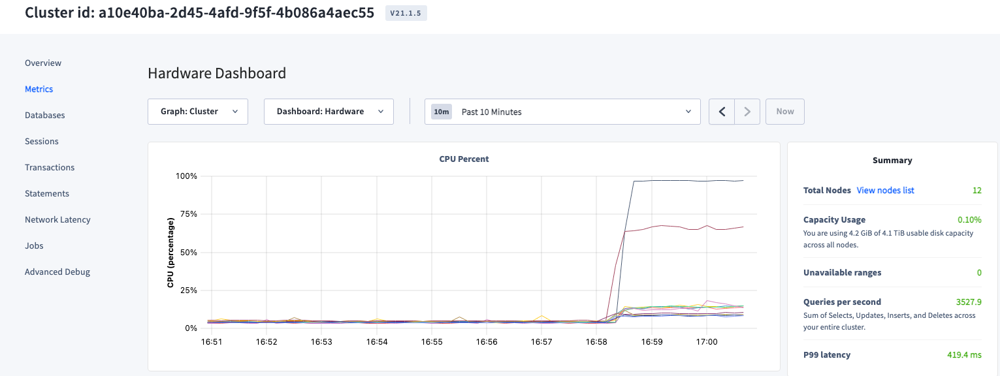
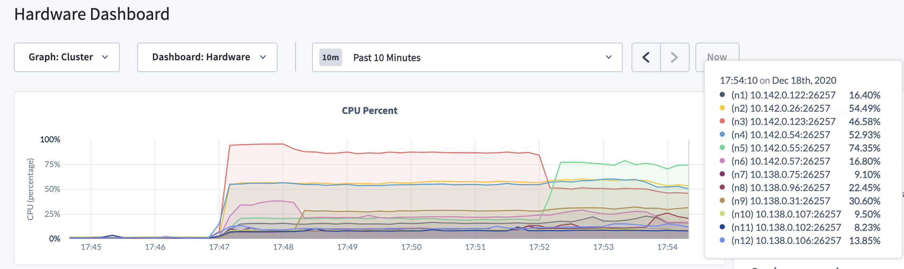

# Troubleshooting Workshop - Student labs

## Lab 0 - Understanding the Problem

The customer complains about high latency and spike in CPU usage for some nodes during their load test.
They ask for your help to lower latencies and improve CPU utilization to achieve higher throughput.

You ask the DBA to provide you with the required information to replicate the issue on your side:

- the cluster configuration: CPUs, MEM, Storage, Networking, location, CockroachDB version, etc.
- the data, in form of a database backup file.
- the workload run, in form of SQL queries.

The customer informs you the UAT environment runs on 12 nodes across 4 datacenters in 2 regions, US East and US West.
They are using CockroachDB v20.1.6 on 4 vCPUs/16GB Mem instances with standard storage.

The customer sent you the tarball with the backup files, `load.tar.gz`, and the SQL queries run as part of the load test, `workload.sql`.

## Lab 1 - Recreate the customer environment

Create the CockroachDB cluster on GCP

```bash
# default machine type is n1-standard-4 (4/16)
roachprod create `whoami`-labs -c gce -n 12 --geo --gce-zones us-east4-b,us-east4-c,us-west1-b,us-west1-c
roachprod stage `whoami`-labs release v20.2.0
roachprod start `whoami`-labs
roachprod adminurl `whoami`-labs
```

Open Admin UI and confirm nodes are grouped into 4 zones, and zones are grouped into 2 regions.


Check the latency: should be minimal within zones of the same region.


Upload the backup tarball file and restore the database tables.

```bash
roachprod put `whoami`-labs:1 load.tar.gz
roachprod ssh `whoami`-labs:1

# in the node
tar xvf load.tar.gz
sudo mkdir -p /mnt/data1/cockroach/extern/
sudo mv load /mnt/data1/cockroach/extern/
./cockroach sql --insecure
```

At the SQL prompt:

```sql
-- restore require enterprise license
SET CLUSTER SETTING cluster.organization = 'ABC Corp';
SET CLUSTER SETTING enterprise.license = 'xxxx-yyyy-zzzz';

RESTORE offers,coupons FROM 'nodelocal://1/load';
```

```text
        job_id       |  status   | fraction_completed |  rows   | index_entries |   bytes
---------------------+-----------+--------------------+---------+---------------+-------------
  606935886222589953 | succeeded |                  1 | 7309726 |      14619446 | 1203433654
(1 row)

Time: 1m8.146552901s
```

Cool, you've successfully created the cluster and restored the data!

Next, let's create a Jumpbox server from which to run the workload to simulate the App.

```bash
roachprod create `whoami`-jump -c gce -n 1 --gce-zones us-east4-b
roachprod stage `whoami`-jump release v20.2.0
roachprod put `whoami`-jump workload.sql
roachprod ssh `whoami`-jump
```

In the jumpbox, download the standalone `workload` binary, used to run the load test.

```bash
wget https://edge-binaries.cockroachdb.com/cockroach/workload.LATEST -O workload; chmod 755 workload
```

Test connection to CockroachDB, make sure to substitute the IP address accordingly

```bash
./cockroach sql -e "SHOW TABLES;" --url 'postgres://root@10.150.0.110:26257?sslmode=disable'
```

You should see below output:

```text
  schema_name | table_name | type  | estimated_row_count
--------------+------------+-------+----------------------
  public      | coupons    | table |             7309720
  public      | offers     | table |                   0
(2 rows)

Time: 677ms
```

Good, the Jumpbox can connect to the cluster!

## Lab 2 - Analyse the CockroachDB cluster

Before diving into running the workload, let's review the database we just imported, as well as analyze the SQL queries in the workload.

We've imported 2 tables, let's see what they look like in terms of size, columns, ranges, indexes. You can view these details using the AdminUI and/or with the `SHOW RANGES` command.


```sql
SHOW CREATE TABLE coupons;
SHOW RANGES FROM TABLE coupons;
```

`coupons` has 2 secondary indexes. Notice how the leaseholder of the ranges are spread across both regions (check the `lease_holder_locality` column).

```text
  table_name |                                         create_statement
-------------+----------------------------------------------------------------------------------------------------
  coupons    | CREATE TABLE public.coupons (
             |     id INT8 NOT NULL,
             |     code STRING NOT NULL,
             |     channel STRING NOT NULL,
             |     pid INT8 NOT NULL,
             |     exp_date DATE NOT NULL,
             |     status STRING NOT NULL,
             |     created TIMESTAMPTZ NULL DEFAULT now():::TIMESTAMPTZ,
             |     modified TIMESTAMPTZ NULL DEFAULT now():::TIMESTAMPTZ,
             |     start_date DATE NOT NULL,
             |     CONSTRAINT "primary" PRIMARY KEY (id ASC, code ASC),
             |     INDEX coupons_pid_idx (pid ASC),
             |     INDEX coupons_code_id_idx (code ASC, id ASC) STORING (channel, status, exp_date, start_date),
             |     FAMILY "primary" (id, code, channel, pid, exp_date, status, created, modified, start_date)
             | )
(1 row)

Time: 818ms total (execution 818ms / network 0ms)

                   start_key                  |                   end_key                   | range_id | range_size_mb | lease_holder |           lease_holder_locality           | replicas |                                                          replica_localities
----------------------------------------------+---------------------------------------------+----------+---------------+--------------+-------------------------------------------+----------+----------------------------------------------------------------------------------------------------------------------------------------
  NULL                                        | /201/"0091f193-2e9b-4b1b-a860-a1b931c94a45" |       42 |             0 |           12 | cloud=gce,region=us-west1,zone=us-west1-c | {1,8,12} | {"cloud=gce,region=us-east4,zone=us-east4-b","cloud=gce,region=us-west1,zone=us-west1-b","cloud=gce,region=us-west1,zone=us-west1-c"}
  /201/"0091f193-2e9b-4b1b-a860-a1b931c94a45" | /400033/"1148sx0rvfqw"                      |      110 |    233.341283 |            1 | cloud=gce,region=us-east4,zone=us-east4-b | {1,8,11} | {"cloud=gce,region=us-east4,zone=us-east4-b","cloud=gce,region=us-west1,zone=us-west1-b","cloud=gce,region=us-west1,zone=us-west1-c"}
  /400033/"1148sx0rvfqw"                      | /400044/"11c8vvly94m2"                      |      109 |    232.505187 |           11 | cloud=gce,region=us-west1,zone=us-west1-c | {1,8,11} | {"cloud=gce,region=us-east4,zone=us-east4-b","cloud=gce,region=us-west1,zone=us-west1-b","cloud=gce,region=us-west1,zone=us-west1-c"}
  /400044/"11c8vvly94m2"                      | NULL                                        |       51 |    211.510939 |            5 | cloud=gce,region=us-east4,zone=us-east4-c | {3,5,7}  | {"cloud=gce,region=us-east4,zone=us-east4-b","cloud=gce,region=us-east4,zone=us-east4-c","cloud=gce,region=us-west1,zone=us-west1-b"}
(4 rows)

Time: 782ms total (execution 782ms / network 0ms)
```

```sql
SHOW CREATE TABLE offers;
SHOW RANGES FROM TABLE offers;
```

Notice how table `offers` has 1 secondary index, and the table is empty (`range_size_mb` is 0).

```text
  table_name |                          create_statement
-------------+----------------------------------------------------------------------
  offers     | CREATE TABLE public.offers (
             |     id INT8 NOT NULL,
             |     code STRING NOT NULL,
             |     token STRING NOT NULL,
             |     created TIMESTAMPTZ NOT NULL DEFAULT now():::TIMESTAMPTZ,
             |     modified TIMESTAMPTZ NOT NULL DEFAULT now():::TIMESTAMPTZ,
             |     CONSTRAINT "primary" PRIMARY KEY (id ASC, code ASC, token ASC),
             |     INDEX offers_token_idx (token ASC),
             |     FAMILY "primary" (id, code, token, created, modified)
             | )
(1 row)

Time: 821ms total (execution 820ms / network 0ms)

  start_key | end_key | range_id | range_size_mb | lease_holder |           lease_holder_locality           | replicas |                                                          replica_localities
------------+---------+----------+---------------+--------------+-------------------------------------------+----------+----------------------------------------------------------------------------------------------------------------------------------------
  NULL      | NULL    |       36 |             0 |           10 | cloud=gce,region=us-west1,zone=us-west1-c | {4,8,10} | {"cloud=gce,region=us-east4,zone=us-east4-c","cloud=gce,region=us-west1,zone=us-west1-b","cloud=gce,region=us-west1,zone=us-west1-c"}
(1 row)

Time: 608ms total (execution 608ms / network 0ms)
```

Now let's inspect the workload that's run against this database. Here's a formatted view of the queries in `workload.sql`.

Please note, `1` and `2` are placeholder for variables, the customer has not supplied those so we hardcoded using `1` and `2`.

```sql
-- Q1
SELECT DISTINCT c.id, c.code, c.channel, c.status, c.exp_date, c.start_date
FROM coupons AS c
WHERE (((c.status = 'ACTIVE') AND (c.exp_date >= current_date())) AND (c.start_date <= current_date())) AND (c.pid = '1')
UNION
SELECT c.id, c.code, c.channel, c.status, c.exp_date, c.start_date
FROM coupons AS c, offers AS o
WHERE (((((c.id = o.id) AND (c.code = o.code)) AND (c.status = 'ACTIVE')) AND (c.exp_date >= current_date())) AND (c.start_date <= current_date())) AND (o.token = '2')

-- Q2
SELECT c.id, c.code, c.channel, c.status, c.exp_date, c.start_date
FROM coupons AS c, offers AS o
WHERE (((((c.id = o.id) AND (c.code = o.code)) AND (c.status = 'ACTIVE')) AND (c.exp_date >= current_date())) AND (c.start_date <= current_date())) AND (o.token = '1')
```

So Q2 is basically the second part of Q1, and it's a join query between the 2 tables. Q1 also has a `SELECT DISTINCT` part, too.

## Lab 3 - Simulate the load test

Back to your laptop, get the full list of DB URLs. Save it for later.

```bash
$ roachprod pgurl `whoami`-labs
'postgres://root@10.150.0.108:26257?sslmode=disable' 'postgres://root@10.150.0.109:26257?sslmode=disable' 'postgres://root@10.150.0.107:26257?sslmode=disable' 'postgres://root@10.150.0.105:26257?sslmode=disable' 'postgres://root@10.150.0.106:26257?sslmode=disable' 'postgres://root@10.150.0.110:26257?sslmode=disable' 'postgres://root@10.138.0.23:26257?sslmode=disable' 'postgres://root@10.138.0.15:26257?sslmode=disable' 'postgres://root@10.138.0.24:26257?sslmode=disable' 'postgres://root@10.138.0.28:26257?sslmode=disable' 'postgres://root@10.138.0.27:26257?sslmode=disable' 'postgres://root@10.138.0.31:26257?sslmode=disable'
```

Connect again to the jumpbox and run the simulation passing all URLs. We are running this workload with 512 active connections, which is far more than the cluster is designed for, which is approximately 12 nodes \* 4 vCPUs \* 4 Active Connections per vCPU = 192 Active Connections. We do so to simulate the highest load.

```bash
./workload run querybench --query-file workload.sql --db=defaultdb --concurrency=512 'postgres://root@10.150.0.110:26257?sslmode=disable' 'postgres://root@10.150.0.95:26257?sslmode=disable' 'postgres://root@10.150.0.111:26257?sslmode=disable' 'postgres://root@10.150.0.109:26257?sslmode=disable' 'postgres://root@10.150.0.92:26257?sslmode=disable' 'postgres://root@10.150.0.93:26257?sslmode=disable' 'postgres://root@10.138.0.2:26257?sslmode=disable' 'postgres://root@10.138.0.8:26257?sslmode=disable' 'postgres://root@10.138.0.9:26257?sslmode=disable' 'postgres://root@10.138.0.18:26257?sslmode=disable' 'postgres://root@10.138.0.10:26257?sslmode=disable' 'postgres://root@10.138.0.39:26257?sslmode=disable'
```

You should see the output similar to below:

```text
_elapsed___errors__ops/sec(inst)___ops/sec(cum)__p50(ms)__p95(ms)__p99(ms)_pMax(ms)
33.0s        0         1622.9         1562.2    176.2    285.2    318.8    369.1  1: SELECT DISTINCT c.id, c.code, c.channel, c.status, c.exp_date, c.start_date FROM coupons AS c WHERE (((c.status = 'ACTIVE') AND (c.exp_date >= current_date())) AND (c.start_date <= current_date())) AND (c.pid = '1') UNION SELECT c.id, c.code, c.channel, c.status, c.exp_date, c.start_date FROM coupons AS c, offers AS o WHERE (((((c.id = o.id) AND (c.code = o.code)) AND (c.status = 'ACTIVE')) AND (c.exp_date >= current_date())) AND (c.start_date <= current_date())) AND (o.token = '2')
33.0s        0         1559.9         1553.5    151.0    218.1    285.2    302.0  2: SELECT c.id, c.code, c.channel, c.status, c.exp_date, c.start_date FROM coupons AS c, offers AS o WHERE (((((c.id = o.id) AND (c.code = o.code)) AND (c.status = 'ACTIVE')) AND (c.exp_date >= current_date())) AND (c.start_date <= current_date())) AND (o.token = '1')
34.0s        0         1515.6         1560.8    167.8    335.5    469.8    520.1  1: SELECT DISTINCT c.id, c.code, c.channel, c.status, c.exp_date, c.start_date FROM coupons AS c WHERE (((c.status = 'ACTIVE') AND (c.exp_date >= current_date())) AND (c.start_date <= current_date())) AND (c.pid = '1') UNION SELECT c.id, c.code, c.channel, c.status, c.exp_date, c.start_date FROM coupons AS c, offers AS o WHERE (((((c.id = o.id) AND (c.code = o.code)) AND (c.status = 'ACTIVE')) AND (c.exp_date >= current_date())) AND (c.start_date <= current_date())) AND (o.token = '2')
34.0s        0         1630.7         1555.7    130.0    285.2    469.8    469.8  2: SELECT c.id, c.code, c.channel, c.status, c.exp_date, c.start_date FROM coupons AS c, offers AS o WHERE (((((c.id = o.id) AND (c.code = o.code)) AND (c.status = 'ACTIVE')) AND (c.exp_date >= current_date())) AND (c.start_date <= current_date())) AND (o.token = '1')
35.0s        0         1616.4  
```

While it runs, check the Metrics in the AdminUI. Open the **Hardware** dashboard to see if you can replicate the spike in high CPU usage.



Notice how node 10 and 7 have very high CPU usage compared to all other nodes.

Check the latency for these 2 queries. Open the **Statements** page or review the scrolling stats in your terminal.


Check also the **SQL** dashboard


Stop the workload now. You can definitely replicate the customer scenario: high CPU spikes and high latency.

## Lab 4 - Analyze the Queries

Open another ssh connection to the jumpbox and connect to the database. We want to pull the query plan for each query

```bash
# update IP accordingly
./cockroach sql --url 'postgres://root@10.150.0.110:26257?sslmode=disable'
```

### Q1

Let's start with Q1, and let's break it down into 2 parts, and let's pull the plan for the 1st part. Again, here the value `1` is a placeholder for a value passed by the application.

```sql
EXPLAIN (VERBOSE) SELECT DISTINCT c.id, c.code, c.channel, c.status, c.exp_date, c.start_date
FROM coupons AS c
WHERE (((c.status = 'ACTIVE') AND (c.exp_date >= current_date())) AND (c.start_date <= current_date())) AND (c.pid = '1');
```

```text
          tree         |        field        |                                      description                                      |                        columns                         | ordering
-----------------------+---------------------+---------------------------------------------------------------------------------------+--------------------------------------------------------+-----------
                       | distribution        | local                                                                                 |                                                        |
                       | vectorized          | false                                                                                 |                                                        |
  project              |                     |                                                                                       | (id, code, channel, status, exp_date, start_date)      |
   │                   | estimated row count | 0                                                                                     |                                                        |
   └── filter          |                     |                                                                                       | (id, code, channel, pid, exp_date, status, start_date) |
        │              | estimated row count | 0                                                                                     |                                                        |
        │              | filter              | ((status = 'ACTIVE') AND (exp_date >= '2020-11-16')) AND (start_date <= '2020-11-16') |                                                        |
        └── index join |                     |                                                                                       | (id, code, channel, pid, exp_date, status, start_date) |
             │         | estimated row count | 0                                                                                     |                                                        |
             │         | table               | coupons@primary                                                                       |                                                        |
             │         | key columns         | id, code                                                                              |                                                        |
             └── scan  |                     |                                                                                       | (id, code, pid)                                        |
                       | estimated row count | 0                                                                                     |                                                        |
                       | table               | coupons@coupons_pid_idx                                                               |                                                        |
                       | spans               | /1-/2                                                                                 |                                                        |
```

So the optimizer is leveraging index `coupons@coupons_pid_idx` to filter rows that have that specific `pid`, but then it has to do a join with `primary` to fetch `status`, `exp_date` and `start_date` to finish the rest of the `WHERE`, and `SELECT`, clauses.

Wouldn't it be better if it didn't have to do this join and instead accessing just 1 index?

### Q2

Let's now pull the plan for Q2.

```sql
EXPLAIN (VERBOSE) SELECT c.id, c.code, c.channel, c.status, c.exp_date, c.start_date
FROM coupons AS c, offers AS o
WHERE (((((c.id = o.id) AND (c.code = o.code)) AND (c.status = 'ACTIVE')) AND (c.exp_date >= current_date())) AND (c.start_date <= current_date())) AND (o.token = '1');
```

```text
            tree           |         field         |                                      description                                      |                              columns                               | ordering
---------------------------+-----------------------+---------------------------------------------------------------------------------------+--------------------------------------------------------------------+-----------
                           | distribution          | full                                                                                  |                                                                    |
                           | vectorized            | false                                                                                 |                                                                    |
  project                  |                       |                                                                                       | (id, code, channel, status, exp_date, start_date)                  |
   │                       | estimated row count   | 0                                                                                     |                                                                    |
   └── lookup join (inner) |                       |                                                                                       | (id, code, token, id, code, channel, exp_date, status, start_date) |
        │                  | estimated row count   | 0                                                                                     |                                                                    |
        │                  | table                 | coupons@coupons_code_id_idx                                                           |                                                                    |
        │                  | equality              | (code, id) = (code,id)                                                                |                                                                    |
        │                  | equality cols are key |                                                                                       |                                                                    |
        │                  | pred                  | ((status = 'ACTIVE') AND (exp_date >= '2020-11-16')) AND (start_date <= '2020-11-16') |                                                                    |
        └── scan           |                       |                                                                                       | (id, code, token)                                                  |
                           | estimated row count   | 1                                                                                     |                                                                    |
                           | table                 | offers@offers_token_idx                                                               |                                                                    |
                           | spans                 | /"1"-/"1"/PrefixEnd                                                                   |                                                                    |

```

Here we see that the optimizer is choosing an index to filter from the `offers` table and join with `coupons`, which is fine.

## Lab 5 - Addressing the Hotspot

Let's first tackle the high CPU usage issue first. Why is it so, why is node 10 using all the CPU?
We can start by trying to isolate the issue by running only Q2 in our workload, and let's see if the problem persist.

Update `workload.sql` by commenting Q1 out, then restart the workload. Give it a couple of minutes, and you should see that n10 is hot again, so we know that Q2 is the culprit.


Let's see if we have a hot range.

Upload file `hot.py` to the jumpbox, or run it locally if you prefer

```bash
$ curl -skl http://<node-ip>:26258/_status/raft > raft ; python troubleshooting/hot.py raft
rank    rangeId QPS     lh      nodes
  1:    36      1680    10      [4, 8, 10]
  2:    6       49      5       [1, 6, 5, 12, 9]
  3:    26      16      6       [1, 6, 5, 7, 10]
  4:    35      12      8       [5, 3, 8, 11, 7]
  5:    4       8       5       [5, 12, 8]
  6:    11      3       2       [2, 5, 11, 7, 10]
  7:    2       2       11      [4, 2, 12, 9, 11]
  8:    7       2       2       [2, 1, 6, 8, 11]
  9:    3       1       12      [2, 1, 5, 12, 8]
 10:    31      1       3       [4, 3, 12, 9, 7]
```

So it looks like rangeId 36 on node 10 is hot. What's in that range, why that range?

Back to your SQL terminal, show the ranges for table `offers` again.

```text
  start_key | end_key | range_id | range_size_mb | lease_holder |           lease_holder_locality           | replicas |                                                          replica_localities
------------+---------+----------+---------------+--------------+-------------------------------------------+----------+----------------------------------------------------------------------------------------------------------------------------------------
  NULL      | NULL    |       36 |             0 |           10 | cloud=gce,region=us-west1,zone=us-west1-c | {4,8,10} | {"cloud=gce,region=us-east4,zone=us-east4-c","cloud=gce,region=us-west1,zone=us-west1-b","cloud=gce,region=us-west1,zone=us-west1-c"}
```

Bingo! We found rangeId 36.
As `offers` is empty, there is just one range for that table and if you have a join operation going on, inevitably CockroachDB will always want to access that range to do the join.

We need to ask our customer:

- why is a join operation sent against an empty table;
- why is the table empty.

If the table were full, you'd have multiple ranges spread across the cluster and the load would be balanced, removing the hotspot on node 10.

The customer provides you with some data, `offers.csv.gz`. Put that data in n1 in the same folder and import it

```bash
roachprod put `whoami`-labs:1 offers.csv.gz
roachprod ssh `whoami`-labs:1  
roachprod run `whoami`-labs:1 "gunzip offers.csv.gz"
roachprod run `whoami`-labs:1 "sudo mv offers.csv /mnt/data1/cockroach/extern/"
```

In your SQL terminal

```sql
IMPORT INTO offers (id, code, token, created, modified)
    CSV DATA ('nodelocal://1/offers.csv');
```

You should now have about 2 million rows in `offers`.
If you rerun the workload, however, you'd still see the spike because the value to search is hardcoded to `1`, so you'd still hit the same range over and over.

Instead, let's run queries that would better simulate the workload by hardcoding `token` value

```sql
SELECT token FROM offers LIMIT 1 OFFSET 1 -- then increment of ~250,000
```

We can use this data to create a new workload file, `q2.sql`

```sql
SELECT c.id, c.code, c.channel, c.status, c.exp_date, c.start_date FROM coupons AS c, offers AS o WHERE (((((c.id = o.id) AND (c.code = o.code)) AND (c.status = 'ACTIVE')) AND (c.exp_date >= current_date())) AND (c.start_date <= current_date())) AND (o.token = '000016aa-57a4-18fd-9a60-e599462b43e0');
SELECT c.id, c.code, c.channel, c.status, c.exp_date, c.start_date FROM coupons AS c, offers AS o WHERE (((((c.id = o.id) AND (c.code = o.code)) AND (c.status = 'ACTIVE')) AND (c.exp_date >= current_date())) AND (c.start_date <= current_date())) AND (o.token = '1fde0504-6a32-0578-75f0-7d25b87996b4');
SELECT c.id, c.code, c.channel, c.status, c.exp_date, c.start_date FROM coupons AS c, offers AS o WHERE (((((c.id = o.id) AND (c.code = o.code)) AND (c.status = 'ACTIVE')) AND (c.exp_date >= current_date())) AND (c.start_date <= current_date())) AND (o.token = '3fe561ed-a778-891e-228c-21cd77254201');
SELECT c.id, c.code, c.channel, c.status, c.exp_date, c.start_date FROM coupons AS c, offers AS o WHERE (((((c.id = o.id) AND (c.code = o.code)) AND (c.status = 'ACTIVE')) AND (c.exp_date >= current_date())) AND (c.start_date <= current_date())) AND (o.token = '5fe1efc3-a038-2e27-816c-7f082b223af0');
SELECT c.id, c.code, c.channel, c.status, c.exp_date, c.start_date FROM coupons AS c, offers AS o WHERE (((((c.id = o.id) AND (c.code = o.code)) AND (c.status = 'ACTIVE')) AND (c.exp_date >= current_date())) AND (c.start_date <= current_date())) AND (o.token = '7fdcaac7-6f19-1599-a476-934cf7cd061a');
SELECT c.id, c.code, c.channel, c.status, c.exp_date, c.start_date FROM coupons AS c, offers AS o WHERE (((((c.id = o.id) AND (c.code = o.code)) AND (c.status = 'ACTIVE')) AND (c.exp_date >= current_date())) AND (c.start_date <= current_date())) AND (o.token = '9ff60a37-6ab3-5e2e-67a2-4552a44b2231');
SELECT c.id, c.code, c.channel, c.status, c.exp_date, c.start_date FROM coupons AS c, offers AS o WHERE (((((c.id = o.id) AND (c.code = o.code)) AND (c.status = 'ACTIVE')) AND (c.exp_date >= current_date())) AND (c.start_date <= current_date())) AND (o.token = 'c009288d-8e63-224e-4db6-9ec31441987a');
SELECT c.id, c.code, c.channel, c.status, c.exp_date, c.start_date FROM coupons AS c, offers AS o WHERE (((((c.id = o.id) AND (c.code = o.code)) AND (c.status = 'ACTIVE')) AND (c.exp_date >= current_date())) AND (c.start_date <= current_date())) AND (o.token = 'e00d75b0-9bbf-6c69-6620-2d312813806e');
SELECT c.id, c.code, c.channel, c.status, c.exp_date, c.start_date FROM coupons AS c, offers AS o WHERE (((((c.id = o.id) AND (c.code = o.code)) AND (c.status = 'ACTIVE')) AND (c.exp_date >= current_date())) AND (c.start_date <= current_date())) AND (o.token = 'fffff710-1de1-64de-652e-3111c1fc71c7');
```

Run this workload for a while, at least 5 minutes to give time to Cockroach to reassign leaseholders around the ranges of the cluster.
Check the **Hardware** dashboard again



```sql
SELECT lease_holder, lease_holder_locality FROM [SHOW RANGES FROM INDEX offers@offers_token_idx];
```

Much better, good job! Let's see how the ranges for the index are spread out:

```text
  lease_holder |           lease_holder_locality
---------------+--------------------------------------------
            10 | cloud=gce,region=us-west1,zone=us-west1-c
            10 | cloud=gce,region=us-west1,zone=us-west1-c
             1 | cloud=gce,region=us-east4,zone=us-east4-b
             4 | cloud=gce,region=us-east4,zone=us-east4-c
            11 | cloud=gce,region=us-west1,zone=us-west1-c
```

Better, on average we can expect the load to be spread across 5 ranges in 4 nodes.

